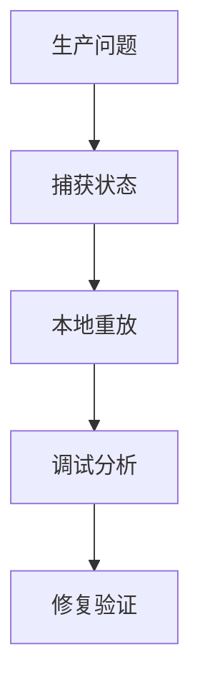
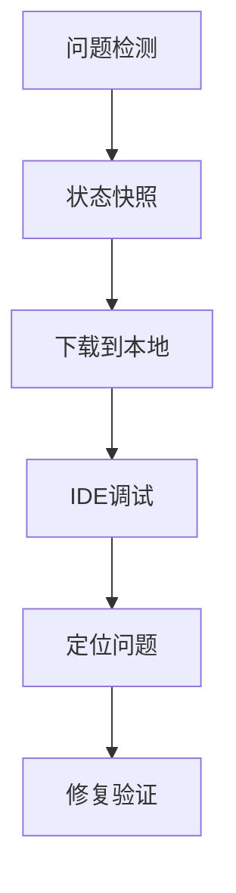

# Flink 调试工具 演进 特性跟踪

> 所属阶段: Flink/roadmap | 前置依赖: [Debugging][^1] | 形式化等级: L3

## 1. 概念定义 (Definitions)

### Def-F-DEBUG-01: Local Replay
本地重放：
$$
\text{Replay} : \text{ProductionEvents} \to \text{LocalEnvironment}
$$

### Def-F-DEBUG-02: Time Travel
时间旅行：
$$
\text{TimeTravel}(t) : \text{StateAtTime}(t)
$$

## 2. 属性推导 (Properties)

### Prop-F-DEBUG-01: Deterministic Replay
确定性重放：
$$
\text{Replay}(E) \equiv \text{Original}(E)
$$

## 3. 关系建立 (Relations)

### 调试工具演进

| 版本 | 特性 |
|------|------|
| 2.0 | Web UI调试 |
| 2.4 | 本地重放 |
| 3.0 | 时间旅行 |

## 4. 论证过程 (Argumentation)

### 4.1 调试架构



## 5. 形式证明 / 工程论证

### 5.1 重放工具

```bash
# 从Savepoint本地重放
./bin/flink run -s <savepoint-path> \
    -p 1 \
    -c com.example.DebugMain \
    ./debug-job.jar
```

## 6. 实例验证 (Examples)

### 6.1 IDEA调试配置

```java
// 本地调试入口
public class DebugJob {
    public static void main(String[] args) throws Exception {
        StreamExecutionEnvironment env = 
            StreamExecutionEnvironment.createLocalEnvironment(1);
        // 设置断点调试
        env.execute();
    }
}
```

## 7. 可视化 (Visualizations)



## 8. 引用参考 (References)

[^1]: Flink Debugging Guide

---

## 跟踪信息

| 属性 | 值 |
|------|-----|
| 涵盖版本 | 2.0-3.0 |
| 当前状态 | 本地重放 |
