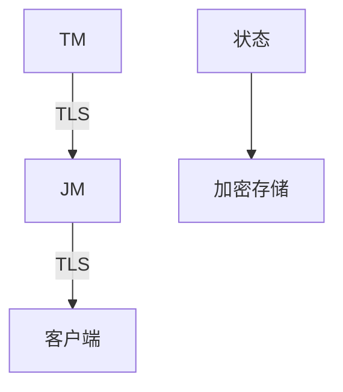
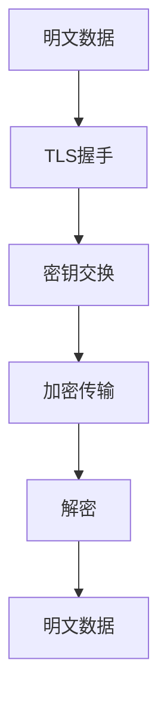

# Flink 加密机制 演进 特性跟踪

> 所属阶段: Flink/roadmap | 前置依赖: [Encryption][^1] | 形式化等级: L4

## 1. 概念定义 (Definitions)

### Def-F-ENC-01: Encryption in Transit
传输加密：
$$
\text{TLS} : \text{Plaintext} \leftrightarrow \text{Ciphertext}
$$

### Def-F-ENC-02: Encryption at Rest
静态加密：
$$
\text{Encrypt}(\text{Data}) \to \text{Storage}
$$

## 2. 属性推导 (Properties)

### Prop-F-ENC-01: Forward Secrecy
前向保密：
$$
\text{Compromise}(K_{\text{now}}) \not\Rightarrow \text{Decrypt}(\text{past})
$$

## 3. 关系建立 (Relations)

### 加密演进

| 版本 | 特性 |
|------|------|
| 1.x | SSL基础 |
| 2.0 | TLS 1.3 |
| 2.4 | mTLS |
| 3.0 | 国密支持 |

## 4. 论证过程 (Argumentation)

### 4.1 加密架构



## 5. 形式证明 / 工程论证

### 5.1 TLS配置

```yaml
security.ssl:
  enabled: true
  algorithm: TLSv1.3
  keystore: /path/to/keystore.jks
  keystore-password: ${KEYSTORE_PASSWORD}
  truststore: /path/to/truststore.jks
```

## 6. 实例验证 (Examples)

### 6.1 状态加密

```yaml
state.backend: rocksdb
state.backend.rocksdb.encryption:
  enabled: true
  algorithm: AES-256-GCM
  key-provider: kms
```

## 7. 可视化 (Visualizations)



## 8. 引用参考 (References)

[^1]: Flink SSL Setup

---

## 跟踪信息

| 属性 | 值 |
|------|-----|
| 涵盖版本 | 1.x-3.0 |
| 当前状态 | mTLS |
