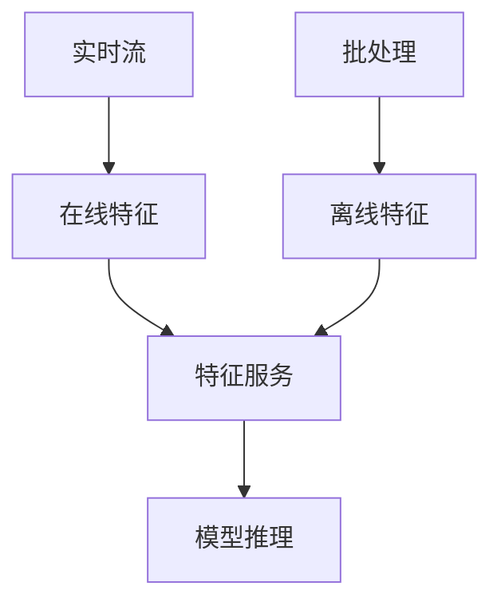
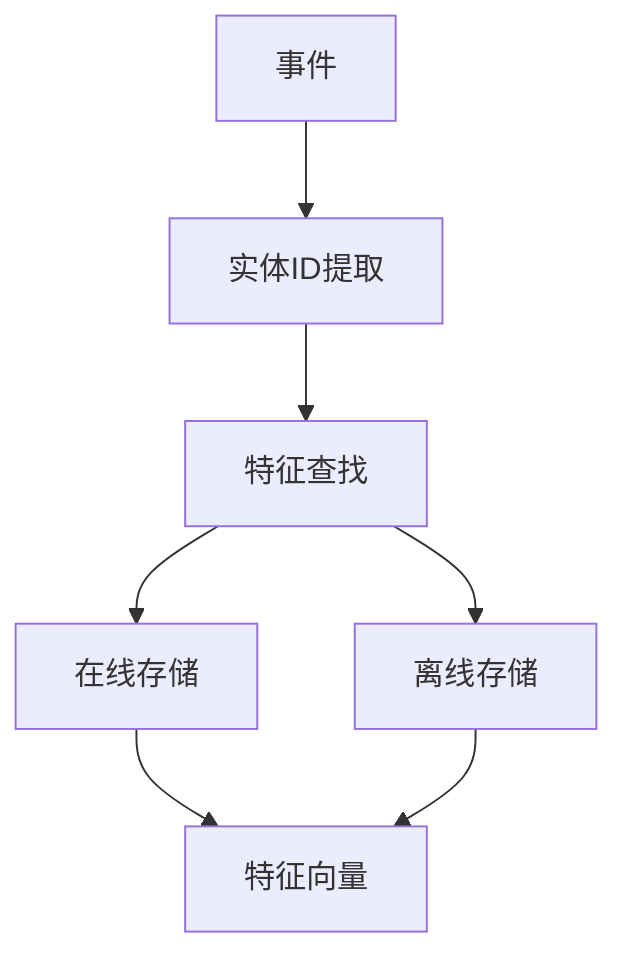

# Flink 特征存储 集成 演进 特性跟踪

> 所属阶段: Flink/roadmap | 前置依赖: [Feature Store][^1] | 形式化等级: L4

## 1. 概念定义 (Definitions)

### Def-F-FS-01: Feature Store
特征存储：
$$
\text{FeatureStore} = \text{OnlineStore} \cup \text{OfflineStore}
$$

### Def-F-FS-02: Feature Vector
特征向量：
$$
\vec{f} = (f_1, f_2, ..., f_n), f_i \in \text{Feature}_i
$$

## 2. 属性推导 (Properties)

### Prop-F-FS-01: Feature Consistency
特征一致性：
$$
\text{Online}(f) \approx \text{Offline}(f), \text{within tolerance}
$$

## 3. 关系建立 (Relations)

### 特征存储集成

| 系统 | 集成方式 |
|------|----------|
| Feast | 原生支持 |
| Tecton | API集成 |
| SageMaker | SDK集成 |

## 4. 论证过程 (Argumentation)

### 4.1 特征存储架构



## 5. 形式证明 / 工程论证

### 5.1 Feast集成

```java
public class FeatureStoreLookup extends RichAsyncFunction<String, Features> {
    private transient FeastClient client;
    
    @Override
    public void asyncInvoke(String entityKey, ResultFuture<Features> resultFuture) {
        GetOnlineFeaturesRequest request = GetOnlineFeaturesRequest.builder()
            .features(List.of("user:age", "user:spend"))
            .entityRows(Map.of("user_id", entityKey))
            .build();
        
        client.getOnlineFeaturesAsync(request, resultFuture::complete);
    }
}
```

## 6. 实例验证 (Examples)

### 6.1 特征服务SQL

```sql
CREATE FUNCTION lookup_features AS 'FeatureStoreUDF';

SELECT 
    user_id,
    lookup_features(user_id, ARRAY['age', 'spend']) as features
FROM events;
```

## 7. 可视化 (Visualizations)



## 8. 引用参考 (References)

[^1]: Feast, Tecton Feature Stores

---

## 跟踪信息

| 属性 | 值 |
|------|-----|
| 涵盖版本 | 2.4-3.0 |
| 当前状态 | Beta |
