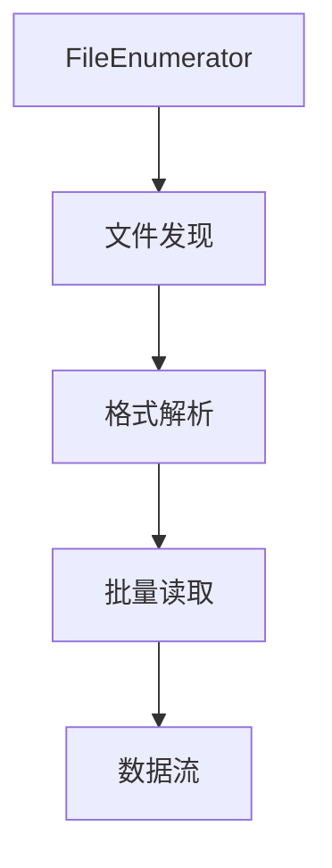
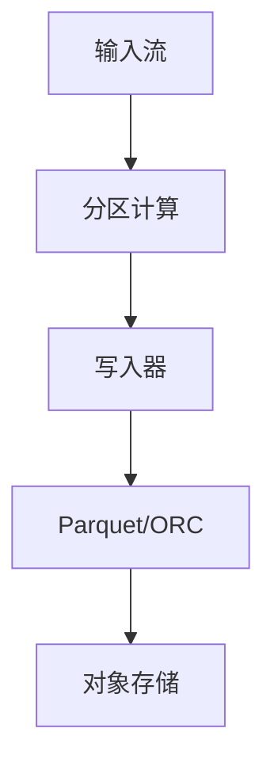

# Flink 文件系统 连接器 演进 特性跟踪

> 所属阶段: Flink/roadmap | 前置依赖: [FileSystem Connector][^1] | 形式化等级: L3

## 1. 概念定义 (Definitions)

### Def-F-FILE-01: File Source
文件源定义：
$$
\text{FileSource} : \text{FileSystem} \to \text{DataStream}
$$

### Def-F-FILE-02: File Formats
文件格式：
$$
\text{Formats} = \{\text{Parquet}, \text{ORC}, \text{Avro}, \text{CSV}, \text{JSON}\}
$$

## 2. 属性推导 (Properties)

### Prop-F-FILE-01: Split Parallelism
分片并行度：
$$
\text{Parallelism} = |\text{FileSplits}|
$$

## 3. 关系建立 (Relations)

### 文件连接器演进

| 版本 | 特性 |
|------|------|
| 1.x | 旧文件源 |
| 2.0 | 新Source API |
| 2.4 | 格式优化 |
| 3.0 | 自适应读取 |

## 4. 论证过程 (Argumentation)

### 4.1 文件读取架构



## 5. 形式证明 / 工程论证

### 5.1 Parquet格式优化

```java
FileSource<RowData> source = FileSource
    .forRecordStreamFormat(
        new ParquetColumnarRowInputFormat(
            new Configuration(),
            rowType,
            1000  // batch size
        ),
        new Path("s3://bucket/data/")
    )
    .build();
```

## 6. 实例验证 (Examples)

### 6.1 分区文件写入

```sql
CREATE TABLE parquet_table (
    user_id STRING,
    event_time TIMESTAMP(3),
    behavior STRING,
    dt STRING
) PARTITIONED BY (dt) WITH (
    'connector' = 'filesystem',
    'path' = 's3://bucket/events',
    'format' = 'parquet',
    'sink.partition-commit.trigger' = 'partition-time',
    'sink.partition-commit.delay' = '1 h'
);
```

## 7. 可视化 (Visualizations)



## 8. 引用参考 (References)

[^1]: Flink FileSystem Connector

---

## 跟踪信息

| 属性 | 值 |
|------|-----|
| 涵盖版本 | 1.x-3.0 |
| 当前状态 | GA |
