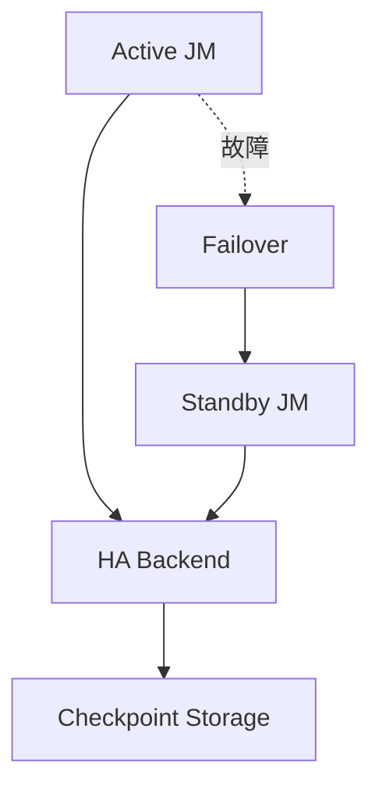
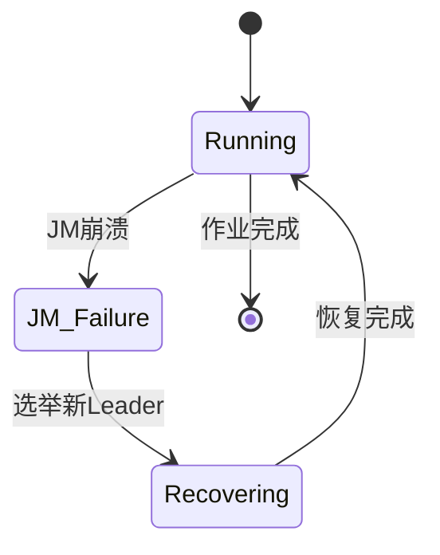

# Flink 高可用性 演进 特性跟踪

> 所属阶段: Flink/roadmap | 前置依赖: [High Availability][^1] | 形式化等级: L4

## 1. 概念定义 (Definitions)

### Def-F-HA-01: High Availability
高可用性：
$$
\text{HA} : \text{Availability} \geq 99.99\%
$$

### Def-F-HA-02: JobManager Failover
JobManager故障转移：
$$
\text{JM}_{\text{failed}} \to \text{JM}_{\text{backup}} \xrightarrow{\text{State}} \text{Recovery}
$$

## 2. 属性推导 (Properties)

### Prop-F-HA-01: State Persistence
状态持久化：
$$
\text{State} \in \text{HAStorage} : \text{Zookeeper} \lor \text{Kubernetes}
$$

### Prop-F-HA-02: Fast Failover
快速故障转移：
$$
T_{\text{failover}} < 30s
$$

## 3. 关系建立 (Relations)

### HA演进

| 版本 | 后端 | 性能 |
|------|------|------|
| 1.x | ZooKeeper | 基础 |
| 2.0 | K8s Native | 优化 |
| 3.0 | 分离式 | 革命性 |

## 4. 论证过程 (Argumentation)

### 4.1 HA架构



## 5. 形式证明 / 工程论证

### 5.1 K8s HA配置

```yaml
high-availability: kubernetes
high-availability.kubernetes.config-map.name: flink-ha
high-availability.kubernetes.leader-election.lease-duration: 15s
```

## 6. 实例验证 (Examples)

### 6.1 ZooKeeper配置

```yaml
high-availability: zookeeper
high-availability.zookeeper.quorum: zk1:2181,zk2:2181,zk3:2181
high-availability.zookeeper.path.root: /flink
```

## 7. 可视化 (Visualizations)



## 8. 引用参考 (References)

[^1]: Flink High Availability

---

## 跟踪信息

| 属性 | 值 |
|------|-----|
| 涵盖版本 | 1.x-3.0 |
| 当前状态 | K8s Native HA |
