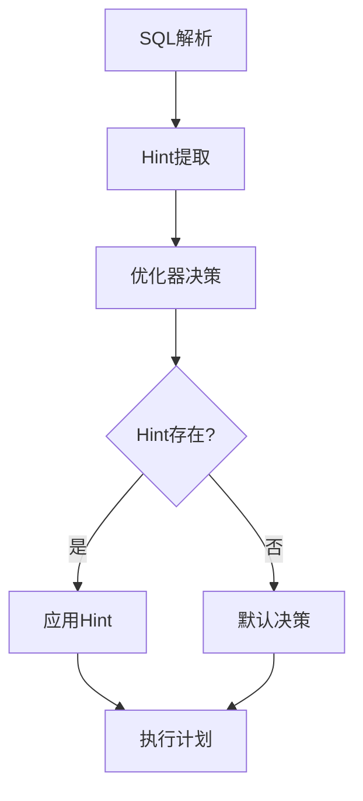
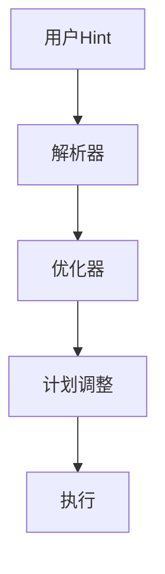

# Flink SQL Hints 演进 特性跟踪

> 所属阶段: Flink/roadmap | 前置依赖: [Optimizer][^1] | 形式化等级: L3

## 1. 概念定义 (Definitions)

### Def-F-HINT-01: Hint Semantics

Hint语义：
$$
\text{Hint} : \text{UserIntent} \to \text{OptimizerDecision}
$$

### Def-F-HINT-02: Hint Types

Hint类型：

- **Join Hint**: JOIN策略提示
- **State Hint**: 状态配置提示
- **Resource Hint**: 资源配置提示

## 2. 属性推导 (Properties)

### Prop-F-HINT-01: Override Capability

Hint覆盖能力：
$$
\text{Decision}_{\text{hint}} \succ \text{Decision}_{\text{optimizer}}
$$

## 3. 关系建立 (Relations)

### Hint演进

| 版本 | Hint支持 |
|------|----------|
| 1.x | 基础Hints |
| 2.0 | 增强Hints |
| 2.5 | Query Hints |
| 3.0 | Adaptive Hints |

## 4. 论证过程 (Argumentation)

### 4.1 Hint决策流程



## 5. 形式证明 / 工程论证

### 5.1 Hint示例

```sql
-- JOIN Hint
SELECT /*+ HASH_JOIN(a, b) */ *
FROM a JOIN b ON a.id = b.id;

-- State Hint
SELECT /*+ STATE_TTL('a' = '1h') */ *
FROM a JOIN b ON a.id = b.id;
```

## 6. 实例验证 (Examples)

### 6.1 Resource Hint

```sql
SELECT /*+ RESOURCE(parallelism=10, memory='4g') */ *
FROM large_table;
```

## 7. 可视化 (Visualizations)



## 8. 引用参考 (References)

[^1]: Flink Optimizer Documentation

---

## 跟踪信息

| 属性 | 值 |
|------|-----|
| 涵盖版本 | 1.x-3.0 |
| 当前状态 | 增强中 |
