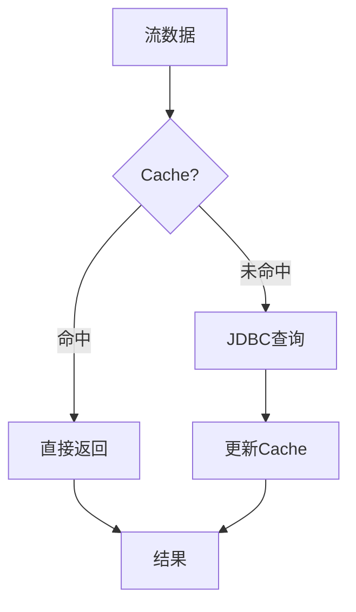
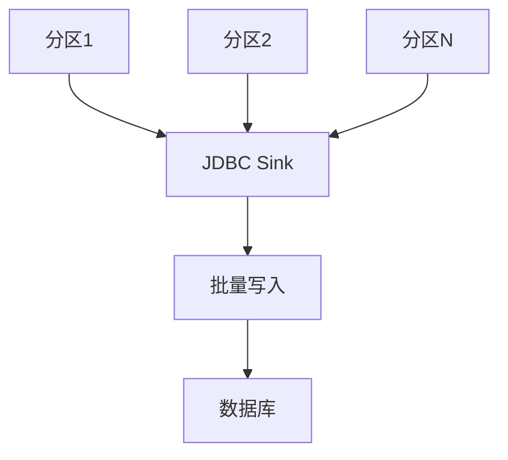

# Flink JDBC 连接器 演进 特性跟踪

> 所属阶段: Flink/roadmap | 前置依赖: [JDBC Connector][^1] | 形式化等级: L3

## 1. 概念定义 (Definitions)

### Def-F-JDBC-01: JDBC Source
JDBC源定义：
$$
\text{JDBCSource} : \text{SQLQuery} \to \text{DataStream}
$$

### Def-F-JDBC-02: Lookup Join
查找JOIN：
$$
\text{Lookup}(k) : \text{Key} \to \text{Row}
$$

## 2. 属性推导 (Properties)

### Prop-F-JDBC-01: Connection Pooling
连接池管理：
$$
|\text{Connections}| \leq \text{PoolSize}
$$

## 3. 关系建立 (Relations)

### JDBC连接器演进

| 版本 | 特性 |
|------|------|
| 1.x | 基础JDBC |
| 2.0 | Lookup Join |
| 2.4 | 异步Lookup |
| 3.0 | 自动分区 |

## 4. 论证过程 (Argumentation)

### 4.1 Lookup Join优化



## 5. 形式证明 / 工程论证

### 5.1 异步Lookup

```java
// 异步Lookup表
CREATE TABLE customers (
    id INT,
    name STRING,
    PRIMARY KEY (id) NOT ENFORCED
) WITH (
    'connector' = 'jdbc',
    'url' = 'jdbc:mysql://...',
    'table-name' = 'customers',
    'lookup.async' = 'true',
    'lookup.cache' = 'PARTIAL'
);
```

## 6. 实例验证 (Examples)

### 6.1 JDBC Sink

```sql
CREATE TABLE output (
    id INT,
    data STRING,
    PRIMARY KEY (id) NOT ENFORCED
) WITH (
    'connector' = 'jdbc',
    'url' = 'jdbc:mysql://...',
    'table-name' = 'output',
    'sink.buffer-flush.interval' = '1s'
);
```

## 7. 可视化 (Visualizations)



## 8. 引用参考 (References)

[^1]: Flink JDBC Connector

---

## 跟踪信息

| 属性 | 值 |
|------|-----|
| 涵盖版本 | 1.x-3.0 |
| 当前状态 | GA |
