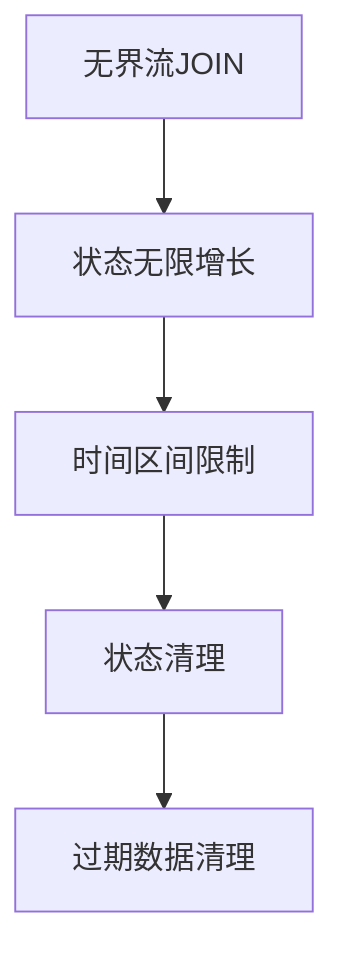
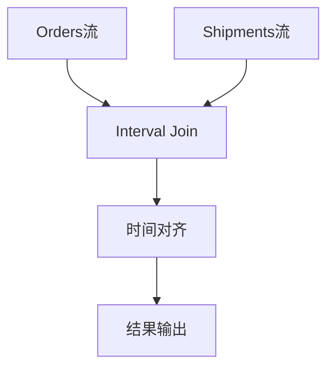

# Flink JOIN 演进 特性跟踪

> 所属阶段: Flink/roadmap | 前置依赖: [Join机制][^1] | 形式化等级: L4

## 1. 概念定义 (Definitions)

### Def-F-JOIN-01: Join Semantics

JOIN语义：
$$
R \bowtie_{\theta} S = \{(r, s) | r \in R, s \in S, \theta(r, s)\}
$$

### Def-F-JOIN-02: Stream Join Types

流JOIN类型：

- **Interval Join**: 时间区间JOIN
- **Temporal Join**: 时态表JOIN
- **Lookup Join**: 维表JOIN
- **Regular Join**: 无界流JOIN

## 2. 属性推导 (Properties)

### Prop-F-JOIN-01: Join Completeness

JOIN完整性：
$$
|R \bowtie S| \leq |R| \times |S|
$$

## 3. 关系建立 (Relations)

### JOIN演进

| JOIN类型 | 2.x | 3.0 |
|----------|-----|-----|
| Interval | GA | GA+优化 |
| Temporal | GA | 增强 |
| Lookup | GA | Async增强 |
| Regular | 受限 | 改进 |

## 4. 论证过程 (Argumentation)

### 4.1 流JOIN挑战



## 5. 形式证明 / 工程论证

### 5.1 Interval Join算法

**算法**:

1. 为左流维护时间窗口状态
2. 为右流维护时间窗口状态
3. 当事件到达时，匹配对方流的窗口
4. 过期状态按事件时间清理

## 6. 实例验证 (Examples)

### 6.1 Interval Join

```sql
SELECT o.*, s.status
FROM orders AS o
JOIN shipments AS s
    ON o.order_id = s.order_id
    AND o.order_time BETWEEN s.ship_time - INTERVAL '1' HOUR
                         AND s.ship_time + INTERVAL '1' HOUR;
```

## 7. 可视化 (Visualizations)



## 8. 引用参考 (References)

[^1]: Flink Join Documentation

---

## 跟踪信息

| 属性 | 值 |
|------|-----|
| 涵盖版本 | 1.x-3.0 |
| 当前状态 | 持续演进 |
