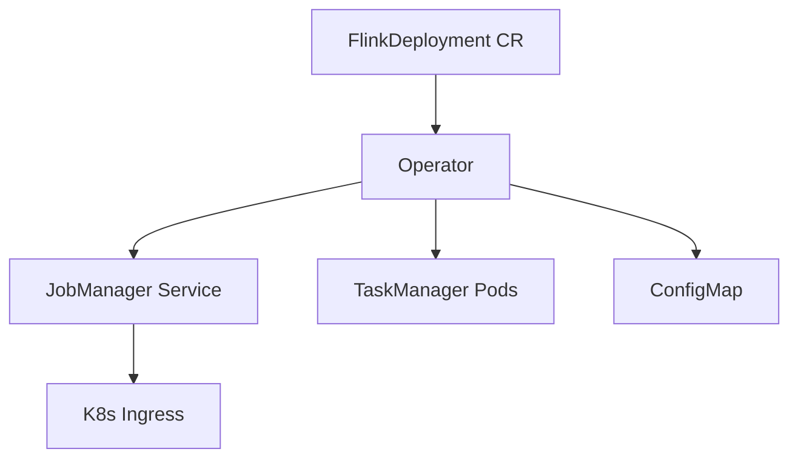
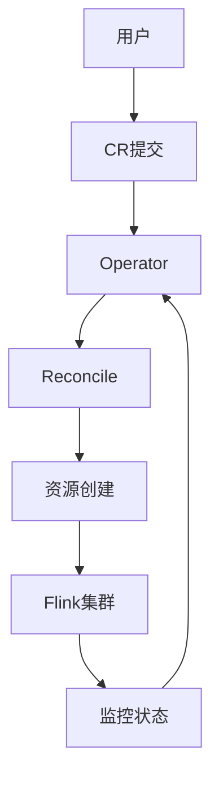

# Flink Kubernetes 部署 演进 特性跟踪

> 所属阶段: Flink/roadmap | 前置依赖: [K8s Operator][^1] | 形式化等级: L4

## 1. 概念定义 (Definitions)

### Def-F-K8S-01: K8s Native Deployment
K8s原生部署：
$$
\text{FlinkJob} \to \text{CustomResource} \to \text{Pods}
$$

### Def-F-K8S-02: Operator Pattern
Operator模式：
$$
\text{ControlLoop} : \text{DesiredState} \to \text{ActualState}
$$

## 2. 属性推导 (Properties)

### Prop-F-K8S-01: Self-Healing
自愈能力：
$$
\text{Failure} \Rightarrow \text{AutoRecovery}
$$

## 3. 关系建立 (Relations)

### K8s部署演进

| 版本 | 方式 |
|------|------|
| 1.x | 手动部署 |
| 2.0 | Helm Chart |
| 2.4 | Operator GA |
| 3.0 | GitOps Native |

## 4. 论证过程 (Argumentation)

### 4.1 Operator架构



## 5. 形式证明 / 工程论证

### 5.1 CR定义

```yaml
apiVersion: flink.apache.org/v1beta1
kind: FlinkDeployment
metadata:
  name: example-job
spec:
  image: flink:2.4
  flinkVersion: v2.4
  jobManager:
    resource:
      memory: 2Gi
      cpu: 1
  taskManager:
    resource:
      memory: 4Gi
      cpu: 2
  job:
    jarURI: local:///opt/flink/examples/StateMachineExample.jar
    parallelism: 2
```

## 6. 实例验证 (Examples)

### 6.1 Session集群

```yaml
apiVersion: flink.apache.org/v1beta1
kind: FlinkSessionJob
metadata:
  name: session-job
spec:
  deploymentName: session-cluster
  job:
    jarURI: https://example.com/job.jar
    parallelism: 3
```

## 7. 可视化 (Visualizations)



## 8. 引用参考 (References)

[^1]: Flink Kubernetes Operator

---

## 跟踪信息

| 属性 | 值 |
|------|-----|
| 涵盖版本 | 1.x-3.0 |
| 当前状态 | Operator GA |
