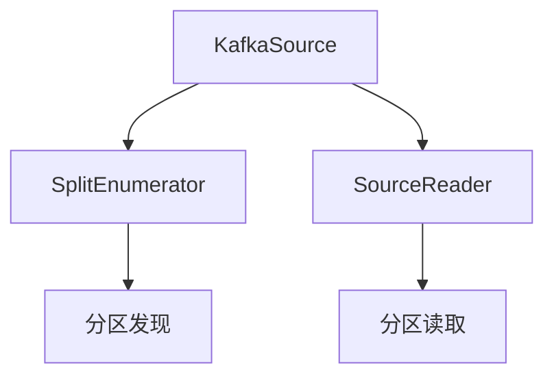
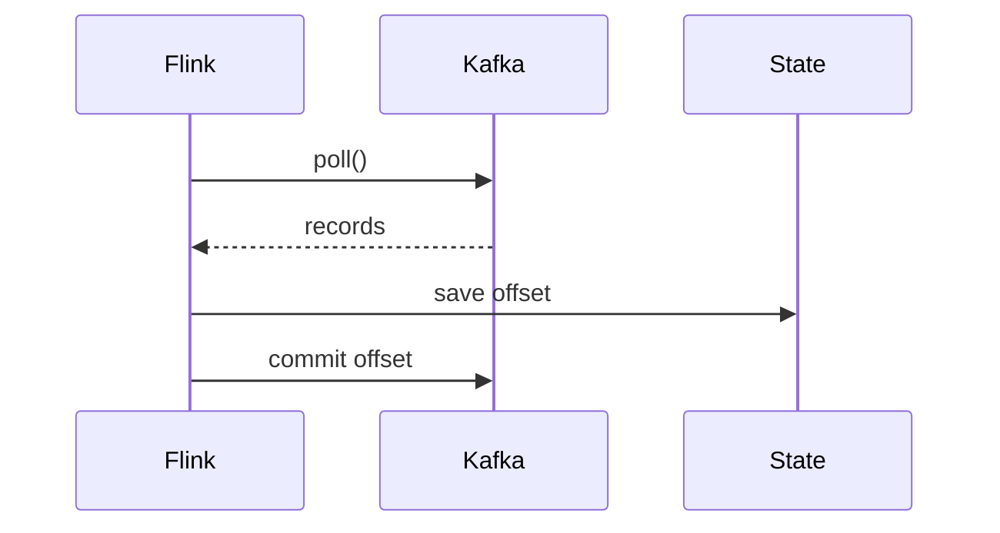

# Flink Kafka 连接器 演进 特性跟踪

> 所属阶段: Flink/roadmap | 前置依赖: [Kafka Connector][^1] | 形式化等级: L4

## 1. 概念定义 (Definitions)

### Def-F-KAFKA-01: Kafka Source

Kafka源定义：
$$
\text{KafkaSource} : \text{KafkaPartitions} \to \text{FlinkDataStream}
$$

### Def-F-KAFKA-02: Consumer Group Protocol

消费组协议：
$$
\text{Protocol} \in \{\text{Classic}, \text{KIP-848}\}
$$

## 2. 属性推导 (Properties)

### Prop-F-KAFKA-01: Offset Consistency

Offset一致性：
$$
\text{Checkpoint} \Rightarrow \text{OffsetsCommitted}
$$

## 3. 关系建立 (Relations)

### Kafka连接器演进

| 版本 | 特性 |
|------|------|
| 1.x | 旧版连接器 |
| 2.0 | 新Source API |
| 2.4 | Kafka 3.x支持 |
| 3.0 | KIP-848消费者 |

## 4. 论证过程 (Argumentation)

### 4.1 新Source架构



## 5. 形式证明 / 工程论证

### 5.1 Exactly-Once消费

**实现**:

1. 提交前记录offset到状态
2. Checkpoint完成后提交offset
3. 恢复时从checkpoint offset开始

## 6. 实例验证 (Examples)

### 6.1 Kafka Source配置

```java
KafkaSource<String> source = KafkaSource.<String>builder()
    .setBootstrapServers("kafka:9092")
    .setTopics("input-topic")
    .setGroupId("flink-group")
    .setStartingOffsets(OffsetsInitializer.earliest())
    .setValueOnlyDeserializer(new SimpleStringSchema())
    .build();
```

## 7. 可视化 (Visualizations)



## 8. 引用参考 (References)

[^1]: Flink Kafka Connector

---

## 跟踪信息

| 属性 | 值 |
|------|-----|
| 涵盖版本 | 1.x-3.0 |
| 当前状态 | GA |
