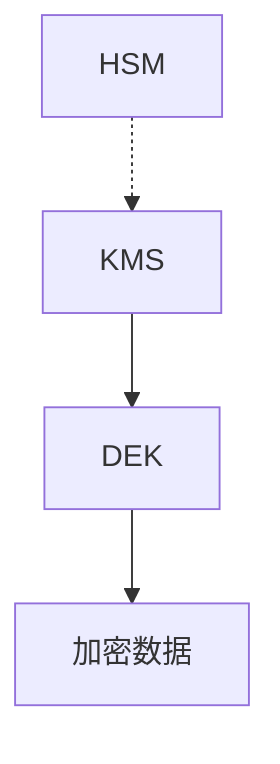
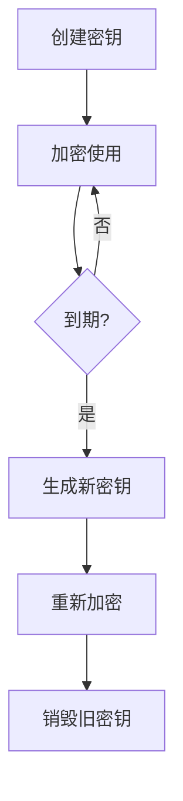

# Flink 密钥管理 演进 特性跟踪

> 所属阶段: Flink/roadmap | 前置依赖: [Key Management][^1] | 形式化等级: L4

## 1. 概念定义 (Definitions)

### Def-F-KEY-01: Key Hierarchy
密钥层级：
$$
\text{Keys} = \text{RootKey} \to \text{DEK} \to \text{Data}
$$

### Def-F-KEY-02: Key Rotation
密钥轮换：
$$
\text{Rotation} : K_{\text{old}} \to K_{\text{new}}, \text{ periodically}
$$

## 2. 属性推导 (Properties)

### Prop-F-KEY-01: Key Segregation
密钥分离：
$$
\text{Key}_i \neq \text{Key}_j, i \neq j
$$

## 3. 关系建立 (Relations)

### 密钥管理演进

| 版本 | 特性 |
|------|------|
| 2.0 | 文件存储 |
| 2.4 | KMS集成 |
| 3.0 | HSM支持 |

## 4. 论证过程 (Argumentation)

### 4.1 密钥架构



## 5. 形式证明 / 工程论证

### 5.1 KMS集成

```yaml
security.encryption:
  key-provider: aws-kms
  aws-kms:
    key-id: alias/flink-key
    region: us-west-2
    credentials:
      type: iam-role
```

## 6. 实例验证 (Examples)

### 6.1 密钥轮换策略

```yaml
security.key.rotation:
  enabled: true
  interval: 90d
  auto-rotate: true
  grace-period: 7d
```

## 7. 可视化 (Visualizations)



## 8. 引用参考 (References)

[^1]: AWS KMS, HashiCorp Vault

---

## 跟踪信息

| 属性 | 值 |
|------|-----|
| 涵盖版本 | 2.0-3.0 |
| 当前状态 | KMS集成 |
