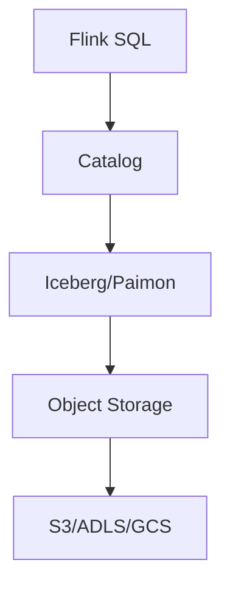
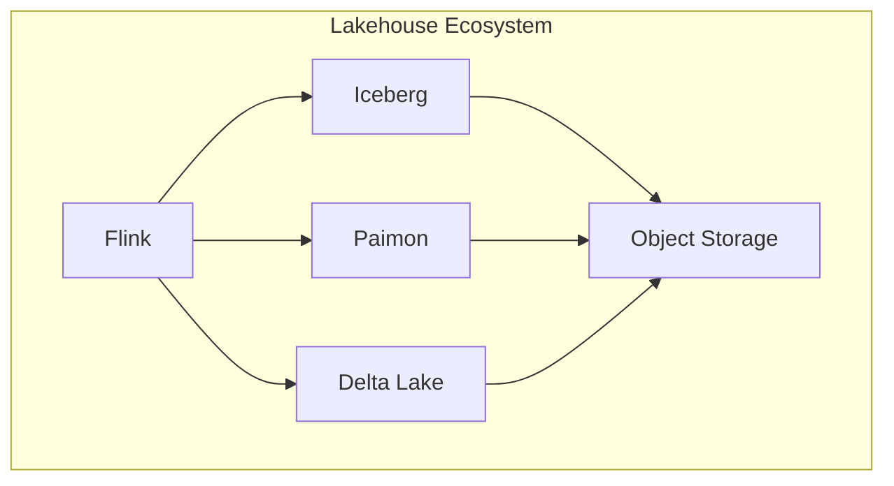

# Flink Lakehouse 连接器 演进 特性跟踪

> 所属阶段: Flink/roadmap | 前置依赖: [Lakehouse Connectors][^1] | 形式化等级: L4

## 1. 概念定义 (Definitions)

### Def-F-LAKE-01: Lakehouse Architecture
Lakehouse架构：
$$
\text{Lakehouse} = \text{DataLake} + \text{DataWarehouseFeatures}
$$

### Def-F-LAKE-02: Time Travel
时间旅行查询：
$$
\text{Query}(T) : \text{TableStateAtTime}(T)
$$

## 2. 属性推导 (Properties)

### Prop-F-LAKE-01: ACID Guarantee
ACID保证：
$$
\text{Transaction} \Rightarrow \text{Atomic} \land \text{Consistent} \land \text{Isolated} \land \text{Durable}
$$

## 3. 关系建立 (Relations)

### Lakehouse支持

| 系统 | 2.x支持 | 3.0目标 |
|------|---------|---------|
| Iceberg | GA | 增强 |
| Paimon | GA | 原生 |
| Delta Lake | Beta | GA |
| Hudi | 社区 | GA |

## 4. 论证过程 (Argumentation)

### 4.1 Lakehouse集成架构



## 5. 形式证明 / 工程论证

### 5.1 Iceberg集成

```sql
-- Iceberg表
CREATE TABLE iceberg_table (
    id BIGINT,
    data STRING,
    dt STRING
) PARTITIONED BY (dt) WITH (
    'connector' = 'iceberg',
    'catalog-name' = 'hive_catalog',
    'catalog-database' = 'default',
    'catalog-table' = 'iceberg_table'
);

-- 时间旅行查询
SELECT * FROM iceberg_table FOR SYSTEM_VERSION AS OF 123456;
```

## 6. 实例验证 (Examples)

### 6.1 Paimon集成

```sql
CREATE TABLE paimon_table (
    id INT PRIMARY KEY NOT ENFORCED,
    data STRING
) WITH (
    'connector' = 'paimon',
    'path' = 's3://bucket/paimon'
);
```

## 7. 可视化 (Visualizations)



## 8. 引用参考 (References)

[^1]: Apache Iceberg, Apache Paimon

---

## 跟踪信息

| 属性 | 值 |
|------|-----|
| 涵盖版本 | 2.0-3.0 |
| 当前状态 | 快速演进 |
