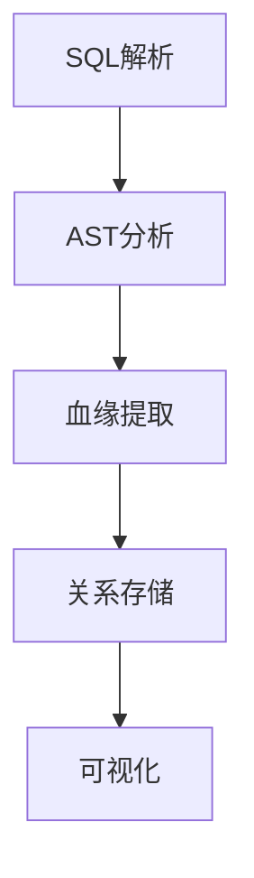
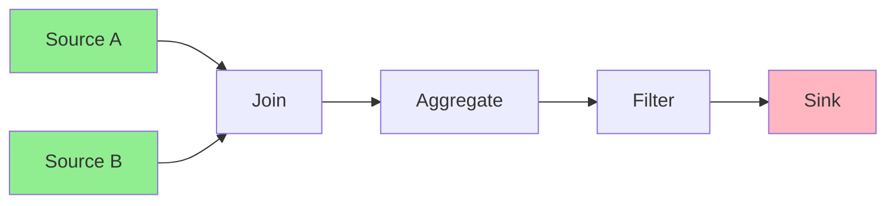

# Flink 数据血缘 演进 特性跟踪

> 所属阶段: Flink/roadmap | 前置依赖: [Data Lineage][^1] | 形式化等级: L3

## 1. 概念定义 (Definitions)

### Def-F-LINEAGE-01: Data Lineage
数据血缘：
$$
\text{Lineage} = (\text{Sources}, \text{Transformations}, \text{Sinks}, \text{Dependencies})
$$

### Def-F-LINEAGE-02: Column-Level Lineage
列级血缘：
$$
\text{ColumnLineage} : \text{OutputCol} \to \{\text{InputCols}\}
$$

## 2. 属性推导 (Properties)

### Prop-F-LINEAGE-01: Lineage Accuracy
血缘准确性：
$$
\text{ActualDependencies} \subseteq \text{ReportedLineage}
$$

## 3. 关系建立 (Relations)

### 血缘演进

| 版本 | 粒度 |
|------|------|
| 2.0 | 表级 |
| 2.4 | 列级 |
| 3.0 | 字段级 |

## 4. 论证过程 (Argumentation)

### 4.1 血缘架构



## 5. 形式证明 / 工程论证

### 5.1 OpenLineage集成

```java
// OpenLineage事件
LineageEvent event = LineageEvent.builder()
    .eventType("COMPLETE")
    .inputs(List.of(inputDataset))
    .outputs(List.of(outputDataset))
    .job(Job.builder().name("my-job").build())
    .build();

lineageClient.emit(event);
```

## 6. 实例验证 (Examples)

### 6.1 血缘查询

```sql
-- 查询上游依赖
SELECT * FROM TABLE(
    GET_LINEAGE('table_name', 'UPSTREAM')
);

-- 查询下游影响
SELECT * FROM TABLE(
    GET_LINEAGE('table_name', 'DOWNSTREAM')
);
```

## 7. 可视化 (Visualizations)



## 8. 引用参考 (References)

[^1]: OpenLineage, DataHub Lineage

---

## 跟踪信息

| 属性 | 值 |
|------|-----|
| 涵盖版本 | 2.0-3.0 |
| 当前状态 | 列级血缘 |
