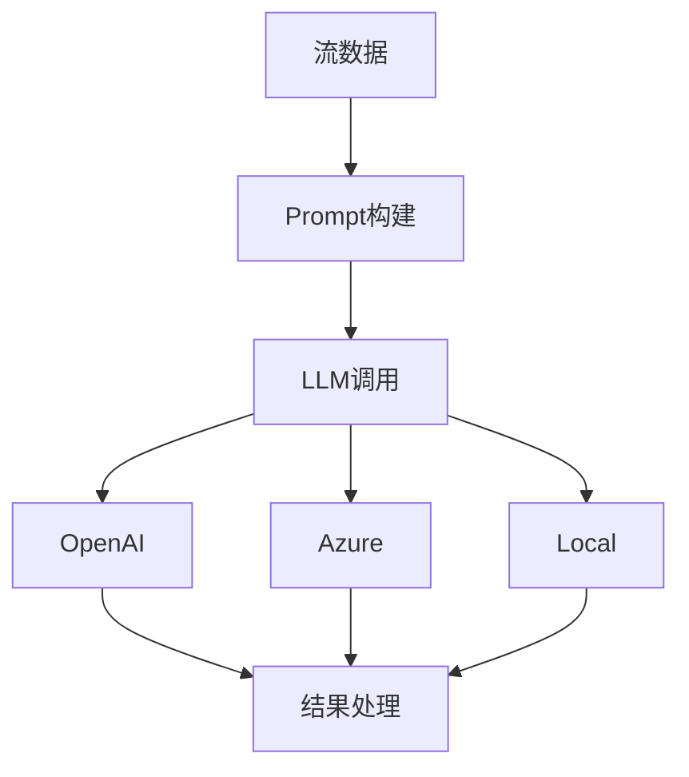
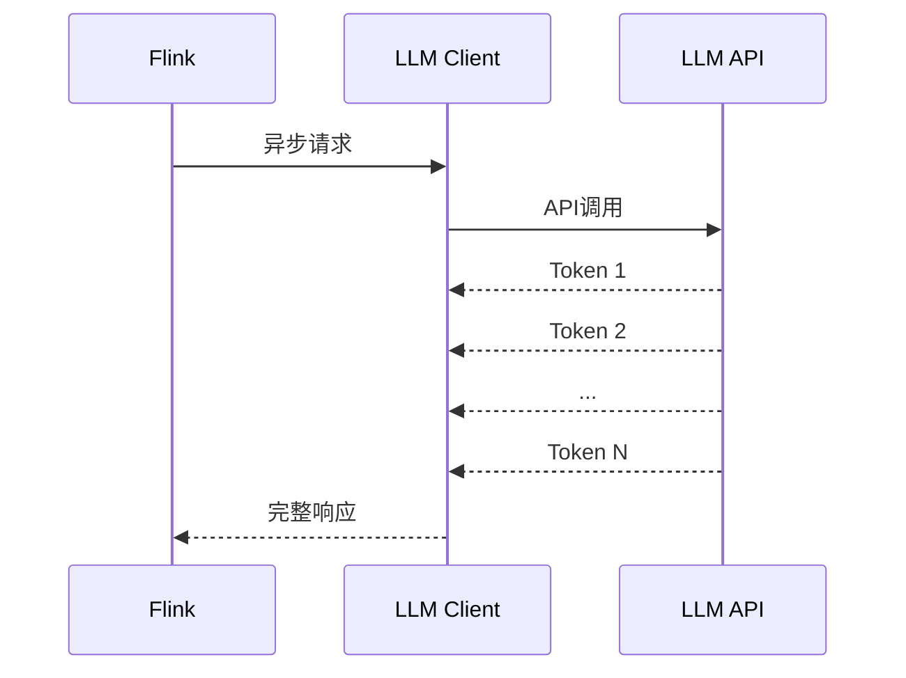

# Flink LLM 集成 演进 特性跟踪

> 所属阶段: Flink/roadmap | 前置依赖: [LLM APIs][^1] | 形式化等级: L4

## 1. 概念定义 (Definitions)

### Def-F-LLM-01: LLM Inference
LLM推理：
$$
\text{LLM}(\text{prompt}, \text{context}) \to \text{response}
$$

### Def-F-LLM-02: Streaming Generation
流式生成：
$$
\text{StreamGen} : \text{Token}_i \to \text{Output}, i = 1, 2, ...
$$

## 2. 属性推导 (Properties)

### Prop-F-LLM-01: Token Rate
Token生成速率：
$$
R_{\text{token}} = \frac{N_{\text{tokens}}}{T_{\text{generation}}}
$$

## 3. 关系建立 (Relations)

### LLM集成演进

| 版本 | 特性 |
|------|------|
| 2.4 | 基础调用 |
| 2.5 | 流式输出 |
| 3.0 | 本地模型 |

## 4. 论证过程 (Argumentation)

### 4.1 LLM集成架构



## 5. 形式证明 / 工程论证

### 5.1 异步LLM调用

```java
public class LLMFunction extends AsyncFunction<String, String> {
    private transient OpenAIClient client;
    
    @Override
    public void asyncInvoke(String input, ResultFuture<String> resultFuture) {
        client.chatCompletionAsync(
            ChatRequest.builder()
                .message("user", input)
                .build(),
            response -> resultFuture.complete(Collections.singleton(response))
        );
    }
}
```

## 6. 实例验证 (Examples)

### 6.1 LLM UDF

```sql
CREATE FUNCTION analyze_sentiment AS 'SentimentUDF';

SELECT 
    message,
    analyze_sentiment(message) as sentiment
FROM social_media;
```

## 7. 可视化 (Visualizations)



## 8. 引用参考 (References)

[^1]: OpenAI API, Azure OpenAI

---

## 跟踪信息

| 属性 | 值 |
|------|-----|
| 涵盖版本 | 2.4-3.0 |
| 当前状态 | GA |
