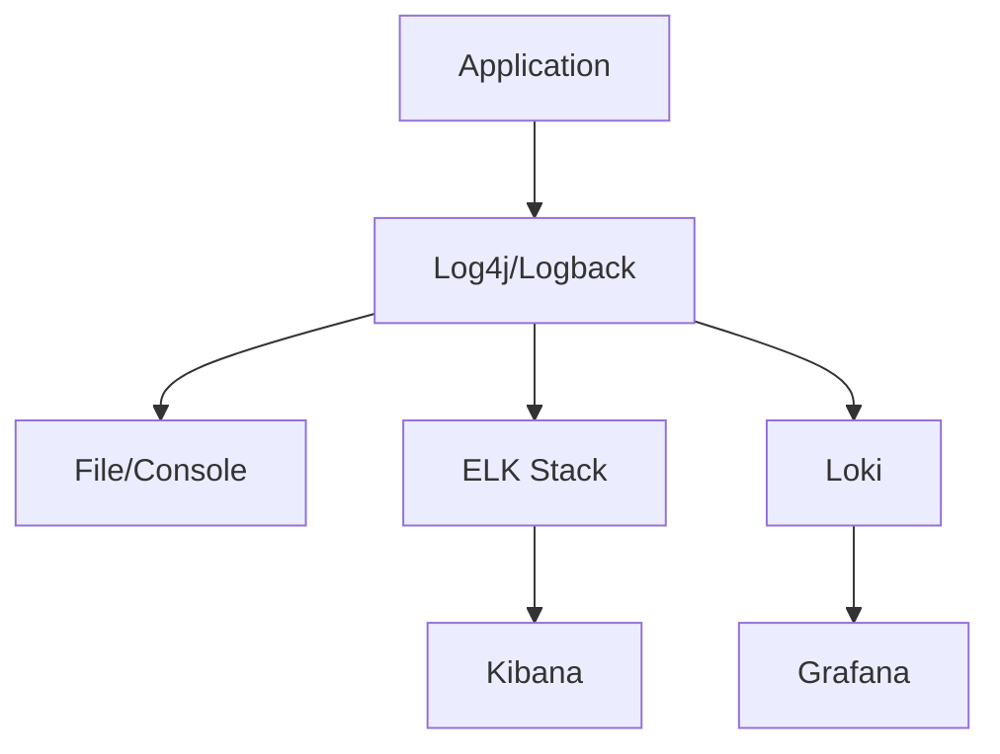
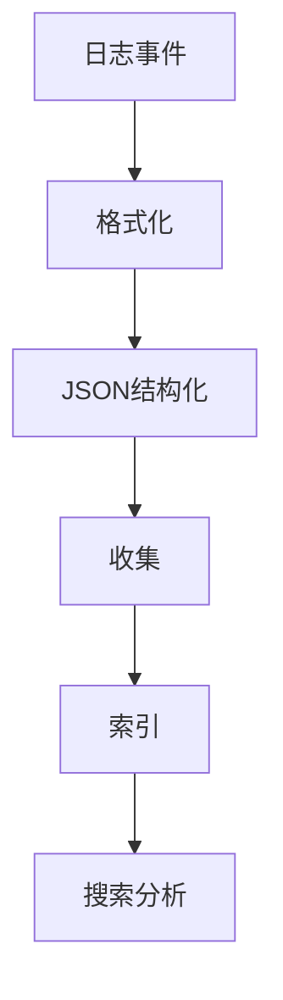

# Flink 日志系统 演进 特性跟踪

> 所属阶段: Flink/roadmap | 前置依赖: [Logging][^1] | 形式化等级: L3

## 1. 概念定义 (Definitions)

### Def-F-LOG-01: Log Levels
日志级别：
$$
\text{Level} \in \{\text{TRACE}, \text{DEBUG}, \text{INFO}, \text{WARN}, \text{ERROR}\}
$$

### Def-F-LOG-02: Structured Logging
结构化日志：
$$
\text{Log} = \{\text{timestamp}, \text{level}, \text{message}, \text{context}, ...\}
$$

## 2. 属性推导 (Properties)

### Prop-F-LOG-01: Log Volume Bound
日志量限制：
$$
\text{Volume} \leq V_{\text{max}} \text{ per unit time}
$$

## 3. 关系建立 (Relations)

### 日志演进

| 版本 | 特性 |
|------|------|
| 1.x | 文本日志 |
| 2.0 | JSON日志 |
| 2.4 | 结构化日志 |
| 3.0 | 智能日志 |

## 4. 论证过程 (Argumentation)

### 4.1 日志架构



## 5. 形式证明 / 工程论证

### 5.1 结构化日志配置

```yaml
logging:
  pattern:
    json:
      format: ecs
  appenders:
    - name: file
      type: file
      file: ${log.file}
      layout:
        type: json
```

## 6. 实例验证 (Examples)

### 6.1 MDC使用

```java
MDC.put("jobId", jobId);
MDC.put("taskId", taskId);
log.info("Processing record: {}", record);
// 输出: {"timestamp":"...","jobId":"123","taskId":"456","message":"..."}
```

## 7. 可视化 (Visualizations)



## 8. 引用参考 (References)

[^1]: Flink Logging Configuration

---

## 跟踪信息

| 属性 | 值 |
|------|-----|
| 涵盖版本 | 1.x-3.0 |
| 当前状态 | JSON结构化 |
