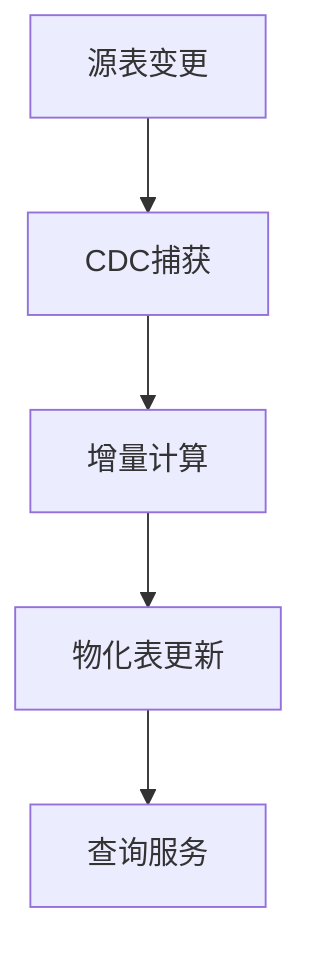
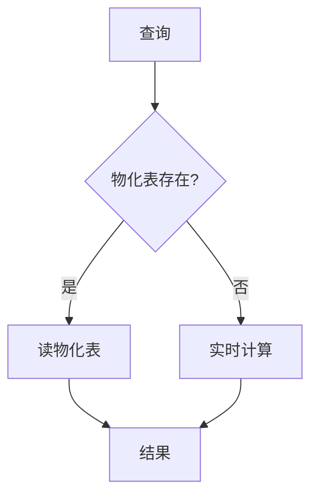

# Flink 物化表/视图 演进 特性跟踪

> 所属阶段: Flink/roadmap | 前置依赖: [Table API][^1] | 形式化等级: L4

## 1. 概念定义 (Definitions)

### Def-F-MV-01: Materialized Table

物化表：
$$
MT = (Q, S, R)
$$
其中 $Q$=查询, $S$=存储, $R$=刷新策略

### Def-F-MV-02: Incremental Maintenance

增量维护：
$$
\Delta MT = f(\Delta S, Q)
$$

## 2. 属性推导 (Properties)

### Prop-F-MV-01: Consistency

一致性：
$$
MT \approx Q(S), \text{ within freshness bound}
$$

## 3. 关系建立 (Relations)

### 物化表演进

| 版本 | 能力 |
|------|------|
| 2.4 | 无 |
| 2.5 | 基础物化表 |
| 3.0 | 智能物化表 |

## 4. 论证过程 (Argumentation)

### 4.1 物化表架构



## 5. 形式证明 / 工程论证

### 5.1 增量维护算法

**算法**:

1. 捕获源表变更 $\Delta S$
2. 计算对物化表的影响 $\Delta MT$
3. 应用变更到物化表
4. 保证最终一致性

## 6. 实例验证 (Examples)

### 6.1 物化表定义

```sql
CREATE MATERIALIZED TABLE hourly_sales
REFRESH EVERY '1' HOUR
AS SELECT
    DATE_TRUNC('HOUR', order_time) as hour,
    SUM(amount) as total
FROM orders
GROUP BY DATE_TRUNC('HOUR', order_time);
```

## 7. 可视化 (Visualizations)



## 8. 引用参考 (References)

[^1]: Flink Table API

---

## 跟踪信息

| 属性 | 值 |
|------|-----|
| 涵盖版本 | 2.5-3.0 |
| 当前状态 | 开发中 |
