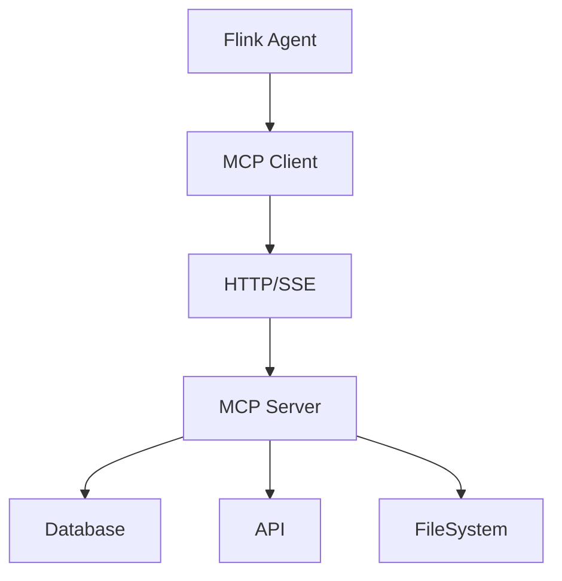
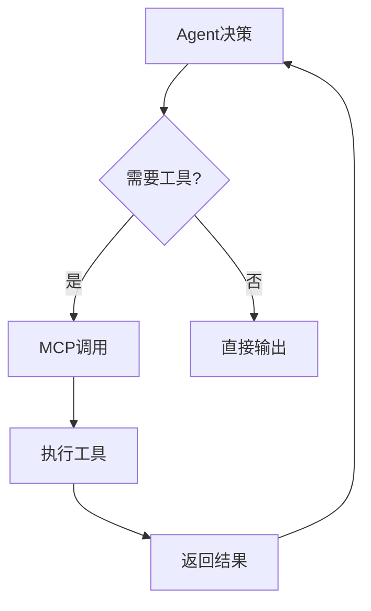

# Flink MCP 协议 演进 特性跟踪

> 所属阶段: Flink/roadmap | 前置依赖: [MCP Specification][^1] | 形式化等级: L4

## 1. 概念定义 (Definitions)

### Def-F-MCP-01: Model Context Protocol

模型上下文协议：
$$
\text{MCP} : \text{Agent} \leftrightarrow \text{Tool}
$$

### Def-F-MCP-02: Tool Definition

工具定义：
$$
\text{Tool} = (\text{Name}, \text{Description}, \text{Parameters}, \text{Returns})
$$

## 2. 属性推导 (Properties)

### Prop-F-MCP-01: Tool Discovery

工具发现：
$$
\text{Agent} \xrightarrow{\text{discover}} \{\text{Tool}_i\}_{i=1}^n
$$

## 3. 关系建立 (Relations)

### MCP演进

| 版本 | 特性 |
|------|------|
| 2.4 | 基础支持 |
| 2.5 | 完整协议 |
| 3.0 | 原生集成 |

## 4. 论证过程 (Argumentation)

### 4.1 MCP架构



## 5. 形式证明 / 工程论证

### 5.1 MCP工具调用

```java
// MCP工具调用
public class MCPToolCall extends ProcessFunction<Event, Result> {
    private transient MCPClient mcp;

    @Override
    public void processElement(Event event, Context ctx, Collector<Result> out) {
        ToolCall call = ToolCall.builder()
            .tool("query_database")
            .parameter("sql", event.getQuery())
            .build();

        ToolResult result = mcp.call(call);
        out.collect(new Result(result));
    }
}
```

## 6. 实例验证 (Examples)

### 6.1 MCP配置

```yaml
mcp:
  servers:
    - name: postgres
      command: npx
      args: [-y, "@modelcontextprotocol/server-postgres"]
      env:
        DATABASE_URL: postgres://localhost/mydb
```

## 7. 可视化 (Visualizations)



## 8. 引用参考 (References)

[^1]: Model Context Protocol Specification, Anthropic

---

## 跟踪信息

| 属性 | 值 |
|------|-----|
| 涵盖版本 | 2.4-3.0 |
| 当前状态 | Beta |
