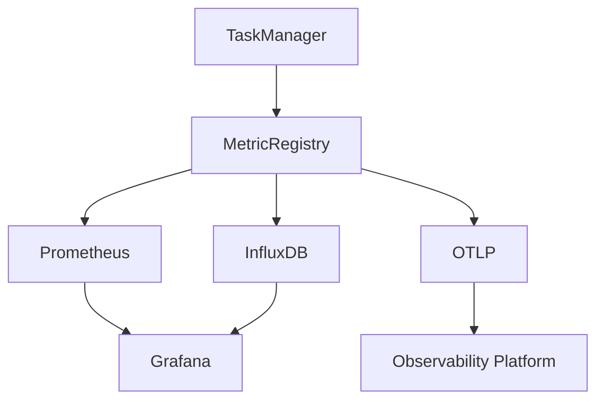
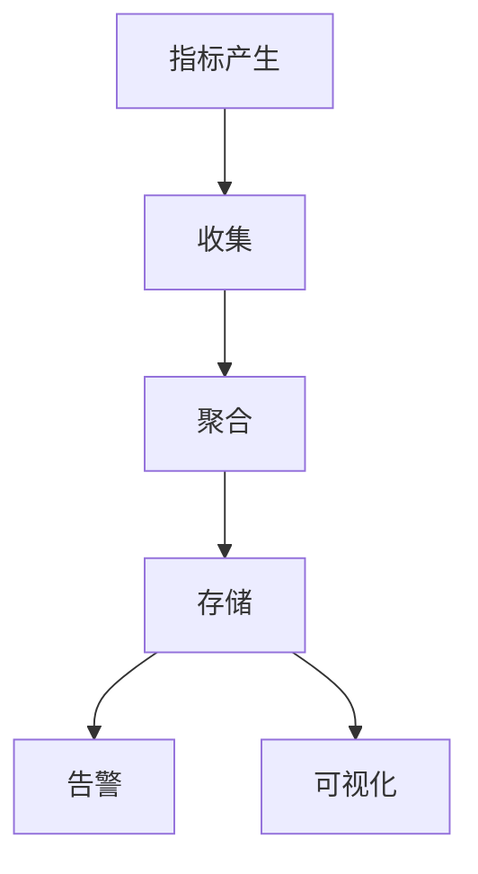

# Flink 指标系统 演进 特性跟踪

> 所属阶段: Flink/roadmap | 前置依赖: [Metrics System][^1] | 形式化等级: L3

## 1. 概念定义 (Definitions)

### Def-F-METRICS-01: Metric Types
指标类型：
$$
\text{Metric} \in \{\text{Counter}, \text{Gauge}, \text{Histogram}, \text{Meter}\}
$$

### Def-F-METRICS-02: Cardinality
基数：
$$
\text{Cardinality} = |\{\text{TimeSeries}\}|
$$

## 2. 属性推导 (Properties)

### Prop-F-METRICS-01: Cardinality Bound
基数限制：
$$
\text{Cardinality} \leq C_{\text{max}}
$$

## 3. 关系建立 (Relations)

### 指标系统演进

| 版本 | 特性 |
|------|------|
| 1.x | 基础指标 |
| 2.0 | 维度指标 |
| 2.4 | OTLP集成 |
| 3.0 | AI驱动 |

## 4. 论证过程 (Argumentation)

### 4.1 指标架构



## 5. 形式证明 / 工程论证

### 5.1 OTLP配置

```yaml
metrics.reporter.otlp.enabled: true
metrics.reporter.otlp.endpoint: http://otel-collector:4317
metrics.reporter.otlp.interval: 60s
```

## 6. 实例验证 (Examples)

### 6.1 自定义指标

```java
public class MyFunction extends RichMapFunction<String, String> {
    private transient Counter counter;
    
    @Override
    public void open(Configuration parameters) {
        counter = getRuntimeContext()
            .getMetricGroup()
            .counter("recordsProcessed");
    }
    
    @Override
    public String map(String value) {
        counter.inc();
        return value.toUpperCase();
    }
}
```

## 7. 可视化 (Visualizations)



## 8. 引用参考 (References)

[^1]: Flink Metrics System

---

## 跟踪信息

| 属性 | 值 |
|------|-----|
| 涵盖版本 | 1.x-3.0 |
| 当前状态 | OTLP集成 |
