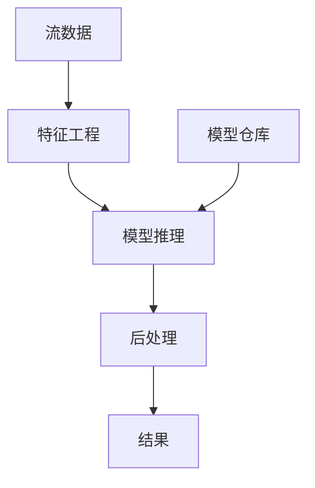
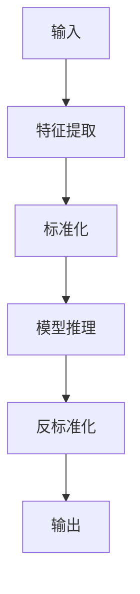

# Flink ML 推理 演进 特性跟踪

> 所属阶段: Flink/roadmap | 前置依赖: [ML Integration][^1] | 形式化等级: L4

## 1. 概念定义 (Definitions)

### Def-F-ML-01: Model Serving
模型服务：
$$
\text{Serve}(M, x) = y \text{ where } M \text{ is trained model}
$$

### Def-F-ML-02: Inference Latency
推理延迟：
$$
T_{\text{inference}} = T_{\text{preprocess}} + T_{\text{forward}} + T_{\text{postprocess}}
$$

## 2. 属性推导 (Properties)

### Prop-F-ML-01: Batch Inference Efficiency
批量推理效率：
$$
T_{\text{batch}}(n) < n \cdot T_{\text{single}}
$$

## 3. 关系建立 (Relations)

### ML推理演进

| 版本 | 特性 |
|------|------|
| 2.0 | 基础预测 |
| 2.4 | 批量优化 |
| 2.5 | GPU加速 |
| 3.0 | 自动模型选择 |

## 4. 论证过程 (Argumentation)

### 4.1 推理架构



## 5. 形式证明 / 工程论证

### 5.1 TF Serving集成

```java
// TensorFlow Serving调用
public class TFServingFunction extends AsyncFunction<Features, Prediction> {
    private transient TFServingClient client;
    
    @Override
    public void asyncInvoke(Features input, ResultFuture<Prediction> resultFuture) {
        client.predictAsync(input, resultFuture::complete);
    }
}
```

## 6. 实例验证 (Examples)

### 6.1 模型推理UDF

```java
@udf(resultType=DataTypes.FLOAT())
public class ModelInference extends ScalarFunction {
    private transient Model model;
    
    public float eval(String features) {
        return model.predict(features);
    }
}
```

## 7. 可视化 (Visualizations)



## 8. 引用参考 (References)

[^1]: Flink ML Documentation

---

## 跟踪信息

| 属性 | 值 |
|------|-----|
| 涵盖版本 | 2.0-3.0 |
| 当前状态 | GA |
