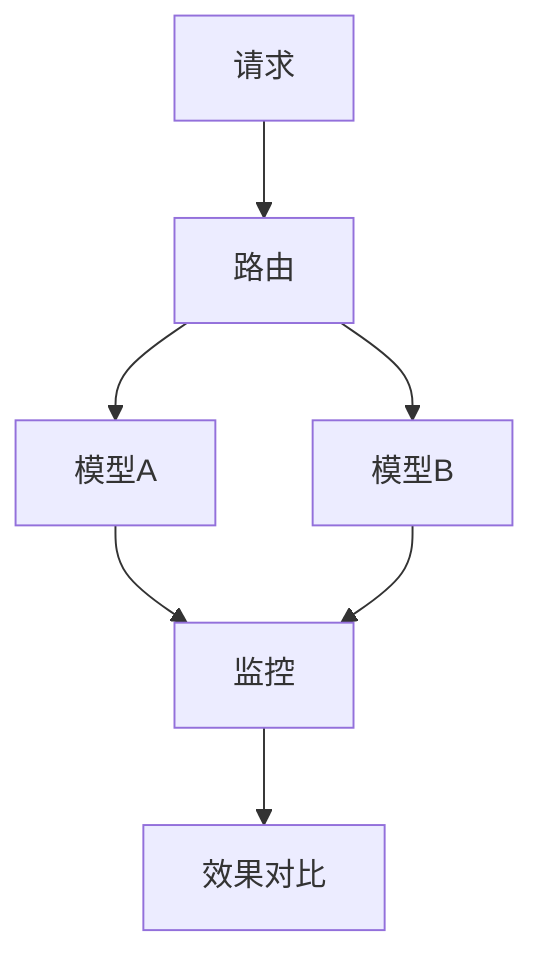
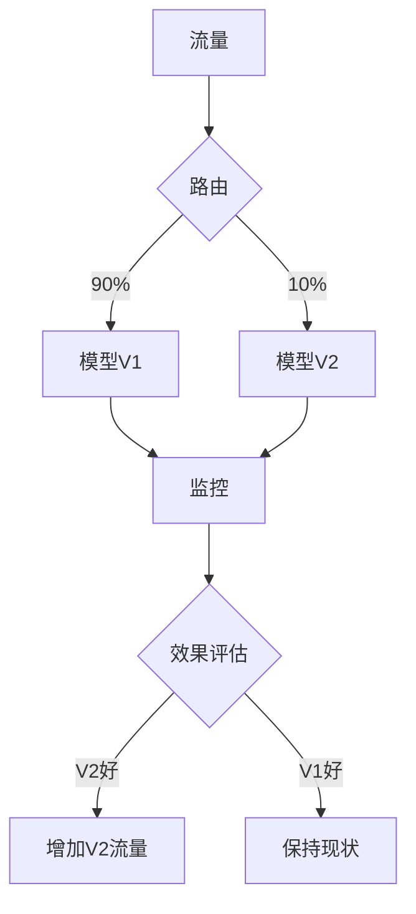

# Flink 模型服务 集成 演进 特性跟踪

> 所属阶段: Flink/roadmap | 前置依赖: [Model Serving][^1] | 形式化等级: L4

## 1. 概念定义 (Definitions)

### Def-F-MS-01: Model Versioning
模型版本：
$$
\text{Model} = (\text{Artifacts}, \text{Version}, \text{Metadata})
$$

### Def-F-MS-02: A/B Testing
A/B测试：
$$
\text{Traffic} \to \{\text{Model}_A, \text{Model}_B\} \text{ by } \text{Ratio}
$$

## 2. 属性推导 (Properties)

### Prop-F-MS-01: Model Consistency
模型一致性：
$$
\forall r \in \text{Requests} : \text{ModelVersion}(r) \text{ is consistent}
$$

## 3. 关系建立 (Relations)

### 模型服务演进

| 版本 | 特性 |
|------|------|
| 2.4 | 基础服务 |
| 2.5 | 灰度发布 |
| 3.0 | 自动回滚 |

## 4. 论证过程 (Argumentation)

### 4.1 模型服务架构



## 5. 形式证明 / 工程论证

### 5.1 多模型路由

```java
public class ModelRouter extends ProcessFunction<Features, Prediction> {
    private Map<String, Model> models;
    
    @Override
    public void processElement(Features features, Context ctx, Collector<Prediction> out) {
        String variant = selectVariant(features.getUserId());
        Model model = models.get(variant);
        Prediction pred = model.predict(features);
        pred.setVariant(variant);
        out.collect(pred);
    }
}
```

## 6. 实例验证 (Examples)

### 6.1 模型服务配置

```yaml
model.serving:
  models:
    - name: fraud-v1
      version: "1.0"
      traffic: 90%
    - name: fraud-v2
      version: "2.0"
      traffic: 10%
  metrics:
    - latency
    - accuracy
    - throughput
```

## 7. 可视化 (Visualizations)



## 8. 引用参考 (References)

[^1]: MLflow, Seldon Core

---

## 跟踪信息

| 属性 | 值 |
|------|-----|
| 涵盖版本 | 2.4-3.0 |
| 当前状态 | Beta |
