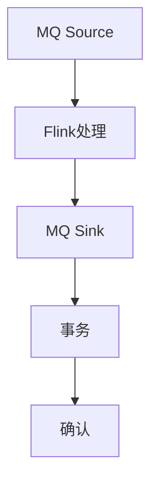
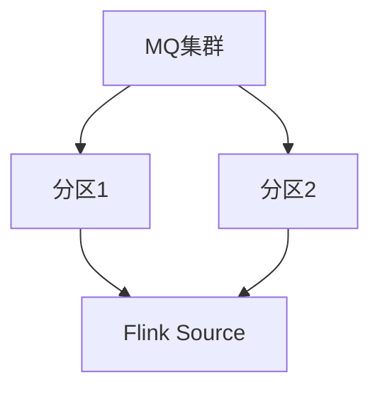

# Flink 消息队列 连接器 演进 特性跟踪

> 所属阶段: Flink/roadmap | 前置依赖: [MQ Connectors][^1] | 形式化等级: L3

## 1. 概念定义 (Definitions)

### Def-F-MQ-01: Message Queue Semantics

消息队列语义：

- **At-Most-Once**: 最多一次投递
- **At-Least-Once**: 至少一次投递
- **Exactly-Once**: 精确一次投递

### Def-F-MQ-02: Message Ordering

消息排序：
$$
\text{Ordering} \in \{\text{PartitionOrder}, \text{GlobalOrder}, \text{Unordered}\}
$$

## 2. 属性推导 (Properties)

### Prop-F-MQ-01: Delivery Guarantee

投递保证：
$$
\text{ExactlyOnce} \Rightarrow \text{Checkpoint} \land \text{Transaction}
$$

## 3. 关系建立 (Relations)

### MQ连接器演进

| 系统 | 状态 |
|------|------|
| RabbitMQ | GA |
| ActiveMQ | GA |
| NATS | 2.4新增 |
| Pulsar | GA |

## 4. 论证过程 (Argumentation)

### 4.1 MQ集成模式



## 5. 形式证明 / 工程论证

### 5.1 NATS连接器

```sql
CREATE TABLE nats_subject (
    subject STRING,
    data STRING
) WITH (
    'connector' = 'nats',
    'servers' = 'nats://localhost:4222',
    'subject' = 'events.>'
);
```

## 6. 实例验证 (Examples)

### 6.1 Pulsar连接器

```java
PulsarSource<String> source = PulsarSource.builder()
    .setServiceUrl("pulsar://localhost:6650")
    .setTopics("persistent://public/default/topic")
    .build();
```

## 7. 可视化 (Visualizations)



## 8. 引用参考 (References)

[^1]: Flink MQ Connectors

---

## 跟踪信息

| 属性 | 值 |
|------|-----|
| 涵盖版本 | 1.x-3.0 |
| 当前状态 | 稳定 |
