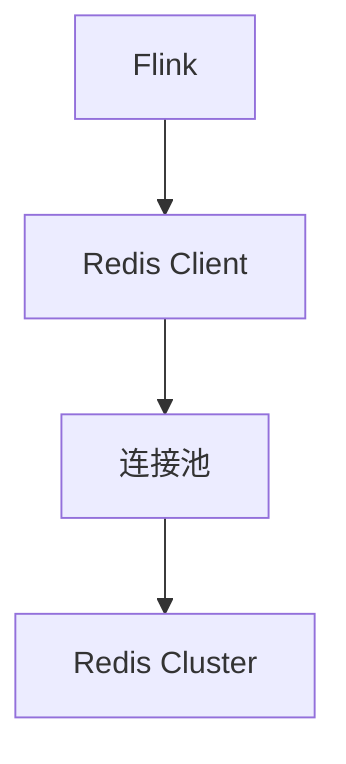
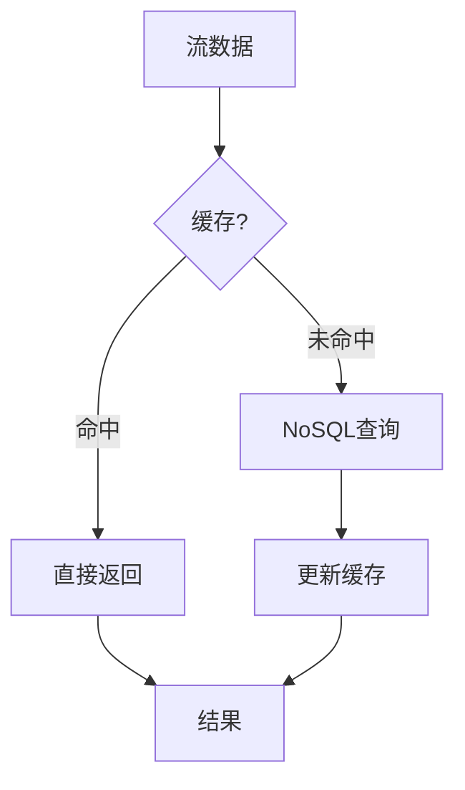

# Flink NoSQL 连接器 演进 特性跟踪

> 所属阶段: Flink/roadmap | 前置依赖: [NoSQL Connectors][^1] | 形式化等级: L3

## 1. 概念定义 (Definitions)

### Def-F-NOSQL-01: NoSQL Categories
NoSQL分类：
- **Key-Value**: Redis, DynamoDB
- **Document**: MongoDB, Couchbase
- **Column**: Cassandra, HBase
- **Graph**: Neo4j

### Def-F-NOSQL-02: Lookup Pattern
查找模式：
$$
\text{Lookup}(K) : \text{Key} \to \text{Value} \cup \{\bot\}
$$

## 2. 属性推导 (Properties)

### Prop-F-NOSQL-01: Lookup Latency
查找延迟：
$$
E[T_{\text{lookup}}] < 10\text{ms}
$$

## 3. 关系建立 (Relations)

### NoSQL连接器

| 系统 | 类型 | 状态 |
|------|------|------|
| Redis | KV | GA |
| MongoDB | Document | GA |
| Cassandra | Column | GA |
| DynamoDB | KV | Beta |
| Elasticsearch | Search | GA |

## 4. 论证过程 (Argumentation)

### 4.1 Redis连接器架构



## 5. 形式证明 / 工程论证

### 5.1 Redis Lookup

```sql
CREATE TABLE redis_table (
    key STRING,
    value STRING
) WITH (
    'connector' = 'redis',
    'host' = 'redis',
    'port' = '6379',
    'lookup.cache.max-rows' = '1000'
);

-- Lookup Join
SELECT o.*, r.value
FROM orders o
LEFT JOIN redis_table FOR SYSTEM_TIME AS OF o.proc_time AS r
    ON o.key = r.key;
```

## 6. 实例验证 (Examples)

### 6.1 MongoDB Sink

```java
MongoSink<Document> sink = MongoSink.<Document>builder()
    .setUri("mongodb://mongo:27017")
    .setDatabase("mydb")
    .setCollection("events")
    .build();
```

## 7. 可视化 (Visualizations)



## 8. 引用参考 (References)

[^1]: Flink NoSQL Connectors

---

## 跟踪信息

| 属性 | 值 |
|------|-----|
| 涵盖版本 | 1.x-3.0 |
| 当前状态 | GA |
