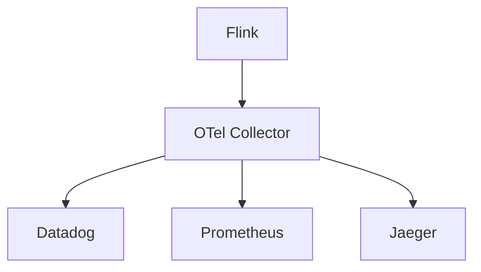
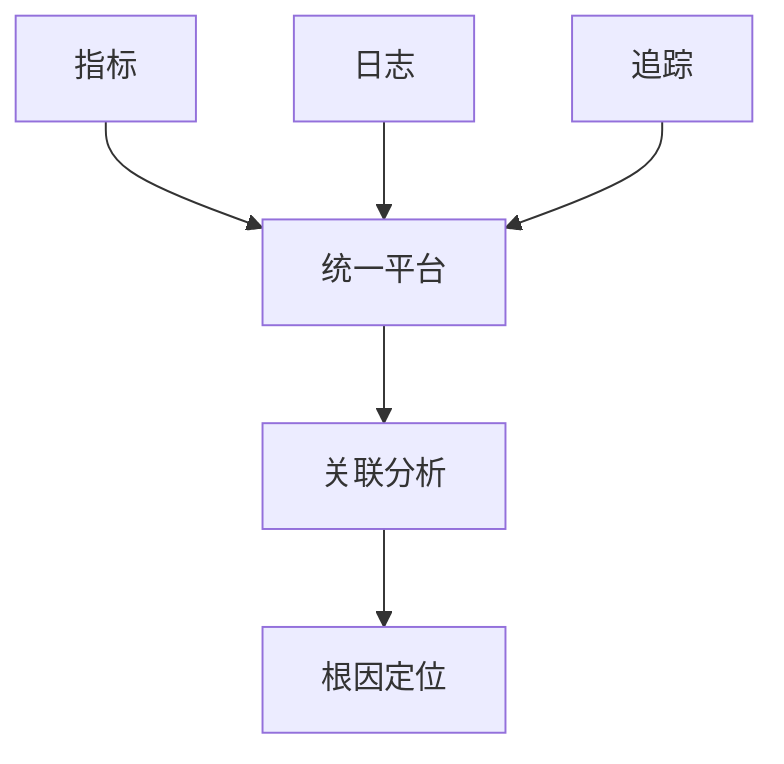

# Flink 可观测性集成 演进 特性跟踪

> 所属阶段: Flink/roadmap | 前置依赖: [Observability Integration][^1] | 形式化等级: L3

## 1. 概念定义 (Definitions)

### Def-F-OBS-INT-01: Observability Platform
可观测性平台：
$$
\text{Platform} = \text{Metrics} \times \text{Logs} \times \text{Traces} \times \text{Events}
$$

### Def-F-OBS-INT-02: Unified Telemetry
统一遥测：
$$
\text{OTLP} : \text{Data} \to \text{AllSignals}
$$

## 2. 属性推导 (Properties)

### Prop-F-OBS-INT-01: Correlation
关联性：
$$
\forall m, l, t : \text{Correlated}(m, l, t) \Rightarrow \text{SameContext}
$$

## 3. 关系建立 (Relations)

### 可观测性集成演进

| 平台 | 集成方式 |
|------|----------|
| Datadog | Agent |
| NewRelic | OTel |
| Grafana | Native |
| Splunk | HEC |

## 4. 论证过程 (Argumentation)

### 4.1 集成架构



## 5. 形式证明 / 工程论证

### 5.1 Datadog集成

```yaml
metrics.reporter.datadog:
  class: org.apache.flink.metrics.datadog.DatadogHttpReporter
  apikey: ${DD_API_KEY}
  tags: env:production,service:flink
```

## 6. 实例验证 (Examples)

### 6.1 统一观测配置

```yaml
observability:
  platform: unified
  exporters:
    - type: otlp
      endpoint: http://otel-collector:4317
    - type: prometheus
      port: 9249
  correlation:
    enabled: true
    attributes:
      - job_id
      - task_id
```

## 7. 可视化 (Visualizations)



## 8. 引用参考 (References)

[^1]: OpenTelemetry Integration

---

## 跟踪信息

| 属性 | 值 |
|------|-----|
| 涵盖版本 | 2.0-3.0 |
| 当前状态 | OTel统一 |
