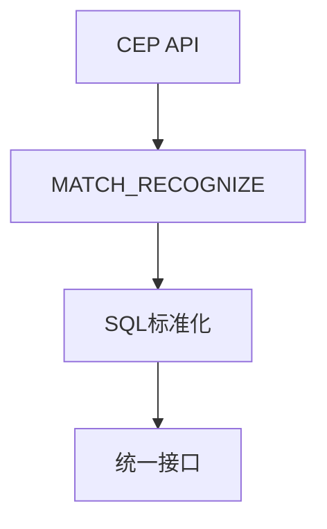
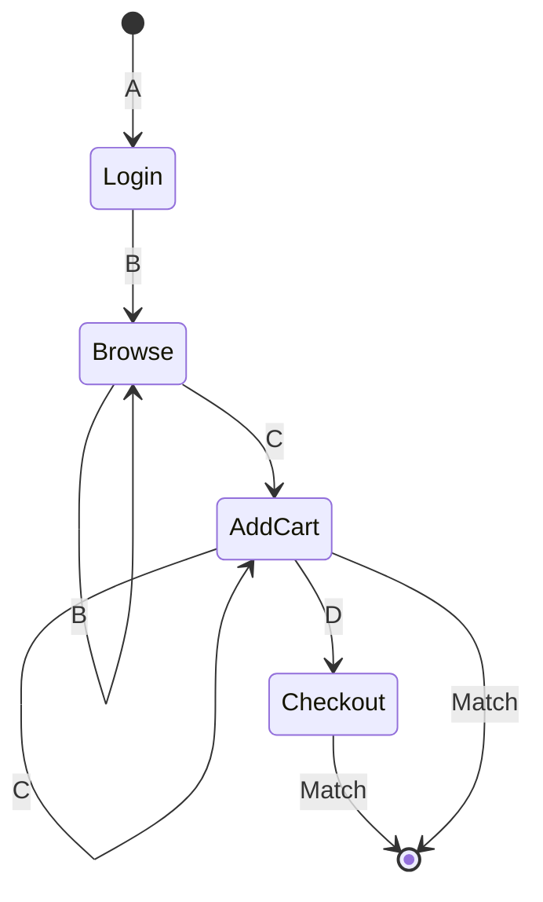

# Flink 模式匹配(MATCH_RECOGNIZE) 演进 特性跟踪

> 所属阶段: Flink/roadmap | 前置依赖: [CEP][^1] | 形式化等级: L4

## 1. 概念定义 (Definitions)

### Def-F-PATTERN-01: Pattern Recognition

模式识别：
$$
\text{Pattern} : \text{EventSequence} \to \text{Match}
$$

### Def-F-PATTERN-02: Pattern Grammar

模式语法：
$$
P = P_1 \text{ PATTERN } (A B+ C) \text{ DEFINE } (A AS ..., B AS ...)
$$

## 2. 属性推导 (Properties)

### Prop-F-PATTERN-01: Pattern Completeness

模式完整性：
$$
\text{Match} \Rightarrow \text{AllPatternConstraintsSatisfied}
$$

## 3. 关系建立 (Relations)

### 模式匹配演进

| 版本 | 能力 |
|------|------|
| 2.0 | 基础MATCH_RECOGNIZE |
| 2.4 | 增强模式 |
| 3.0 | 复杂事件处理融合 |

## 4. 论证过程 (Argumentation)

### 4.1 CEP与SQL融合



## 5. 形式证明 / 工程论证

### 5.1 模式匹配算法

**NFA (Non-deterministic Finite Automaton)**:

- 状态 = 模式定义
- 转移 = 事件匹配
- 输出 = 完整匹配

## 6. 实例验证 (Examples)

### 6.1 复杂模式

```sql
SELECT *
FROM events
MATCH_RECOGNIZE (
    PARTITION BY user_id
    ORDER BY event_time
    MEASURES
        A.event_time as start_time,
        LAST(C.event_time) as end_time
    PATTERN (A B* C+ D?)
    DEFINE
        A AS event_type = 'login',
        B AS event_type = 'browse',
        C AS event_type = 'add_cart',
        D AS event_type = 'checkout'
);
```

## 7. 可视化 (Visualizations)



## 8. 引用参考 (References)

[^1]: Flink CEP Documentation

---

## 跟踪信息

| 属性 | 值 |
|------|-----|
| 涵盖版本 | 2.0-3.0 |
| 当前状态 | GA |
