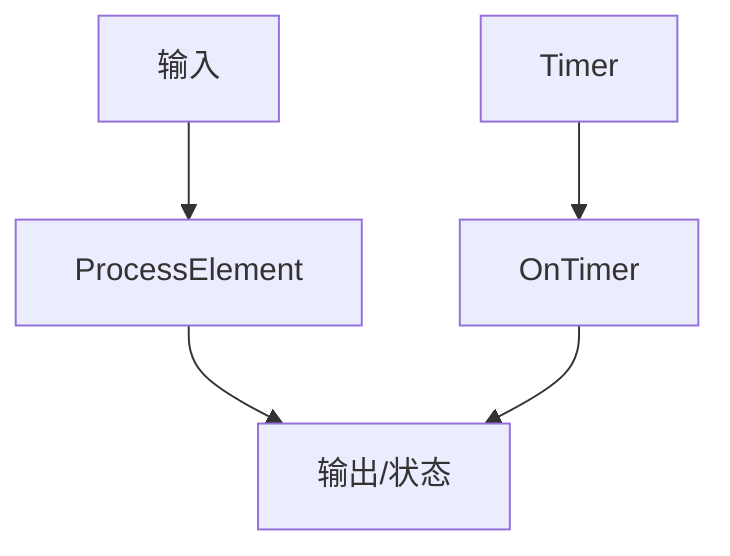
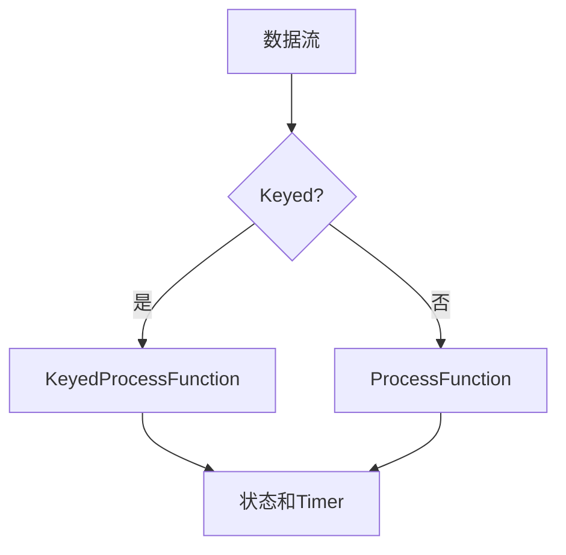

# Flink ProcessFunction API 演进 特性跟踪

> 所属阶段: Flink/roadmap | 前置依赖: [ProcessFunction][^1] | 形式化等级: L4

## 1. 概念定义 (Definitions)

### Def-F-PROCESS-01: ProcessFunction
处理函数：
$$
\text{ProcessFunction} : (\text{Input}, \text{Context}, \text{State}) \to \text{Output}
$$

### Def-F-PROCESS-02: Timer Service
定时器服务：
$$
\text{Timer} : \text{Timestamp} \to \text{Callback}
$$

## 2. 属性推导 (Properties)

### Prop-F-PROCESS-01: Timer Completeness
定时器完整性：
$$
\text{Timer}(t) \land \text{Watermark} \geq t \Rightarrow \text{Callback}
$$

## 3. 关系建立 (Relations)

### ProcessFunction演进

| 版本 | 特性 |
|------|------|
| 1.x | 基础ProcessFunction |
| 2.0 | KeyedProcessFunction |
| 2.4 | 批量Timer |
| 3.0 | 异步Timer |

## 4. 论证过程 (Argumentation)

### 4.1 ProcessFunction架构



## 5. 形式证明 / 工程论证

### 5.1 KeyedProcessFunction

```java
public class CountWithTimeout extends KeyedProcessFunction<String, Event, Result> {
    private ValueState<CountState> state;
    
    @Override
    public void processElement(Event value, Context ctx, Collector<Result> out) {
        CountState current = state.value();
        if (current == null) {
            current = new CountState();
            current.key = value.getKey();
        }
        current.count++;
        state.update(current);
        
        ctx.timerService().registerEventTimeTimer(ctx.timestamp() + 60000);
    }
    
    @Override
    public void onTimer(long timestamp, OnTimerContext ctx, Collector<Result> out) {
        out.collect(new Result(ctx.getCurrentKey(), state.value().count));
        state.clear();
    }
}
```

## 6. 实例验证 (Examples)

### 6.1 ProcessAllWindowFunction

```java
public class TopNFunction extends ProcessAllWindowFunction<Score, Ranking, TimeWindow> {
    @Override
    public void process(Context context, Iterable<Score> elements, Collector<Ranking> out) {
        List<Score> sorted = StreamSupport.stream(elements.spliterator(), false)
            .sorted(Comparator.comparing(Score::getValue).reversed())
            .limit(10)
            .collect(Collectors.toList());
        out.collect(new Ranking(sorted));
    }
}
```

## 7. 可视化 (Visualizations)



## 8. 引用参考 (References)

[^1]: Flink ProcessFunction

---

## 跟踪信息

| 属性 | 值 |
|------|-----|
| 涵盖版本 | 1.x-3.0 |
| 当前状态 | 批量Timer优化 |
