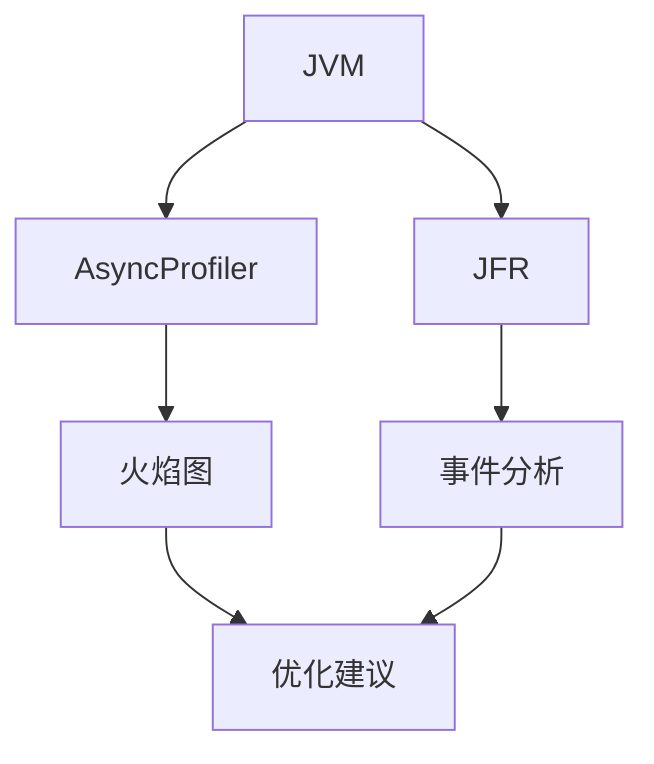
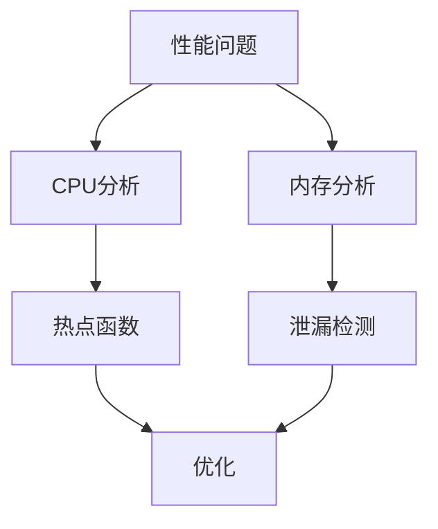

# Flink 性能分析 演进 特性跟踪

> 所属阶段: Flink/roadmap | 前置依赖: [Profiling][^1] | 形式化等级: L3

## 1. 概念定义 (Definitions)

### Def-F-PROF-01: CPU Profiling
CPU分析：
$$
\text{Profile} : \text{Time} \to \text{StackTrace}
$$

### Def-F-PROF-02: Memory Profiling
内存分析：
$$
\text{Memory} = \text{Heap} + \text{OffHeap} + \text{Native}
$$

## 2. 属性推导 (Properties)

### Prop-F-PROF-01: Sampling Overhead
采样开销：
$$
\text{Overhead}_{\text{profiling}} < 5\%
$$

## 3. 关系建立 (Relations)

### 性能分析演进

| 版本 | 特性 |
|------|------|
| 2.0 | JFR支持 |
| 2.4 | 火焰图 |
| 2.5 | 持续剖析 |
| 3.0 | 自动诊断 |

## 4. 论证过程 (Argumentation)

### 4.1 分析架构



## 5. 形式证明 / 工程论证

### 5.1 异步分析器

```java
// AsyncProfiler集成
public class ProfilerReporter implements MetricReporter {
    private AsyncProfiler profiler;
    
    @Override
    public void open(MetricConfig config) {
        profiler = AsyncProfiler.getInstance();
        profiler.start("event=cpu,interval=10ms,file=profile.html");
    }
}
```

## 6. 实例验证 (Examples)

### 6.1 JFR配置

```yaml
profiling:
  enabled: true
  type: jfr
  jfr:
    settings: profile
    filename: recording.jfr
```

## 7. 可视化 (Visualizations)



## 8. 引用参考 (References)

[^1]: AsyncProfiler, JFR

---

## 跟踪信息

| 属性 | 值 |
|------|-----|
| 涵盖版本 | 2.0-3.0 |
| 当前状态 | 持续剖析 |
