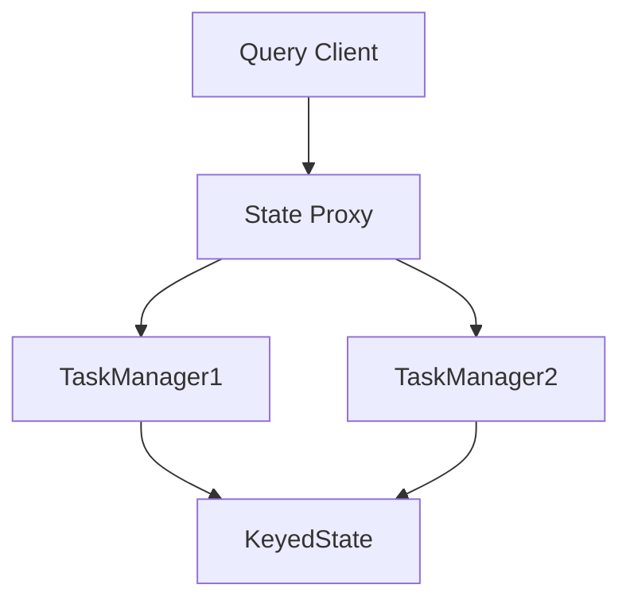
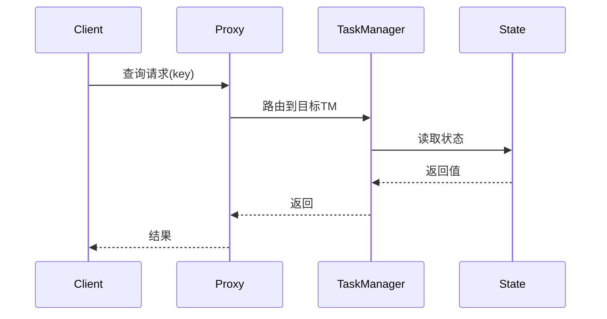

# Flink 查询状态API 演进 特性跟踪

> 所属阶段: Flink/roadmap | 前置依赖: [Queryable State][^1] | 形式化等级: L4

## 1. 概念定义 (Definitions)

### Def-F-QUERY-01: Queryable State
可查询状态：
$$
\text{Query} : \text{Key} \xrightarrow{\text{Client}} \text{StateValue}
$$

### Def-F-QUERY-02: State Proxy
状态代理：
$$
\text{Proxy} : \text{QueryRequest} \to \text{TaskManager}
$$

## 2. 属性推导 (Properties)

### Prop-F-QUERY-01: Read Consistency
读取一致性：
$$
\text{QueryResult} \approx \text{State}, \text{ within latency bound}
$$

## 3. 关系建立 (Relations)

### 查询API演进

| 版本 | 特性 |
|------|------|
| 1.x | Queryable State |
| 2.0 | 实验性 |
| 2.4 | SQL查询状态 |
| 3.0 | 统一查询层 |

## 4. 论证过程 (Argumentation)

### 4.1 查询架构



## 5. 形式证明 / 工程论证

### 5.1 可查询状态配置

```java
StateDescriptor<Tuple2<String, Long>, Long> descriptor = 
    new ValueStateDescriptor<>("count", Types.LONG);
descriptor.setQueryable("query-name");
```

### 5.2 SQL查询状态

```sql
-- 查询作业状态
SELECT * FROM TABLE(QUERY_STATE('job-id', 'state-name'))
WHERE key = 'user-123';
```

## 6. 实例验证 (Examples)

### 6.1 客户端查询

```java
QueryableStateClient client = new QueryableStateClient(tmHostname, proxyPort);

CompletableFuture<ValueState<Count>> result = client.getKvState(
    jobId,
    "query-name",
    key,
    Types.STRING,
    stateDescriptor
);
```

## 7. 可视化 (Visualizations)



## 8. 引用参考 (References)

[^1]: Flink Queryable State

---

## 跟踪信息

| 属性 | 值 |
|------|-----|
| 涵盖版本 | 1.x-3.0 |
| 当前状态 | SQL查询状态 |
