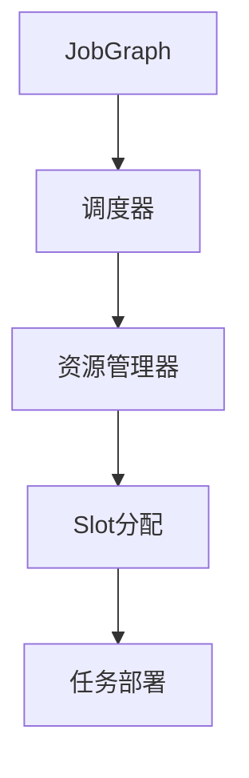
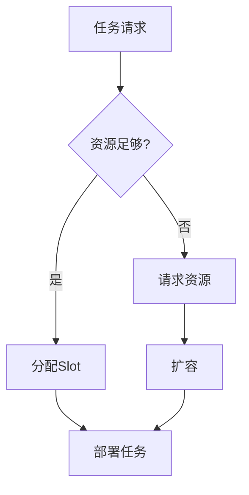

# Flink 资源调度 演进 特性跟踪

> 所属阶段: Flink/roadmap | 前置依赖: [Scheduler][^1] | 形式化等级: L4

## 1. 概念定义 (Definitions)

### Def-F-SCHED-01: Slot Allocation
Slot分配：
$$
\text{Allocation} : \text{Task} \to \text{Slot} \text{ s.t. } \text{Resources}(\text{Task}) \leq \text{SlotCapacity}
$$

### Def-F-SCHED-02: Scheduling Strategy
调度策略：
$$
\text{Strategy} \in \{\text{FIFO}, \text{Fair}, \text{Priority}, \text{Delay}\}
$$

## 2. 属性推导 (Properties)

### Prop-F-SCHED-01: Resource Balancing
资源平衡：
$$
\forall TM_i, TM_j : |\text{Load}_i - \text{Load}_j| < \epsilon
$$

## 3. 关系建立 (Relations)

### 调度演进

| 版本 | 特性 |
|------|------|
| 1.x | 基础调度 |
| 2.0 | 细粒度资源 |
| 2.4 | 自适应调度 |
| 3.0 | AI调度 |

## 4. 论证过程 (Argumentation)

### 4.1 调度架构



## 5. 形式证明 / 工程论证

### 5.1 自适应调度

```java
// 自适应调度配置
scheduler:
  type: adaptive
  min-parallelism: 2
  max-parallelism: 100
  target-utilization: 0.8
```

## 6. 实例验证 (Examples)

### 6.1 细粒度资源

```yaml
taskmanager.memory.process.size: 4gb
taskmanager.memory.managed.fraction: 0.4
pipeline.job-vertex.parallelism.auto-config: true
```

## 7. 可视化 (Visualizations)



## 8. 引用参考 (References)

[^1]: Flink Scheduler

---

## 跟踪信息

| 属性 | 值 |
|------|-----|
| 涵盖版本 | 1.x-3.0 |
| 当前状态 | 自适应调度 |
