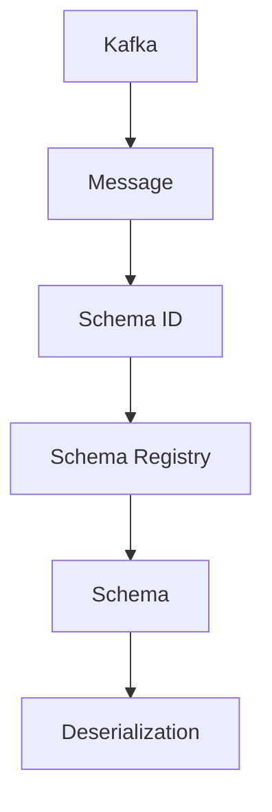
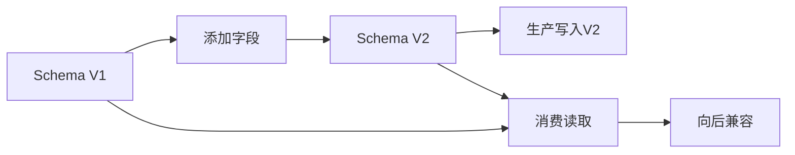

# Flink Schema Registry 集成 演进 特性跟踪

> 所属阶段: Flink/roadmap | 前置依赖: [Schema Registry][^1] | 形式化等级: L3

## 1. 概念定义 (Definitions)

### Def-F-SR-01: Schema Evolution

Schema演进：
$$
\text{Schema}_{v2} = \text{Schema}_{v1} + \Delta, \text{ backward compatible}
$$

### Def-F-SR-02: Schema Compatibility

Schema兼容性：
$$
\text{Compatibility} \in \{\text{BACKWARD}, \text{FORWARD}, \text{FULL}, \text{NONE}\}
$$

## 2. 属性推导 (Properties)

### Prop-F-SR-01: Version Resolution

版本解析：
$$
\text{Deserialize}(d, s_v) = o, \text{ where } v = \text{schema-version}(d)
$$

## 3. 关系建立 (Relations)

### Schema Registry演进

| Registry | 支持 |
|----------|------|
| Confluent | GA |
| AWS Glue | GA |
| Azure Schema Registry | Beta |
| Apicurio | GA |

## 4. 论证过程 (Argumentation)

### 4.1 Schema架构



## 5. 形式证明 / 工程论证

### 5.1 Confluent集成

```sql
CREATE TABLE events (
    user_id STRING,
    event_time TIMESTAMP(3)
) WITH (
    'connector' = 'kafka',
    'format' = 'avro-confluent',
    'avro-confluent.schema-registry.url' = 'http://schema-registry:8081'
);
```

## 6. 实例验证 (Examples)

### 6.1 模式演进处理

```java
// 向后兼容读取
DeserializationSchema<Event> schema = new AvroDeserializationSchema(
    Event.class,
    new SchemaRegistryClient("http://schema-registry:8081"),
    CompatibilityMode.BACKWARD
);
```

## 7. 可视化 (Visualizations)



## 8. 引用参考 (References)

[^1]: Confluent Schema Registry, Avro

---

## 跟踪信息

| 属性 | 值 |
|------|-----|
| 涵盖版本 | 1.x-3.0 |
| 当前状态 | GA |
