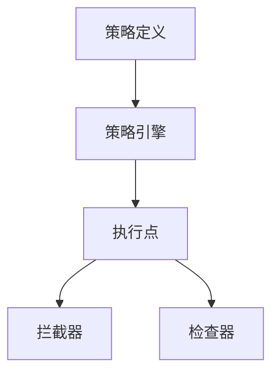
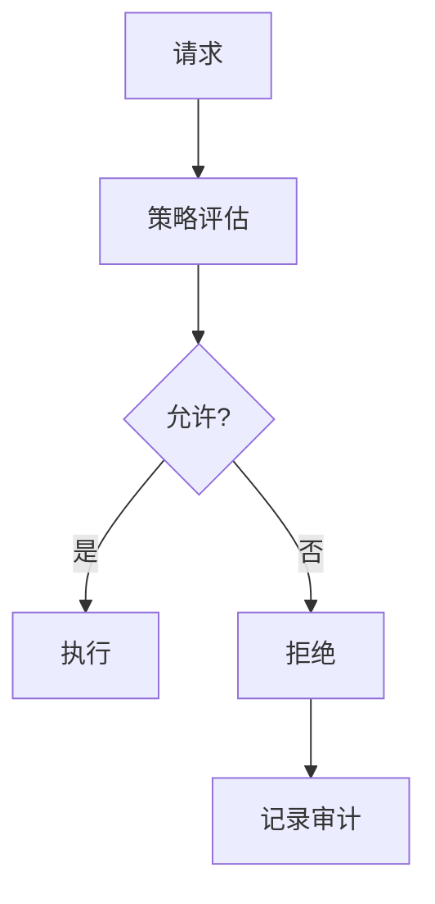

# Flink 安全策略 演进 特性跟踪

> 所属阶段: Flink/roadmap | 前置依赖: [Security Policy][^1] | 形式化等级: L4

## 1. 概念定义 (Definitions)

### Def-F-POLICY-01: Security Policy
安全策略：
$$
\text{Policy} = (\text{Rules}, \text{Actions}, \text{Conditions})
$$

### Def-F-POLICY-02: Policy Enforcement
策略执行：
$$
\text{Enforce} : \text{Event} \times \text{Policy} \to \text{Action}
$$

## 2. 属性推导 (Properties)

### Prop-F-POLICY-01: Policy Consistency
策略一致性：
$$
\forall p \in \text{Policies} : \neg\text{Conflict}(p)
$$

## 3. 关系建立 (Relations)

### 安全策略演进

| 版本 | 模型 |
|------|------|
| 2.0 | 静态策略 |
| 2.4 | 动态策略 |
| 3.0 | 自适应策略 |

## 4. 论证过程 (Argumentation)

### 4.1 策略架构



## 5. 形式证明 / 工程论证

### 5.1 OPA集成

```yaml
security.policy:
  engine: opa
  opa:
    url: http://opa:8181
    policy: flink/authz
  fallback: deny
```

## 6. 实例验证 (Examples)

### 6.1 Rego策略

```rego
package flink.authz

import future.keywords.if

default allow := false

allow if {
    input.user.role == "admin"
}

allow if {
    input.user.role == "operator"
    input.action == "view"
}
```

## 7. 可视化 (Visualizations)



## 8. 引用参考 (References)

[^1]: OPA, Cedar Policy

---

## 跟踪信息

| 属性 | 值 |
|------|-----|
| 涵盖版本 | 2.0-3.0 |
| 当前状态 | OPA集成 |
