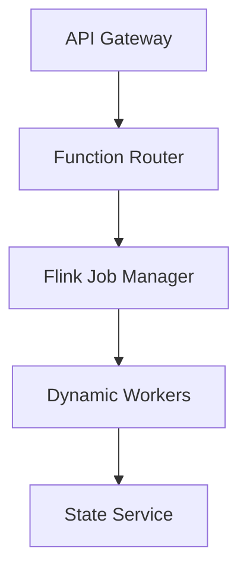
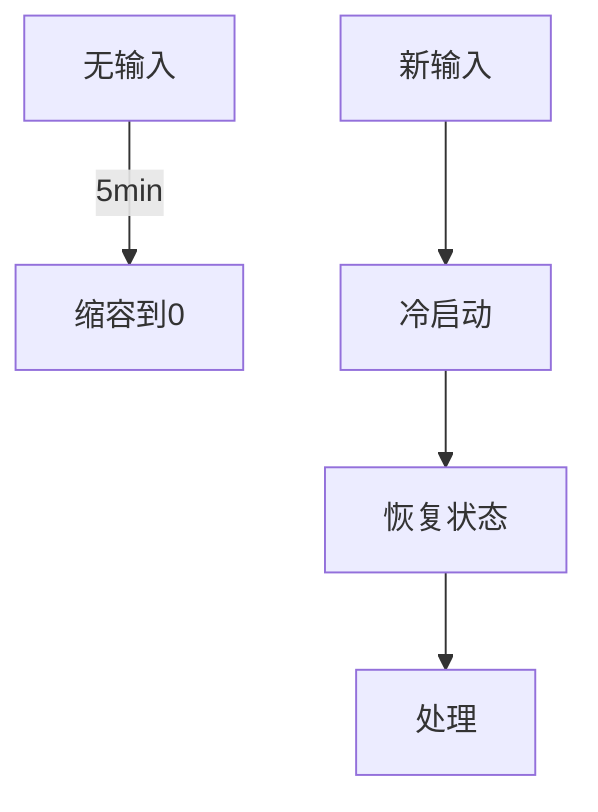

# Flink Serverless 部署 演进 特性跟踪

> 所属阶段: Flink/roadmap | 前置依赖: [Serverless Flink][^1] | 形式化等级: L4

## 1. 概念定义 (Definitions)

### Def-F-SERVERLESS-01: Serverless Flink
Serverless Flink：
$$
\text{Serverless} = \text{NoInfrastructure} + \text{AutoScale} + \text{PayPerUse}
$$

### Def-F-SERVERLESS-02: Cold Start
冷启动：
$$
T_{\text{cold}} = T_{\text{init}} + T_{\text{restore}}
$$

## 2. 属性推导 (Properties)

### Prop-F-SERVERLESS-01: Scale-To-Zero
缩容到零：
$$
\text{NoInput} \Rightarrow \text{ZeroResources}
$$

## 3. 关系建立 (Relations)

### Serverless演进

| 版本 | 特性 |
|------|------|
| 2.0 | Preview |
| 2.4 | GA |
| 2.5 | V2成熟 |
| 3.0 | 原生支持 |

## 4. 论证过程 (Argumentation)

### 4.1 Serverless架构



## 5. 形式证明 / 工程论证

### 5.1 配置示例

```yaml
execution.mode: serverless
serverless:
  autoscaling:
    min: 0
    max: 100
    scale-down-delay: 5min
  cold-start:
    keep-warm: true
    warm-pool-size: 2
```

## 6. 实例验证 (Examples)

### 6.1 SQL Serverless

```sql
-- 自动扩缩容
SET 'execution.serverless.enabled' = 'true';
SET 'serverless.target-latency' = '100ms';

SELECT * FROM events WHERE value > 100;
```

## 7. 可视化 (Visualizations)



## 8. 引用参考 (References)

[^1]: FLIP-318 Serverless Flink

---

## 跟踪信息

| 属性 | 值 |
|------|-----|
| 涵盖版本 | 2.0-3.0 |
| 当前状态 | 2.4 GA |
