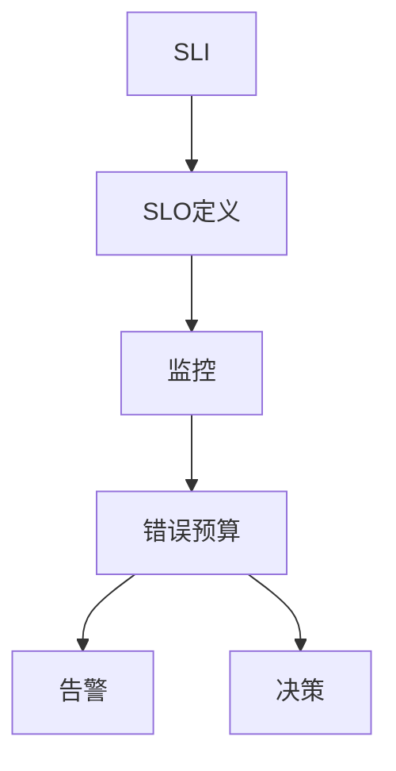
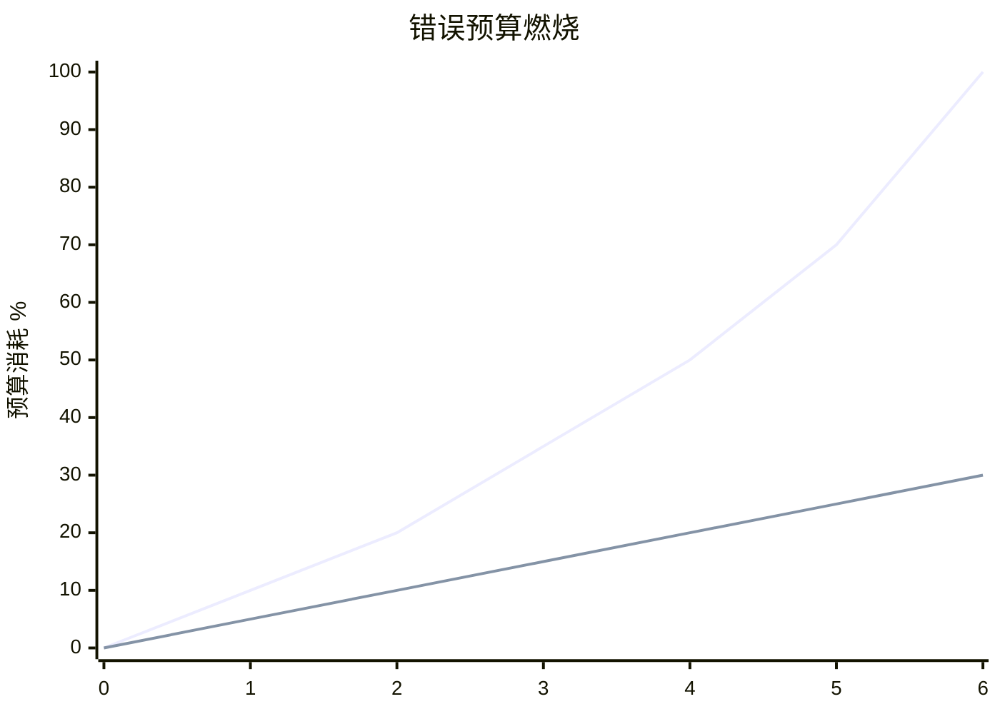

# Flink SLO管理 演进 特性跟踪

> 所属阶段: Flink/roadmap | 前置依赖: [SRE Practices][^1] | 形式化等级: L4

## 1. 概念定义 (Definitions)

### Def-F-SLO-01: Service Level Objective
服务水平目标：
$$
\text{SLO} : P(\text{Metric} \in \text{Target}) \geq \text{Threshold}
$$

### Def-F-SLO-02: Error Budget
错误预算：
$$
\text{Budget} = 1 - \text{SLO}
$$

## 2. 属性推导 (Properties)

### Prop-F-SLO-01: Burn Rate
燃烧率：
$$
\text{BurnRate} = \frac{\text{ErrorBudgetConsumed}}{\text{Time}}
$$

## 3. 关系建立 (Relations)

### SLO演进

| 版本 | 特性 |
|------|------|
| 2.4 | 基础SLO |
| 2.5 | 错误预算 |
| 3.0 | 自动修复 |

## 4. 论证过程 (Argumentation)

### 4.1 SLO架构



## 5. 形式证明 / 工程论证

### 5.1 SLO定义

```yaml
slo:
  name: processing_latency
  target: 99
  threshold: 100ms
  window: 30d
  
  burn_rates:
    fast: 14.4  # 2% budget in 1 hour
    slow: 2     # 5% budget in 6 hours
```

## 6. 实例验证 (Examples)

### 6.1 SLO仪表板

```sql
-- SLO计算
SELECT 
    job_name,
    SUM(CASE WHEN latency < 100 THEN 1 ELSE 0 END) * 100.0 / COUNT(*) as slo_percentage
FROM job_metrics
WHERE timestamp > NOW() - INTERVAL '30' DAY
GROUP BY job_name;
```

## 7. 可视化 (Visualizations)



## 8. 引用参考 (References)

[^1]: Google SRE Book

---

## 跟踪信息

| 属性 | 值 |
|------|-----|
| 涵盖版本 | 2.4-3.0 |
| 当前状态 | Beta |
