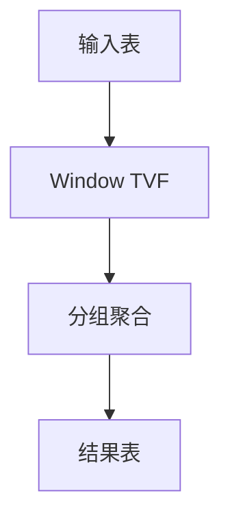

# Flink SQL/Table API 2.4 演进 特性跟踪

> 所属阶段: Flink/roadmap | 前置依赖: [Table API][^1] | 形式化等级: L3

## 1. 概念定义 (Definitions)

### Def-F-SQL24-01: ANSI SQL Compliance

ANSI SQL兼容性：
$$
\text{Compatibility} = \frac{|\text{Implemented}|}{|\text{ANSI SQL 2023}|}
$$

### Def-F-SQL24-02: Stream-Table Duality

流表对偶性：
$$
\text{Stream} \leftrightarrow \text{Table} : \text{Changelog}
$$

## 2. 属性推导 (Properties)

### Prop-F-SQL24-01: Query Stability

查询结果稳定性：
$$
\text{Result}_{\text{streaming}}(Q) \to \text{Result}_{\text{batch}}(Q), t \to \infty
$$

## 3. 关系建立 (Relations)

### 2.4 SQL特性

| 特性 | 描述 | 状态 |
|------|------|------|
| Window TVF | 窗口表值函数 | GA |
| MATCH_RECOGNIZE | 模式匹配 | GA |
| JSON函数 | SQL/JSON | GA |
| 时间旅行 | Temporal Query | Beta |

## 4. 论证过程 (Argumentation)

### 4.1 Window TVF演进

```sql
-- 2.4新语法
SELECT * FROM TABLE(
    TUMBLE(TABLE events, DESCRIPTOR(event_time), INTERVAL '5' MINUTES)
);
```

## 5. 形式证明 / 工程论证

### 5.1 窗口计算语义

**定理**: 窗口TVF保持事件时间语义。

## 6. 实例验证 (Examples)

### 6.1 MATCH_RECOGNIZE

```sql
SELECT *
FROM events
MATCH_RECOGNIZE (
    PARTITION BY user_id
    ORDER BY event_time
    MEASURES A.event_time as start_time
    PATTERN (A B+ C)
    DEFINE A AS event_type = 'start'
);
```

## 7. 可视化 (Visualizations)



## 8. 引用参考 (References)

[^1]: Flink Table API

---

## 跟踪信息

| 属性 | 值 |
|------|-----|
| 目标版本 | Flink 2.4 |
| 当前状态 | GA |
