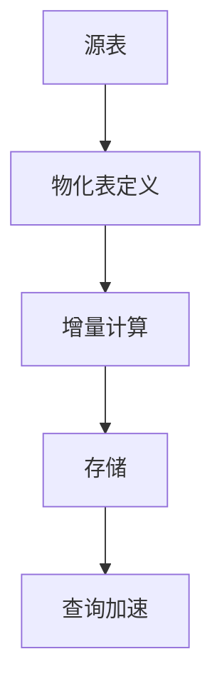
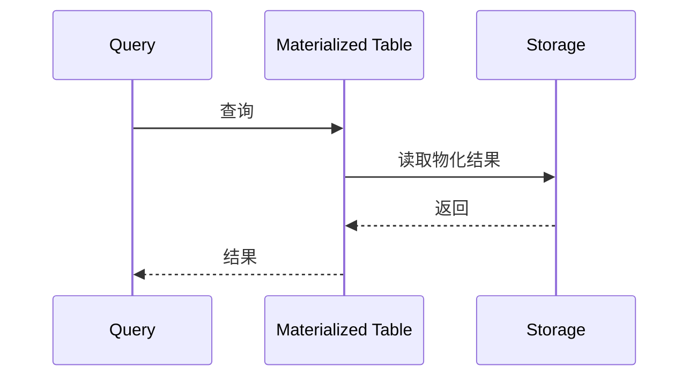

# Flink SQL/Table API 2.5 演进 特性跟踪

> 所属阶段: Flink/roadmap | 前置依赖: [2.4 SQL][^1] | 形式化等级: L3

## 1. 概念定义 (Definitions)

### Def-F-SQL25-01: Materialized Table

物化表定义：
$$
\text{MaterializedTable} = \text{Query} + \text{RefreshPolicy}
$$

### Def-F-SQL25-02: Incremental View Maintenance

增量视图维护：
$$
\Delta V = f(\Delta B, V_{\text{old}})
$$

## 2. 属性推导 (Properties)

### Prop-F-SQL25-01: View Freshness

视图新鲜度：
$$
\text{Freshness} = t_{\text{now}} - t_{\text{last\_refresh}}
$$

## 3. 关系建立 (Relations)

### 2.5 SQL特性

| 特性 | 描述 | 状态 |
|------|------|------|
| Materialized Table | 物化表 | Beta |
| Lookup Join增强 | 维表关联 | GA |
| Async UDF | 异步函数 | GA |
| Hint增强 | 优化器提示 | Beta |

## 4. 论证过程 (Argumentation)

### 4.1 物化表架构



## 5. 形式证明 / 工程论证

### 5.1 物化表定义

```sql
-- 2.5物化表
CREATE MATERIALIZED TABLE sales_summary
REFRESH EVERY '1' HOUR
AS SELECT
    region,
    SUM(amount) as total,
    COUNT(*) as cnt
FROM sales
GROUP BY region;
```

## 6. 实例验证 (Examples)

### 6.1 Async Lookup Join

```sql
SELECT o.*, c.name
FROM orders AS o
LEFT JOIN customers AS c
    ON o.customer_id = c.id
    WITH ASYNC LookupHint;
```

## 7. 可视化 (Visualizations)



## 8. 引用参考 (References)

[^1]: Flink 2.4 SQL

---

## 跟踪信息

| 属性 | 值 |
|------|-----|
| 目标版本 | Flink 2.5 |
| 当前状态 | 开发中 |
