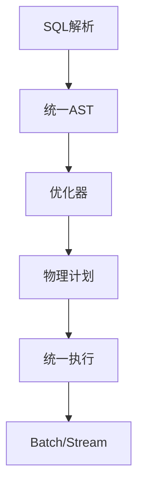
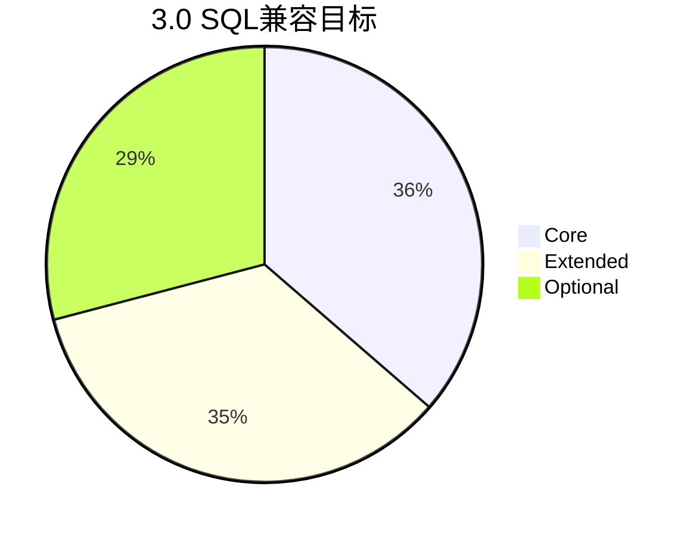

# Flink SQL/Table API 3.0 演进 特性跟踪

> 所属阶段: Flink/roadmap | 前置依赖: [2.5 SQL][^1] | 形式化等级: L4

## 1. 概念定义 (Definitions)

### Def-F-SQL30-01: Full SQL Standard

完全SQL标准支持：
$$
\text{FullSQL} = \text{ANSI SQL 2023} \cup \text{Streaming Extensions}
$$

### Def-F-SQL30-02: Unified SQL Engine

统一SQL引擎：
$$
\text{Engine}(\text{Batch}) \equiv \text{Engine}(\text{Streaming})
$$

## 2. 属性推导 (Properties)

### Prop-F-SQL30-01: Universal Portability

通用可移植性：
$$
Q_{\text{Flink}} \equiv Q_{\text{Standard}}, \forall Q \in \text{StandardSQL}
$$

## 3. 关系建立 (Relations)

### 3.0 SQL愿景

| 特性 | 描述 | 状态 |
|------|------|------|
| 100% ANSI | 完全兼容 | 规划 |
| 存储过程 | SQL/PSM | 研究 |
| 自定义类型 | UDT | 规划 |
| 高级分析 | Window函数增强 | 设计 |

## 4. 论证过程 (Argumentation)

### 4.1 统一引擎架构



## 5. 形式证明 / 工程论证

### 5.1 完全标准支持

```sql
-- 3.0愿景：完整SQL支持
CREATE TYPE address AS (
    street VARCHAR(100),
    city VARCHAR(50)
);

CREATE PROCEDURE process_orders()
BEGIN
    FOR order IN SELECT * FROM orders LOOP
        INSERT INTO processed VALUES (order.id);
    END LOOP;
END;
```

## 6. 实例验证 (Examples)

### 6.1 高级Window函数

```sql
-- 3.0增强Window函数
SELECT
    user_id,
    value,
    LAG(value, 2) OVER w as lag_2,
    LEAD(value, 2) OVER w as lead_2,
    FIRST_VALUE(value) OVER w as first,
    NTH_VALUE(value, 3) OVER w as third
FROM events
WINDOW w AS (PARTITION BY user_id ORDER BY event_time);
```

## 7. 可视化 (Visualizations)



## 8. 引用参考 (References)

[^1]: Flink 2.5 SQL

---

## 跟踪信息

| 属性 | 值 |
|------|-----|
| 目标版本 | Flink 3.0 |
| 当前状态 | 愿景阶段 |
