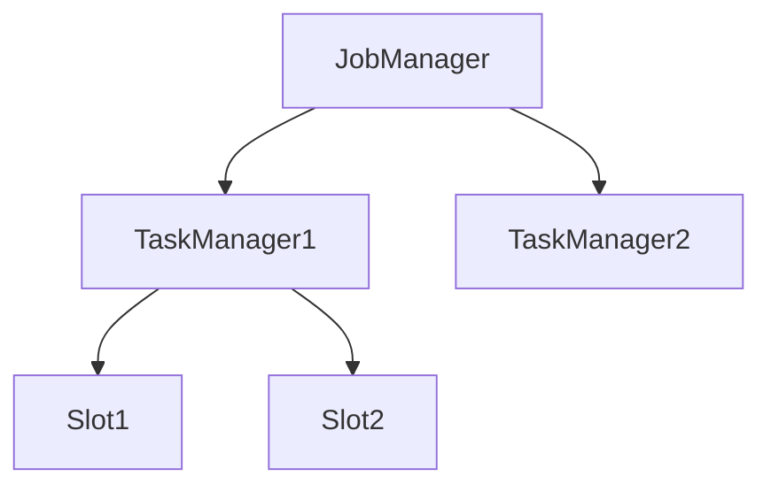
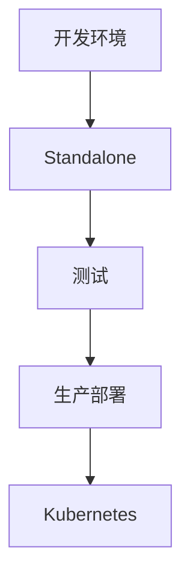

# Flink Standalone 部署 演进 特性跟踪

> 所属阶段: Flink/roadmap | 前置依赖: [Standalone Setup][^1] | 形式化等级: L3

## 1. 概念定义 (Definitions)

### Def-F-STANDALONE-01: Standalone Cluster
Standalone集群：
$$
\text{Cluster} = \text{JobManager} \cup \{\text{TaskManager}_i\}_{i=1}^n
$$

### Def-F-STANDALONE-02: Embedded Mode
嵌入式模式：
$$
\text{Embedded} : \text{Job} \to \text{SameProcess}
$$

## 2. 属性推导 (Properties)

### Prop-F-STANDALONE-01: Minimal Overhead
最小开销：
$$
\text{Overhead}_{\text{standalone}} < \text{Overhead}_{\text{managed}}
$$

## 3. 关系建立 (Relations)

### Standalone演进

| 版本 | 特性 |
|------|------|
| 1.x | 基础Standalone |
| 2.0 | Docker支持 |
| 2.4 | Compose集成 |
| 3.0 | 轻量级模式 |

## 4. 论证过程 (Argumentation)

### 4.1 部署架构



## 5. 形式证明 / 工程论证

### 5.1 Docker部署

```yaml
version: '3'
services:
  jobmanager:
    image: flink:2.4
    command: jobmanager
    ports:
      - "8081:8081"
  
  taskmanager:
    image: flink:2.4
    command: taskmanager
    environment:
      - JOB_MANAGER_RPC_ADDRESS=jobmanager
```

## 6. 实例验证 (Examples)

### 6.1 本地开发

```java
// 嵌入式模式
StreamExecutionEnvironment env = 
    StreamExecutionEnvironment.createLocalEnvironment(2);
```

## 7. 可视化 (Visualizations)



## 8. 引用参考 (References)

[^1]: Flink Standalone Deployment

---

## 跟踪信息

| 属性 | 值 |
|------|-----|
| 涵盖版本 | 1.x-3.0 |
| 当前状态 | 稳定 |
