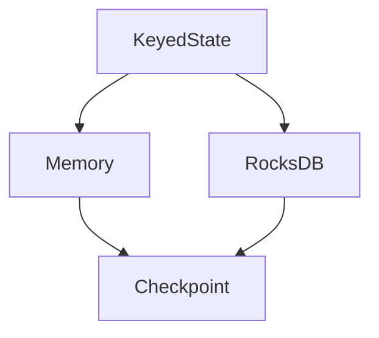
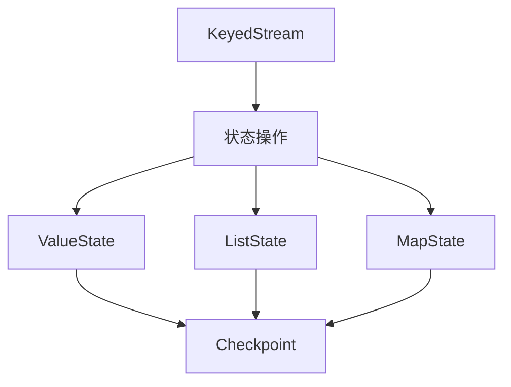

# Flink State API 演进 特性跟踪

> 所属阶段: Flink/roadmap | 前置依赖: [State API][^1] | 形式化等级: L4

## 1. 概念定义 (Definitions)

### Def-F-STATE-01: State Types
状态类型：
$$
\text{State} \in \{\text{Value}, \text{List}, \text{Map}, \text{Reducing}, \text{Aggregating}\}
$$

### Def-F-STATE-02: State Backend
状态后端：
$$
\text{Backend} \in \{\text{Memory}, \text{FsState}, \text{RocksDB}, \text{ForSt}\}
$$

## 2. 属性推导 (Properties)

### Prop-F-STATE-01: State Persistence
状态持久化：
$$
\text{Checkpoint} \Rightarrow \text{StatePersisted}
$$

## 3. 关系建立 (Relations)

### State API演进

| 版本 | 特性 |
|------|------|
| 1.x | 基础State |
| 2.0 | State TTL |
| 2.4 | 异步Snapshot |
| 3.0 | 分离式状态 |

## 4. 论证过程 (Argumentation)

### 4.1 状态架构



## 5. 形式证明 / 工程论证

### 5.1 状态使用

```java
public class CountFunction extends RichFlatMapFunction<String, Tuple2<String, Integer>> {
    private ValueState<Integer> countState;
    
    @Override
    public void open(Configuration parameters) {
        StateTtlConfig ttlConfig = StateTtlConfig
            .newBuilder(Time.hours(1))
            .setUpdateType(OnCreateAndWrite)
            .build();
            
        ValueStateDescriptor<Integer> descriptor = 
            new ValueStateDescriptor<>("count", Types.INT);
        descriptor.enableTimeToLive(ttlConfig);
        countState = getRuntimeContext().getState(descriptor);
    }
}
```

## 6. 实例验证 (Examples)

### 6.1 MapState使用

```java
MapState<String, Integer> mapState = getRuntimeContext()
    .getMapState(new MapStateDescriptor<>("user-counts", String.class, Integer.class));
```

## 7. 可视化 (Visualizations)



## 8. 引用参考 (References)

[^1]: Flink State Management

---

## 跟踪信息

| 属性 | 值 |
|------|-----|
| 涵盖版本 | 1.x-3.0 |
| 当前状态 | 异步Snapshot |
