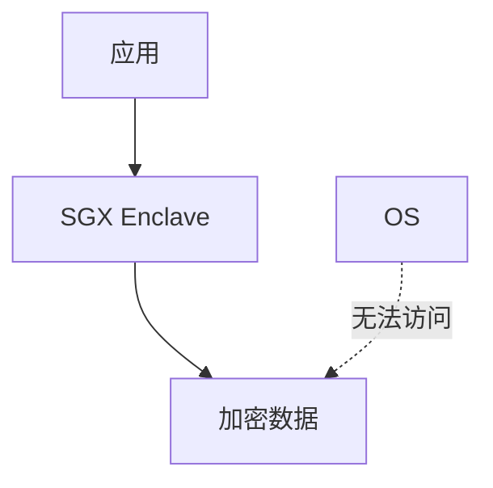
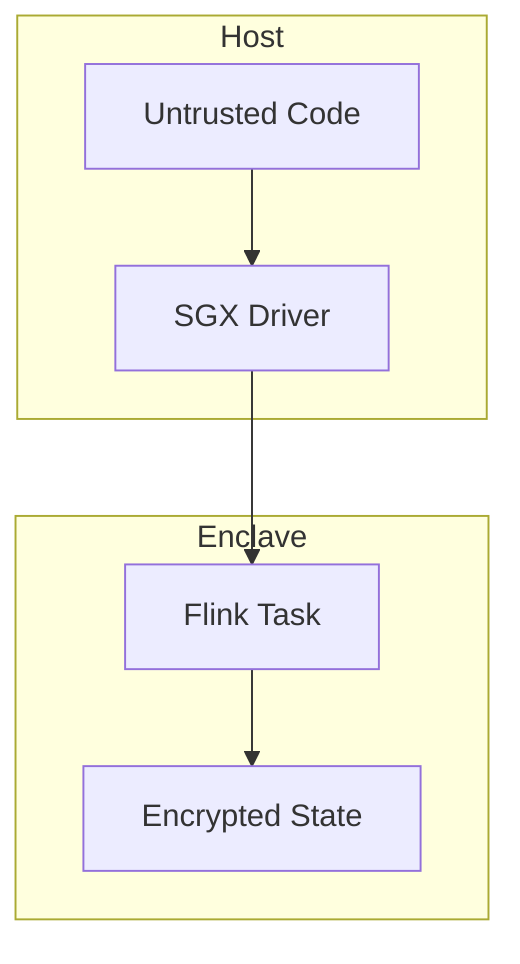

# Flink 可信执行环境 演进 特性跟踪

> 所属阶段: Flink/roadmap | 前置依赖: [TEE][^1] | 形式化等级: L4

## 1. 概念定义 (Definitions)

### Def-F-TEE-01: Trusted Execution Environment
可信执行环境：
$$
\text{TEE} : \text{Code} \to \text{Execution}, \text{ isolated from OS}
$$

### Def-F-TEE-02: Remote Attestation
远程证明：
$$
\text{Attest} : \text{TEE} \to \text{Evidence} \to \{\text{Trusted}, \text{Untrusted}\}
$$

## 2. 属性推导 (Properties)

### Prop-F-TEE-01: Memory Isolation
内存隔离：
$$
\text{TEE}_{\text{memory}} \cap \text{OS}_{\text{memory}} = \emptyset
$$

## 3. 关系建立 (Relations)

### TEE演进

| 版本 | 支持 |
|------|------|
| 2.4 | 研究 |
| 2.5 | 预览 |
| 3.0 | 生产 |

## 4. 论证过程 (Argumentation)

### 4.1 TEE架构



## 5. 形式证明 / 工程论证

### 5.1 SGX配置

```yaml
security.tee:
  enabled: true
  type: sgx
  enclave:
    size: 256M
    debug: false
  attestation:
    provider: intel
```

## 6. 实例验证 (Examples)

### 6.1 敏感数据处理

```java
@Enclave
public class SensitiveProcessor {
    public EncryptedResult process(SensitiveData data) {
        // 在Enclave内执行
        return encrypt(analyze(data));
    }
}
```

## 7. 可视化 (Visualizations)



## 8. 引用参考 (References)

[^1]: Intel SGX, AMD SEV

---

## 跟踪信息

| 属性 | 值 |
|------|-----|
| 涵盖版本 | 2.4-3.0 |
| 当前状态 | 研究阶段 |
