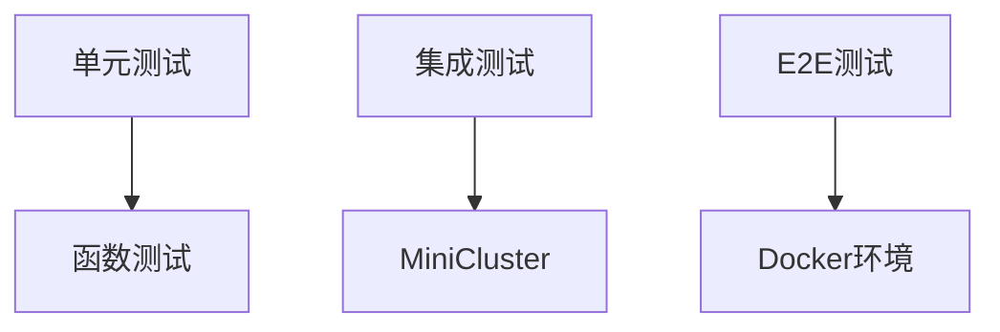
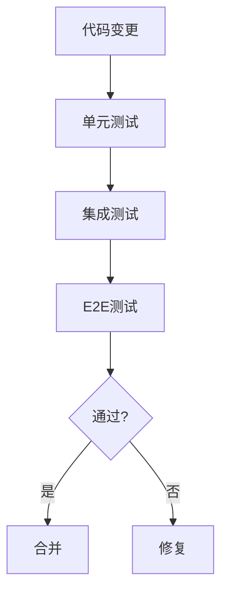

# Flink 测试工具 演进 特性跟踪

> 所属阶段: Flink/roadmap | 前置依赖: [Testing][^1] | 形式化等级: L3

## 1. 概念定义 (Definitions)

### Def-F-TEST-01: Unit Test
单元测试：
$$
\text{UnitTest} : \text{Function} \times \text{Input} \to \{\text{Pass}, \text{Fail}\}
$$

### Def-F-TEST-02: Integration Test
集成测试：
$$
\text{Integration} : \text{Job} \times \text{Environment} \to \{\text{Pass}, \text{Fail}\}
$$

## 2. 属性推导 (Properties)

### Prop-F-TEST-01: Test Isolation
测试隔离：
$$
\text{Test}_i \perp \text{Test}_j, i \neq j
$$

## 3. 关系建立 (Relations)

### 测试工具演进

| 版本 | 特性 |
|------|------|
| 1.x | MiniCluster |
| 2.0 | DataStream API Test |
| 2.4 | Table API Test |
| 3.0 | Chaos Engineering |

## 4. 论证过程 (Argumentation)

### 4.1 测试架构



## 5. 形式证明 / 工程论证

### 5.1 DataStream测试

```java
@Test
public void testMapFunction() throws Exception {
    StreamExecutionEnvironment env = 
        StreamExecutionEnvironment.getExecutionEnvironment();
    env.setParallelism(1);
    
    DataStream<String> input = env.fromElements("a", "b", "c");
    DataStream<String> output = input.map(String::toUpperCase);
    
    assertThat(
        DataStreamUtils.collect(output),
        contains("A", "B", "C")
    );
}
```

## 6. 实例验证 (Examples)

### 6.1 Table测试

```java
@Test
public void testSQL() {
    StreamTableEnvironment tableEnv = StreamTableEnvironment.create(env);
    
    tableEnv.executeSql("CREATE TABLE test (id INT, name STRING)");
    tableEnv.executeSql("INSERT INTO test VALUES (1, 'Alice')");
    
    TableResult result = tableEnv.executeSql("SELECT * FROM test");
    assertThat(result, hasRow(1, "Alice"));
}
```

## 7. 可视化 (Visualizations)



## 8. 引用参考 (References)

[^1]: Flink Testing Documentation

---

## 跟踪信息

| 属性 | 值 |
|------|-----|
| 涵盖版本 | 1.x-3.0 |
| 当前状态 | 完善中 |
