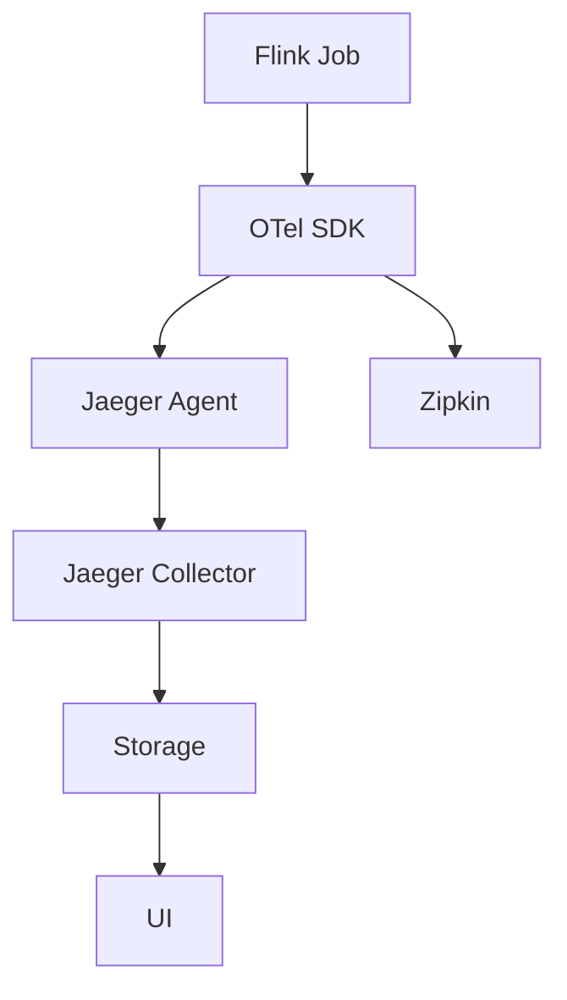
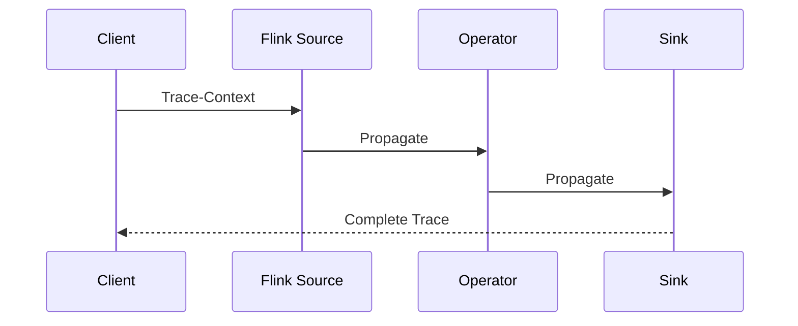

# Flink 追踪系统 演进 特性跟踪

> 所属阶段: Flink/roadmap | 前置依赖: [Distributed Tracing][^1] | 形式化等级: L3

## 1. 概念定义 (Definitions)

### Def-F-TRACE-01: Trace Structure
追踪结构：
$$
\text{Trace} = \{\text{Span}_i\}_{i=1}^n, \text{Span} = (\text{ID}, \text{Parent}, \text{Op}, \text{Duration})
$$

### Def-F-TRACE-02: Context Propagation
上下文传播：
$$
\text{Context} \xrightarrow{\text{Propagator}} \text{Carrier} \xrightarrow{\text{Extract}} \text{Context}'
$$

## 2. 属性推导 (Properties)

### Prop-F-TRACE-01: Trace Completeness
追踪完整性：
$$
\text{Coverage} = \frac{|\text{TracedOps}|}{|\text{TotalOps}|} \geq 0.95
$$

## 3. 关系建立 (Relations)

### 追踪演进

| 版本 | 特性 |
|------|------|
| 1.x | 无原生支持 |
| 2.0 | OpenTracing |
| 2.4 | OpenTelemetry |
| 3.0 | 自动采样 |

## 4. 论证过程 (Argumentation)

### 4.1 追踪架构



## 5. 形式证明 / 工程论证

### 5.1 OpenTelemetry配置

```yaml
tracing:
  enabled: true
  exporter: otlp
  otlp:
    endpoint: http://jaeger:4317
  sampling:
    type: ratio
    ratio: 0.1
```

## 6. 实例验证 (Examples)

### 6.1 自定义Span

```java
public class TracedFunction extends RichMapFunction<String, String> {
    private transient Tracer tracer;
    
    @Override
    public String map(String value) {
        Span span = tracer.spanBuilder("process").startSpan();
        try (Scope scope = span.makeCurrent()) {
            return process(value);
        } finally {
            span.end();
        }
    }
}
```

## 7. 可视化 (Visualizations)



## 8. 引用参考 (References)

[^1]: OpenTelemetry, Jaeger

---

## 跟踪信息

| 属性 | 值 |
|------|-----|
| 涵盖版本 | 2.0-3.0 |
| 当前状态 | OTel集成 |
