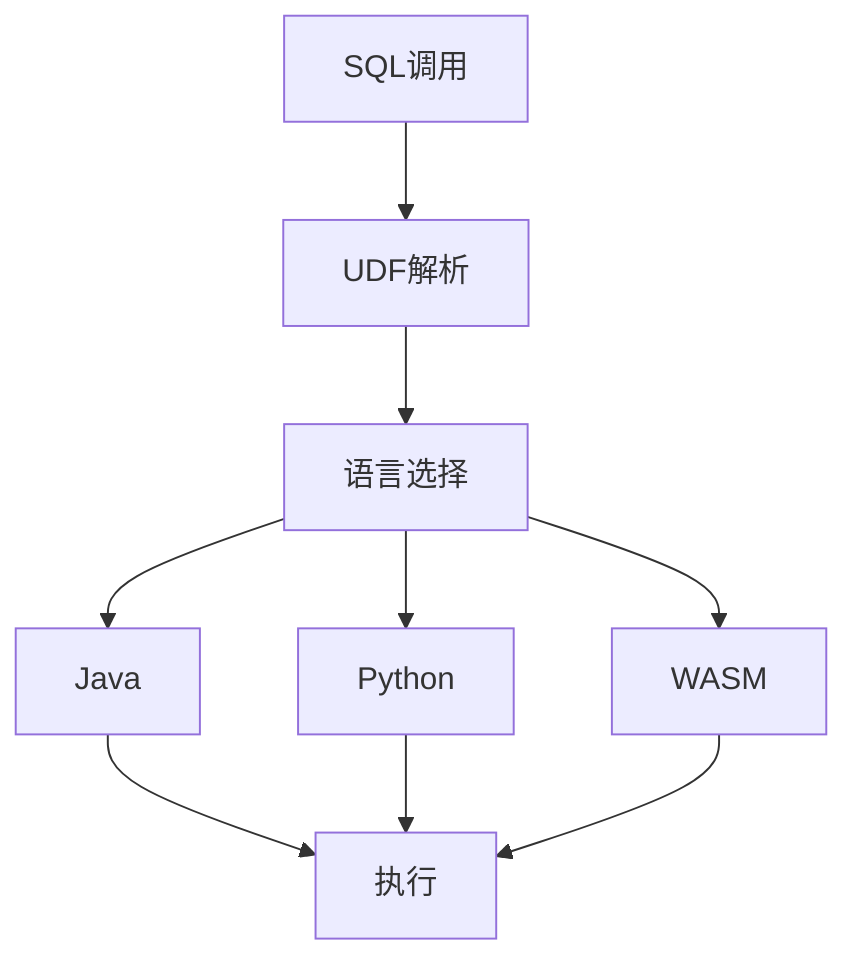

# Flink UDF 演进 特性跟踪

> 所属阶段: Flink/roadmap | 前置依赖: [UDF机制][^1] | 形式化等级: L3

## 1. 概念定义 (Definitions)

### Def-F-UDF-01: UDF Classification

UDF分类：
$$
\text{UDF} = \text{Scalar} \cup \text{Aggregate} \cup \text{Table}
$$

### Def-F-UDF-02: Language Support

语言支持：
$$
\text{Languages} = \{\text{Java}, \text{Scala}, \text{Python}, \text{WASM}\}
$$

## 2. 属性推导 (Properties)

### Prop-F-UDF-01: Isolation

UDF隔离性：
$$
\text{Failure}(UDF_i) \not\Rightarrow \text{Failure}(System)
$$

## 3. 关系建立 (Relations)

### UDF演进

| 版本 | 特性 |
|------|------|
| 1.x | Java/Scala UDF |
| 2.0 | Python UDF |
| 2.4 | WASM预览 |
| 2.5 | WASM GA |
| 3.0 | AI-Native UDF |

## 4. 论证过程 (Argumentation)

### 4.1 UDF执行架构



## 5. 形式证明 / 工程论证

### 5.1 Python UDF

```python
from pyflink.table import udf
from pyflink.table.types import DataTypes

@udf(result_type=DataTypes.STRING())
def my_func(s: str) -> str:
    return s.upper()
```

## 6. 实例验证 (Examples)

### 6.1 WASM UDF

```rust
#[udf]
pub fn process(input: &str) -> String {
    input.to_lowercase()
}
```

## 7. 可视化 (Visualizations)


## 8. 引用参考 (References)

[^1]: Flink UDF Documentation

---

## 跟踪信息

| 属性 | 值 |
|------|-----|
| 涵盖版本 | 1.x-3.0 |
| 当前状态 | WASM GA |
