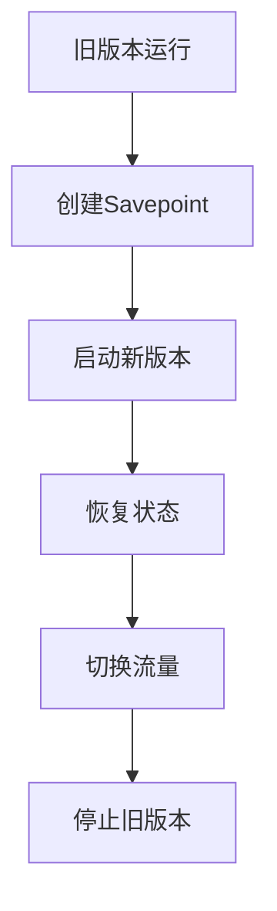
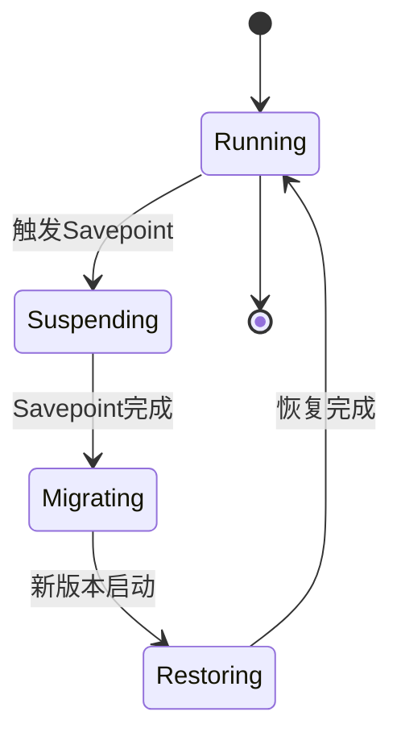

# Flink 升级策略 演进 特性跟踪

> 所属阶段: Flink/roadmap | 前置依赖: [Upgrading][^1] | 形式化等级: L4

## 1. 概念定义 (Definitions)

### Def-F-UPGRADE-01: Rolling Upgrade
滚动升级：
$$
\text{Rolling} : V_{\text{old}} \to V_{\text{new}} \text{ without downtime}
$$

### Def-F-UPGRADE-02: State Migration
状态迁移：
$$
\text{State}_{\text{old}} \xrightarrow{\text{Transform}} \text{State}_{\text{new}}
$$

## 2. 属性推导 (Properties)

### Prop-F-UPGRADE-01: Compatibility
兼容性：
$$
\text{Compatible} \Rightarrow \text{State}_{\text{new}} \supseteq \text{State}_{\text{old}}
$$

### Prop-F-UPGRADE-02: Zero Downtime
零停机：
$$
T_{\text{downtime}} = 0
$$

## 3. 关系建立 (Relations)

### 升级策略演进

| 版本 | 策略 |
|------|------|
| 1.x | 停机升级 |
| 2.0 | Savepoint升级 |
| 2.4 | 滚动升级 |
| 3.0 | 热升级 |

## 4. 论证过程 (Argumentation)

### 4.1 滚动升级流程



## 5. 形式证明 / 工程论证

### 5.1 状态兼容性检查

```java
// 检查状态兼容性
public class StateCompatibility {
    public boolean check(StateDescriptor old, StateDescriptor neW) {
        return old.getSerializer().equals(new.getSerializer());
    }
}
```

## 6. 实例验证 (Examples)

### 6.1 升级命令

```bash
# 创建Savepoint
./bin/flink savepoint <job-id> s3://bucket/savepoints

# 从Savepoint启动新版本
./bin/flink run -s s3://bucket/savepoints/... \
    -c com.example.Main ./new-job.jar
```

## 7. 可视化 (Visualizations)



## 8. 引用参考 (References)

[^1]: Flink Upgrading Documentation

---

## 跟踪信息

| 属性 | 值 |
|------|-----|
| 涵盖版本 | 1.x-3.0 |
| 当前状态 | 滚动升级 |
