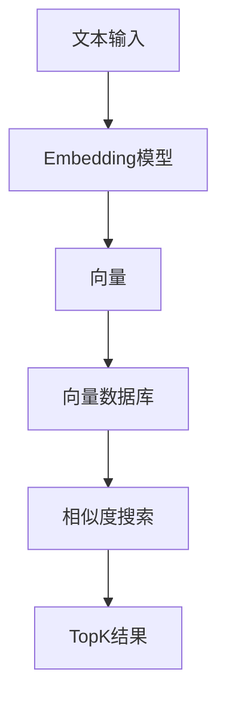
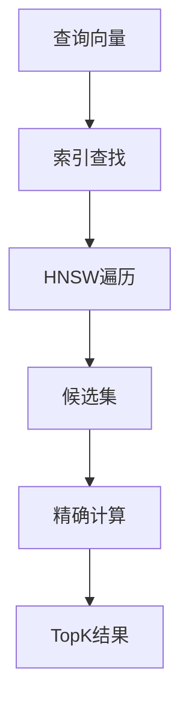

# Flink 向量搜索 演进 特性跟踪

> 所属阶段: Flink/roadmap | 前置依赖: [Vector DB][^1] | 形式化等级: L4

## 1. 概念定义 (Definitions)

### Def-F-VECTOR-01: Vector Embedding
向量嵌入：
$$
\text{Embed} : \text{Text} \to \mathbb{R}^d
$$

### Def-F-VECTOR-02: Similarity Search
相似度搜索：
$$
\text{Search}(q, D, k) = \arg\max_{x \subset D, |x|=k} \text{Similarity}(q, x)
$$

## 2. 属性推导 (Properties)

### Prop-F-VECTOR-01: Approximation Bound
近似边界：
$$
\text{Recall}@k \geq 0.95
$$

## 3. 关系建立 (Relations)

### 向量搜索演进

| 版本 | 特性 |
|------|------|
| 2.4 | 基础集成 |
| 2.5 | 实时更新 |
| 3.0 | 内置索引 |

## 4. 论证过程 (Argumentation)

### 4.1 向量搜索架构



## 5. 形式证明 / 工程论证

### 5.1 向量索引

```java
// HNSW索引
public class VectorSearchFunction extends ProcessFunction<String, Result> {
    private transient HNSWIndex index;
    
    @Override
    public void processElement(String query, Context ctx, Collector<Result> out) {
        float[] vector = embeddingModel.encode(query);
        List<Neighbor> neighbors = index.search(vector, 10);
        out.collect(new Result(neighbors));
    }
}
```

## 6. 实例验证 (Examples)

### 6.1 向量查找表

```sql
CREATE TABLE vector_index (
    id STRING,
    vector ARRAY<FLOAT>,
    metadata STRING,
    PRIMARY KEY (id) NOT ENFORCED
) WITH (
    'connector' = 'vector-db',
    'vector-db.type' = 'milvus',
    'vector-db.dimension' = '768'
);
```

## 7. 可视化 (Visualizations)



## 8. 引用参考 (References)

[^1]: Vector Databases (Milvus, Pinecone)

---

## 跟踪信息

| 属性 | 值 |
|------|-----|
| 涵盖版本 | 2.4-3.0 |
| 当前状态 | Beta |
