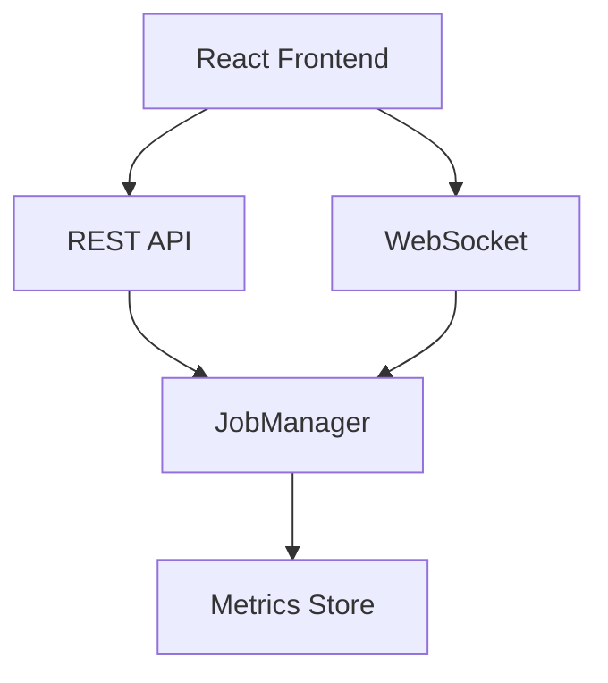
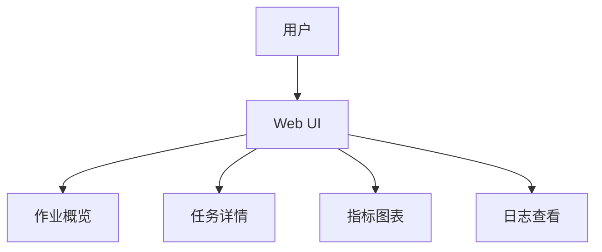

# Flink Web UI 演进 特性跟踪

> 所属阶段: Flink/roadmap | 前置依赖: [Web UI][^1] | 形式化等级: L3

## 1. 概念定义 (Definitions)

### Def-F-WEBUI-01: Dashboard Metrics
仪表板指标：
$$
\text{Dashboard} = \{\text{Widget}_i(\text{Metric}_j)\}_{i,j=1}^{n,m}
$$

### Def-F-WEBUI-02: Interactive Query
交互式查询：
$$
\text{Query} : \text{UserInput} \to \text{Visualization}
$$

## 2. 属性推导 (Properties)

### Prop-F-WEBUI-01: Real-Time Update
实时更新：
$$
\text{Latency}_{\text{UI}} < 5s
$$

## 3. 关系建立 (Relations)

### Web UI演进

| 版本 | 特性 |
|------|------|
| 1.x | 基础UI |
| 2.0 | React重构 |
| 2.4 | 增强可视化 |
| 3.0 | AI助手 |

## 4. 论证过程 (Argumentation)

### 4.1 UI架构



## 5. 形式证明 / 工程论证

### 5.1 自定义仪表板

```javascript
// 自定义Widget
const CustomWidget = {
  type: 'line-chart',
  metrics: ['taskmanager.cpu.load', 'taskmanager.memory.used'],
  aggregation: 'AVG',
  timeRange: '1h'
};
```

## 6. 实例验证 (Examples)

### 6.1 SQL编辑器

```sql
-- Web UI SQL查询
SELECT 
    task_name,
    COUNT(*) as record_count,
    AVG(duration) as avg_duration
FROM task_metrics
WHERE job_id = '<job-id>'
GROUP BY task_name;
```

## 7. 可视化 (Visualizations)



## 8. 引用参考 (References)

[^1]: Flink Web Dashboard

---

## 跟踪信息

| 属性 | 值 |
|------|-----|
| 涵盖版本 | 1.x-3.0 |
| 当前状态 | 增强可视化 |
