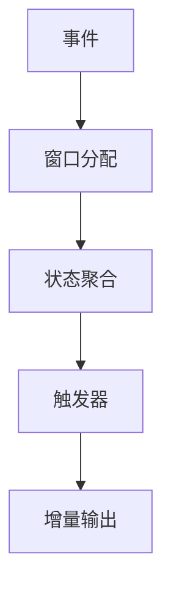

# Flink Window API 演进 特性跟踪

> 所属阶段: Flink/roadmap | 前置依赖: [Window机制][^1] | 形式化等级: L4

## 1. 概念定义 (Definitions)

### Def-F-WIN-01: Window Semantics

窗口语义定义：
$$
\text{Window} : \text{EventStream} \to \text{BoundedStream}
$$

### Def-F-WIN-02: Window Types

窗口类型：
$$
\text{WindowTypes} = \{\text{Tumbling}, \text{Sliding}, \text{Session}, \text{Global}\}
$$

## 2. 属性推导 (Properties)

### Prop-F-WIN-01: Completeness

窗口完整性：
$$
\bigcup_{w \in \text{Windows}} w = \text{AllEvents}
$$

### Prop-F-WIN-02: Non-Overlap (Tumbling)

滚动窗口互斥：
$$
\forall w_i, w_j \in \text{TumblingWindows}, i \neq j : w_i \cap w_j = \emptyset
$$

## 3. 关系建立 (Relations)

### Window演进

| 版本 | 特性 |
|------|------|
| 1.x | 基础窗口 |
| 2.0 | Window TVF |
| 2.4 | Incremental计算 |
| 3.0 | 自适应窗口 |

## 4. 论证过程 (Argumentation)

### 4.1 窗口计算优化



## 5. 形式证明 / 工程论证

### 5.1 窗口正确性

**定理**: 窗口聚合结果与批处理等价。

**证明**:
设批处理结果为 $R_{batch}$，流处理窗口结果为 $\{R_{w_1}, ..., R_{w_n}\}$。

由于窗口覆盖所有事件且无重叠：
$$
\bigcup_{i} R_{w_i} = R_{batch}
$$

## 6. 实例验证 (Examples)

### 6.1 会话窗口

```java
// 会话窗口使用
stream
    .keyBy(Event::getUserId)
    .window(EventTimeSessionWindows.withGap(Time.minutes(10)))
    .aggregate(new CountAggregate());
```

## 7. 可视化 (Visualizations)

```mermaid
gantt
    title 窗口类型对比
    dateFormat X
    axisFormat %s

    section Tumbling
    Window 1           :0, 5
    Window 2           :5, 10
    Window 3           :10, 15

    section Sliding
    Window 1           :0, 5
    Window 2           :3, 8
    Window 3           :6, 11

    section Session
    Session 1          :0, 3
    Session 2          :5, 8
    Session 3          :10, 14
```



## 8. 引用参考 (References)

[^1]: Flink Window Documentation

---

## 跟踪信息

| 属性 | 值 |
|------|-----|
| 涵盖版本 | 1.x-3.0 |
| 当前状态 | 持续演进 |
