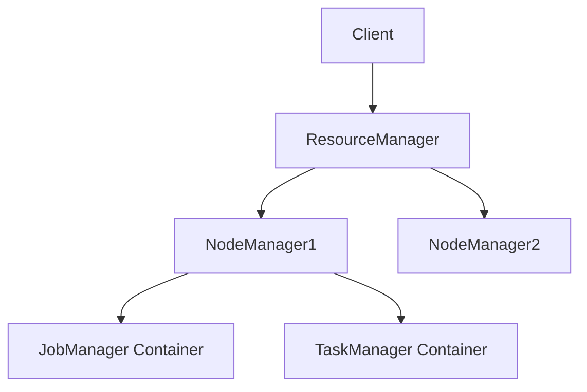
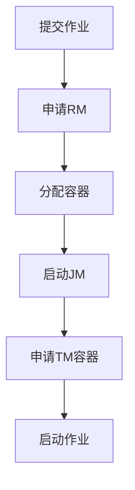

# Flink YARN 部署 演进 特性跟踪

> 所属阶段: Flink/roadmap | 前置依赖: [YARN Deployment][^1] | 形式化等级: L3

## 1. 概念定义 (Definitions)

### Def-F-YARN-01: YARN Application
YARN应用模式：
$$
\text{FlinkOnYARN} : \text{JobJar} \to \text{YARNContainer}
$$

### Def-F-YARN-02: Resource Negotiation
资源协商：
$$
\text{ResourceRequest} \to \text{RM} \to \text{Allocation}
$$

## 2. 属性推导 (Properties)

### Prop-F-YARN-01: Container Reuse
容器复用：
$$
\text{Reuse} \Rightarrow \text{ReducedStartupTime}
$$

## 3. 关系建立 (Relations)

### YARN部署演进

| 版本 | 特性 |
|------|------|
| 1.x | 基础YARN支持 |
| 2.0 | Application Mode |
| 3.0 | 优化资源申请 |

## 4. 论证过程 (Argumentation)

### 4.1 YARN架构



## 5. 形式证明 / 工程论证

### 5.1 提交命令

```bash
# YARN Application Mode
./bin/flink run-application -t yarn-application \
    -Djobmanager.memory.process.size=2048m \
    -Dtaskmanager.memory.process.size=4096m \
    -Dyarn.application.name="MyJob" \
    ./examples/streaming/StateMachineExample.jar
```

## 6. 实例验证 (Examples)

### 6.1 资源配置

```yaml
yarn.application-attempts: 3
yarn.application-node-label: "flink"
yarn.containers.vcores: 2
```

## 7. 可视化 (Visualizations)



## 8. 引用参考 (References)

[^1]: Flink YARN Setup

---

## 跟踪信息

| 属性 | 值 |
|------|-----|
| 涵盖版本 | 1.x-3.0 |
| 当前状态 | 稳定 |
