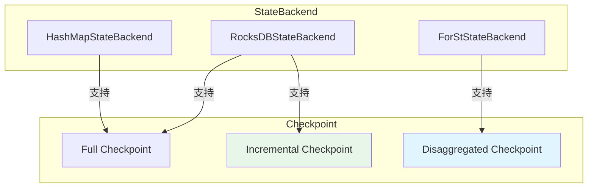
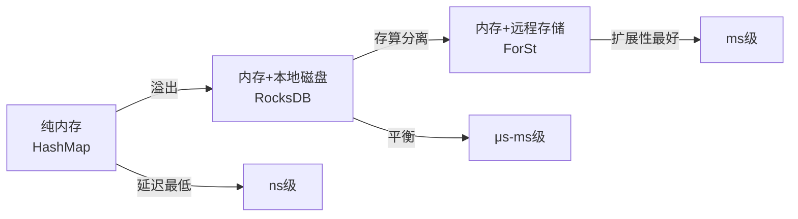
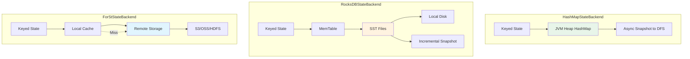
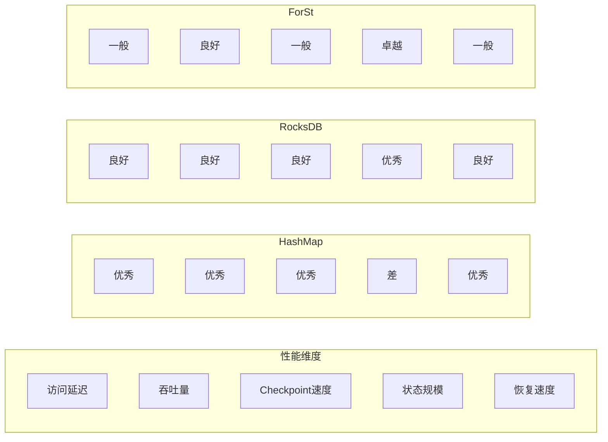
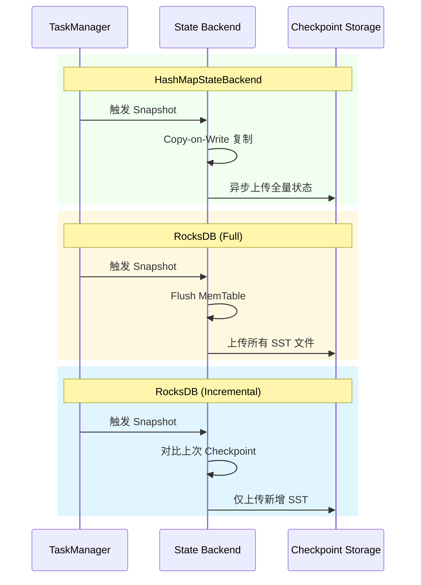

# Flink State Backends 深度对比

> 所属阶段: Flink | 前置依赖: [checkpoint-mechanism-deep-dive.md](02-core/checkpoint-mechanism-deep-dive.md) | 形式化等级: L4

---

## 1. 概念定义 (Definitions)

### Def-F-Backend-01: State Backend 定义

**定义**: State Backend 是 Flink 中负责状态存储、访问和快照的运行时组件：

$$
\text{StateBackend} = \langle \text{Storage}, \text{Access}, \text{Snapshot}, \text{Recovery} \rangle
$$

其中：

- $\text{Storage}$: 状态物理存储层
- $\text{Access}$: 状态访问接口
- $\text{Snapshot}$: 快照生成策略
- $\text{Recovery}$: 故障恢复机制

### Def-F-Backend-02: HashMapStateBackend

**定义**: 基于 JVM 堆内存的状态后端：

$$
\text{HashMapStateBackend} = \langle \text{Heap}_{tm}, \text{HashMap}_{K,V}, \text{Copy-on-Write}, \text{Async} \rangle
$$

**核心特征**：

- 存储位置: TaskManager JVM 堆内存
- 数据结构: `HashMap<K, State>`
- 快照机制: 异步复制到文件系统
- 访问延迟: 纳秒级

**容量约束**：

$$
|S_{total}| \leq \alpha \cdot \text{taskmanager.memory.task.heap.size}, \quad \alpha \approx 0.3
$$

### Def-F-Backend-03: EmbeddedRocksDBStateBackend

**定义**: 基于 RocksDB 的状态后端：

$$
\text{RocksDBStateBackend} = \langle \text{LSM-Tree}, \text{MemTable}, \text{SST}, \text{Incremental} \rangle
$$

**核心组件**：

| 组件 | 功能 | 特性 |
|------|------|------|
| MemTable | 内存写入缓冲区 | 有序结构，可配置大小 |
| SST Files | 磁盘持久化文件 | 分层存储，支持压缩 |
| WAL | 预写日志 | 崩溃恢复 |
| Block Cache | 读缓存 | LRU 淘汰策略 |

### Def-F-Backend-04: ForStStateBackend (Flink 2.0+)

**定义**: Flink 2.0 引入的远程状态后端：

$$
\text{ForStStateBackend} = \langle \text{Disaggregated}, \text{Remote}, \text{Async}, \text{Shared} \rangle
$$

**关键创新**：

- **存算分离**: 状态存储独立于计算节点
- **共享状态**: 多 TM 共享远程状态存储
- **异步 Checkpoint**: 无需阻塞本地执行

---

## 2. 属性推导 (Properties)

### Lemma-F-Backend-01: 状态大小边界

**引理**: 各状态后端支持的最大状态规模：

| 状态后端 | 最大状态规模 | 限制因素 |
|---------|-------------|----------|
| HashMapStateBackend | 几十 MB ~ 几百 MB | JVM 堆大小，GC 压力 |
| RocksDBStateBackend | 几十 GB ~ 几百 GB | 磁盘空间，内存/磁盘比 |
| ForStStateBackend | 理论上无上限 | 远程存储容量 |

### Lemma-F-Backend-02: 访问延迟层次

**引理**: 状态访问延迟满足以下关系：

$$
L_{HashMap} \ll L_{RocksDB\_memory} < L_{RocksDB\_disk} \ll L_{ForSt\_remote}
$$

**近似数量级**：

| 后端 | 命中场景 | 延迟量级 |
|------|----------|----------|
| HashMap | 内存 | ~100 ns |
| RocksDB (MemTable) | 内存 | ~1 μs |
| RocksDB (SST L0) | SSD | ~100 μs |
| RocksDB (SST L3+) | SSD | ~1 ms |
| ForSt | 网络 | ~10 ms |

### Prop-F-Backend-01: Checkpoint 规模关系

**命题**: Checkpoint 大小与状态后端的关系：

$$
\text{Checkpoint}_{HashMap} = |S_{total}|
$$

$$
\text{Checkpoint}_{RocksDB\_full} = |S_{total}|
$$

$$
\text{Checkpoint}_{RocksDB\_incremental} = |\Delta S| \ll |S_{total}|
$$

---

## 3. 关系建立 (Relations)

### 3.1 状态后端选择决策矩阵

| 场景 | HashMapStateBackend | RocksDBStateBackend | ForStStateBackend |
|------|---------------------|---------------------|-------------------|
| 状态大小 < 100MB | ✅ 首选 | ⚠️ 可用 | ❌ 不必要 |
| 状态大小 > 1GB | ❌ OOM 风险 | ✅ 首选 | ✅ 可选 |
| 大窗口聚合 | ❌ GC 问题 | ✅ 推荐 | ✅ 推荐 |
| 高频读写 | ✅ 最优 | ⚠️ 可接受 | ⚠️ 网络开销 |
| 异地多活 | ❌ 难同步 | ⚠️ 可配置 | ✅ 天然支持 |

### 3.2 与 Checkpoint 机制关系



### 3.3 内存-磁盘-远程存储谱系



---

## 4. 论证过程 (Argumentation)

### 4.1 状态后端选择决策树

```
状态大小估计?
├── < 100MB
│   └── 是否要求极速访问?
│       ├── 是 → HashMapStateBackend
│       └── 否 → HashMapStateBackend (默认)
├── 100MB ~ 10GB
│   └── 是否有大窗口/大 Key State?
│       ├── 是 → RocksDBStateBackend (增量Checkpoint)
│       └── 否 → RocksDBStateBackend
└── > 10GB
    └── 是否需要存算分离?
        ├── 是 → ForStStateBackend (Flink 2.0+)
        └── 否 → RocksDBStateBackend (优化配置)
```

### 4.2 性能调优策略对比

| 优化目标 | HashMap | RocksDB | ForSt |
|---------|---------|---------|-------|
| 减少 GC | 减少状态大小 | 无需优化 | 无需优化 |
| 降低延迟 | 预分配内存 | 增大 Block Cache | 优化网络 |
| 提高吞吐 | 并行度 | 批量读写 | 异步 Pipeline |
| 减少 Checkpoint 时间 | 状态小 | 启用增量 | 无需 Checkpoint |

---

## 5. 形式证明 / 工程论证 (Proof / Engineering Argument)

### Thm-F-Backend-01: RocksDB 增量 Checkpoint 正确性

**定理**: RocksDB 增量 Checkpoint 只传输变更的 SST 文件，恢复时状态完整。

**证明概要**：

1. SST 文件一旦生成即不可变（LSM-Tree 特性）
2. 新数据写入新的 SST 文件
3. Checkpoint 只上传新增的 SST 文件
4. 恢复时合并所有 SST 文件，状态视图一致

### Thm-F-Backend-02: HashMapStateBackend 内存上限

**定理**: HashMapStateBackend 的最大安全状态量为 TaskManager 堆内存的 30%。

**工程论证**：

- JVM 堆需要空间存储：
  - Flink 运行时对象
  - 网络缓冲区
  - 用户代码对象
- 预留 70% 给非状态用途
- GC 阈值考虑：状态过大导致 Full GC 频繁

---

## 6. 实例验证 (Examples)

### 6.1 配置示例

```java
import org.apache.flink.runtime.state.hashmap.HashMapStateBackend;
import org.apache.flink.runtime.state.rocksdb.EmbeddedRocksDBStateBackend;
import org.apache.flink.streaming.api.environment.StreamExecutionEnvironment;

StreamExecutionEnvironment env = StreamExecutionEnvironment.getExecutionEnvironment();

// ========== HashMapStateBackend ==========
// 适合:小状态,低延迟场景
env.setStateBackend(new HashMapStateBackend());
env.getCheckpointConfig().setCheckpointStorage("hdfs://namenode:8020/flink/checkpoints");

// ========== RocksDB State Backend ==========
// 适合:大状态,大窗口场景
EmbeddedRocksDBStateBackend rocksDbBackend = new EmbeddedRocksDBStateBackend(true); // 增量
env.setStateBackend(rocksDbBackend);
env.getCheckpointConfig().setCheckpointStorage("hdfs://namenode:8020/flink/checkpoints");

// RocksDB 高级配置
DefaultConfigurableStateBackend configurableBackend =
    new EmbeddedRocksDBStateBackend(true);
configurableBackend.setPredefinedOptions(PredefinedOptions.FLASH_SSD_OPTIMIZED);
env.setStateBackend(configurableBackend);

// ========== ForSt State Backend (Flink 2.0+) ==========
// 适合:超大规模状态,存算分离
ForStStateBackend forstBackend = new ForStStateBackend();
forstBackend.setRemoteStorageUri("s3://flink-state-bucket/");
env.setStateBackend(forstBackend);
```

### 6.2 配置文件示例

```yaml
# flink-conf.yaml

# --- HashMapStateBackend 配置 ---
state.backend: hashmap
state.checkpoint-storage: filesystem
state.checkpoints.dir: hdfs://namenode:8020/flink/checkpoints

# --- RocksDBStateBackend 配置 ---
state.backend: rocksdb
state.backend.incremental: true
state.backend.rocksdb.memory.fixed-per-slot: 256mb
state.backend.rocksdb.predefined-options: FLASH_SSD_OPTIMIZED

# RocksDB 调优参数
state.backend.rocksdb.threads.threads-number: 4
state.backend.rocksdb.timer-service.factory: ROCKSDB

# --- ForSt State Backend 配置 (Flink 2.0+) ---
state.backend: forst
state.backend.forst.remote.uri: s3://my-flink-state/
state.backend.forst.local.dir: /tmp/flink-forst
```

### 6.3 状态监控代码

```java
// 获取状态后端指标
public void monitorStateBackend(RuntimeContext ctx) {
    // 状态大小
    long stateSize = ctx.getStateSize();

    // 对于 RocksDB,获取详细指标
    if (stateBackend instanceof RocksDBStateBackend) {
        // SST 文件数量
        int sstFileCount = getMetric("rocksdb.num-files-at-level0")
                         + getMetric("rocksdb.num-files-at-level1")
                         + getMetric("rocksdb.num-files-at-level2");

        // Block Cache 命中率
        double cacheHitRate = getMetric("rocksdb.block.cache.hit.rate");

        // 写入放大
        double writeAmplification = getMetric("rocksdb.write.amplification");

        // 输出日志
        LOG.info("RocksDB Metrics - SST Files: {}, Cache Hit: {:.2f}%, Write Amp: {:.2f}",
            sstFileCount, cacheHitRate * 100, writeAmplification);
    }
}
```

### 6.4 状态迁移脚本

```python
#!/usr/bin/env python3
"""状态后端迁移检查脚本"""

import json

def analyze_state_usage(checkpoint_path):
    """分析 Checkpoint 状态大小,推荐状态后端"""

    # 模拟读取 Checkpoint 元数据
    checkpoint_meta = {
        "state_size_bytes": 536870912,  # 512 MB
        "state_files": 150,
        "max_key_state_size": 10485760,  # 10 MB
        "checkpoint_duration_ms": 30000
    }

    size_mb = checkpoint_meta["state_size_bytes"] / (1024 * 1024)

    recommendation = {
        "current_size_mb": size_mb,
        "recommendation": None,
        "reasoning": []
    }

    if size_mb < 100:
        recommendation["recommendation"] = "HashMapStateBackend"
        recommendation["reasoning"].append("状态小于 100MB,适合内存存储")
        recommendation["reasoning"].append("可获得最低访问延迟")
    elif size_mb < 5120:  # 5GB
        recommendation["recommendation"] = "RocksDBStateBackend (Incremental)"
        recommendation["reasoning"].append("状态较大,需要磁盘存储")
        recommendation["reasoning"].append("启用增量 Checkpoint 减少网络传输")
        recommendation["reasoning"].append("适合大窗口聚合场景")
    else:
        recommendation["recommendation"] = "ForStStateBackend (Flink 2.0+)"
        recommendation["reasoning"].append("状态超过 5GB,考虑存算分离")
        recommendation["reasoning"].append("避免本地磁盘瓶颈")
        recommendation["reasoning"].append("支持超大规模状态")

    # 额外建议
    if checkpoint_meta["checkpoint_duration_ms"] > 60000:
        recommendation["reasoning"].append(
            "⚠️ Checkpoint 时间过长,考虑启用增量 Checkpoint 或优化状态访问模式"
        )

    return recommendation

if __name__ == "__main__":
    result = analyze_state_usage("hdfs://checkpoints/job-123")
    print(json.dumps(result, indent=2, ensure_ascii=False))
```

---

## 7. 可视化 (Visualizations)

### 7.1 状态后端架构对比



### 7.2 性能对比雷达图



### 7.3 Checkpoint 流程对比



---

## 8. 引用参考 (References)
