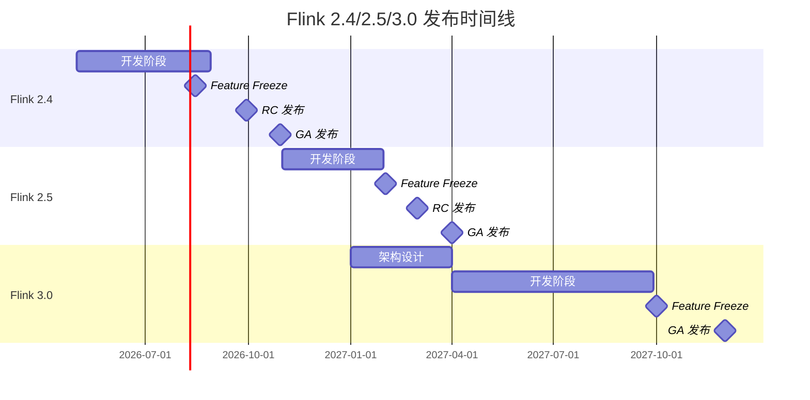
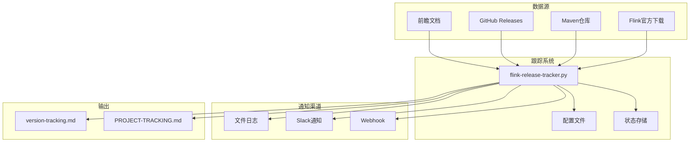

# Flink 版本发布跟踪文档

> 所属阶段: Flink/ | 前置依赖: [PROJECT-TRACKING.md](../PROJECT-TRACKING.md) | 形式化等级: L2
> **最后更新**: 2026-04-04 | **状态**: 🔄 持续跟踪 | **跟踪系统**: [flink-release-tracker.py](../.scripts/flink-release-tracker.py)

---

## 1. 跟踪目标

本文档跟踪 Apache Flink 2.4、2.5 和 3.0 版本的发布状态，以及相关前瞻文档的维护状态。

### 1.1 跟踪版本范围

| 版本 | 目标发布时间 | 主要特性 | 状态 |
|------|-------------|----------|------|
| Flink 2.4 | 2026 Q3-Q4 | AI Agent GA、Serverless Beta、自适应执行v2 | 🔍 前瞻 |
| Flink 2.5 | 2027 Q1-Q2 | 流批一体完成、Serverless GA、AI/ML生产化 | 🔍 前瞻 |
| Flink 3.0 | 2027+ | 架构重构、Cloud-Native Native | 🔭 远景 |

---

## 2. 版本状态跟踪表

### 2.1 Flink 2.4 发布跟踪

| 组件 | 当前状态 | 进度 | 预计完成 | 相关文档 |
|------|---------|------|----------|----------|
| FLIP-531 AI Agent | 🔄 MVP→GA | 85% | 2026-08 | [flink-2.4-tracking.md](08-roadmap/flink-2.4-tracking.md) |
| Serverless Framework | 🔄 实现中 | 70% | 2026-09 | [serverless-flink-ga-guide.md](10-deployment/serverless-flink-ga-guide.md) |
| Adaptive Execution v2 | 🔄 实现中 | 60% | 2026-08 | [adaptive-execution-engine-v2.md](02-core-mechanisms/adaptive-execution-engine-v2.md) |
| Intelligent Checkpointing | 🔄 设计完成 | 40% | 2026-09 | [smart-checkpointing-strategies.md](02-core-mechanisms/smart-checkpointing-strategies.md) |
| ANSI SQL 2023 | 🔄 实现中 | 75% | 2026-07 | [ansi-sql-2023-compliance-guide.md](03-sql-table-api/ansi-sql-2023-compliance-guide.md) |
| New Connectors | 🔄 开发中 | 80% | 2026-08 | [flink-24-connectors-guide.md](04-connectors/flink-24-connectors-guide.md) |

### 2.2 Flink 2.5 发布跟踪

| 组件 | 当前状态 | 进度 | 预计完成 | 相关文档 |
|------|---------|------|----------|----------|
| 流批一体统一 | 📋 规划中 | 30% | 2027-01 | [flink-25-stream-batch-unification.md](08-roadmap/flink-25-stream-batch-unification.md) |
| Serverless GA | 📋 规划中 | 20% | 2027-02 | [flink-2.5-preview.md](08-roadmap/flink-2.5-preview.md) |
| AI/ML Production | 📋 规划中 | 25% | 2027-01 | [flink-25-gpu-acceleration.md](12-ai-ml/flink-25-gpu-acceleration.md) |
| WASM UDF GA | 📋 规划中 | 35% | 2027-Q1 | [flink-25-wasm-udf-ga.md](09-language-foundations/flink-25-wasm-udf-ga.md) |

### 2.3 Flink 3.0 发布跟踪

| 组件 | 当前状态 | 进度 | 预计完成 | 相关文档 |
|------|---------|------|----------|----------|
| API Redesign | 📋 规划中 | 10% | 2027+ | [flink-30-architecture-redesign.md](08-roadmap/flink-30-architecture-redesign.md) |
| Cloud-Native Core | 📋 规划中 | 5% | 2027+ | [flink-30-architecture-redesign.md](08-roadmap/flink-30-architecture-redesign.md) |

---

## 3. 前瞻文档状态跟踪

### 3.1 文档状态汇总

| 目标版本 | 文档数量 | 状态分布 | 最后扫描 |
|---------|---------|---------|----------|
| Flink 2.4 | 9 篇 | 8 前瞻 + 1 草案 | 2026-04-04 |
| Flink 2.5 | 3 篇 | 3 前瞻 | 2026-04-04 |
| Flink 3.0 | 1 篇 | 1 远景 | 2026-04-04 |

### 3.2 Flink 2.4 前瞻文档清单

| 文档路径 | 文档状态 | 目标发布 | 最后更新 | 负责人 |
|---------|---------|---------|---------|--------|
| [Flink/08-roadmap/flink-2.4-tracking.md](08-roadmap/flink-2.4-tracking.md) | 🔍 前瞻 | 2026 Q3-Q4 | 2026-04-04 | Agent |
| [Flink/roadmap/flink-24-flip-531-ai-agents.md](../Flink/roadmap/flink-24-flip-531-ai-agents.md) | 🔍 前瞻 | 2026 Q3-Q4 | 2026-04-04 | Agent |
| [Flink/roadmap/flink-24-serverless-ga.md](../Flink/roadmap/flink-24-serverless-ga.md) | 🔍 前瞻 | 2026 Q3-Q4 | 2026-04-04 | Agent |
| [Flink/roadmap/flink-24-performance.md](../Flink/roadmap/flink-24-performance.md) | 🔍 前瞻 | 2026 Q3-Q4 | 2026-04-04 | Agent |
| [Flink/roadmap/flink-24-smart-checkpoint.md](../Flink/roadmap/flink-24-smart-checkpoint.md) | 🔍 前瞻 | 2026 Q3-Q4 | 2026-04-04 | Agent |
| [Flink/roadmap/flink-24-ansi-sql-2023.md](../Flink/roadmap/flink-24-ansi-sql-2023.md) | 🔍 前瞻 | 2026 Q3-Q4 | 2026-04-04 | Agent |
| [Flink/roadmap/flink-24-new-connectors.md](../Flink/roadmap/flink-24-new-connectors.md) | 🔍 前瞻 | 2026 Q3-Q4 | 2026-04-04 | Agent |
| [Flink/roadmap/flink-24-deployment.md](../Flink/roadmap/flink-24-deployment.md) | 🔍 前瞻 | 2026 Q3-Q4 | 2026-04-04 | Agent |
| [Flink/roadmap/flink-24-observability.md](../Flink/roadmap/flink-24-observability.md) | 🔍 前瞻 | 2026 Q3-Q4 | 2026-04-04 | Agent |
| [Flink/roadmap/flink-24-security.md](../Flink/roadmap/flink-24-security.md) | 🔍 前瞻 | 2026 Q3-Q4 | 2026-04-04 | Agent |

### 3.3 Flink 2.5 前瞻文档清单

| 文档路径 | 文档状态 | 目标发布 | 最后更新 | 负责人 |
|---------|---------|---------|---------|--------|
| [Flink/08-roadmap/flink-2.5-preview.md](08-roadmap/flink-2.5-preview.md) | 🔍 前瞻 | 2027 Q1-Q2 | 2026-04-04 | Agent |
| [Flink/roadmap/flink-25-stream-batch-unified.md](../Flink/roadmap/flink-25-stream-batch-unified.md) | 🔍 前瞻 | 2027 Q1-Q2 | 2026-04-04 | Agent |
| [Flink/roadmap/flink-25-wasm-udf-ga.md](../Flink/roadmap/flink-25-wasm-udf-ga.md) | 🔍 前瞻 | 2027 Q1-Q2 | 2026-04-04 | Agent |

### 3.4 Flink 3.0 前瞻文档清单

| 文档路径 | 文档状态 | 目标发布 | 最后更新 | 负责人 |
|---------|---------|---------|---------|--------|
| [Flink/08-roadmap/flink-30-architecture-redesign.md](08-roadmap/flink-30-architecture-redesign.md) | 🔭 远景 | 2027+ | 2026-04-04 | Agent |

---

## 4. API 变更跟踪

### 4.1 Flink 2.4 API 变更

#### 新增 API

| API 类别 | API 名称 | 状态 | 相关 FLIP |
|---------|---------|------|-----------|
| SQL | `CREATE AGENT` | 🔍 前瞻 | FLIP-531 |
| SQL | `CREATE AGENT_TEAM` | 🔍 前瞻 | FLIP-531 |
| SQL | `VECTOR_SEARCH` | 🔍 前瞻 | FLIP-542 |
| Config | `execution.adaptive.model` | 🔍 前瞻 | FLIP-541 |
| Config | `serverless.enabled` | 🔍 前瞻 | FLIP-540 |

#### 废弃 API

| API 名称 | 废弃版本 | 替代方案 | 移除计划 |
|---------|---------|---------|---------|
| `execution.adaptive.mode` | 2.4 | `execution.adaptive.model` | 3.0 |

### 4.2 Maven 依赖变更

#### Flink 2.4 新增依赖 (规划中)

```xml
<!-- AI Agent GA 依赖（未来可能提供的模块，设计阶段） -->
<dependency>
    <groupId>org.apache.flink</groupId>
    <artifactId>flink-ai-agent</artifactId>
    <version>2.4.0</version>
    <!-- 注: 尚未正式发布 -->
</dependency>

<!-- MCP协议支持 (规划中) -->
<dependency>
    <groupId>org.apache.flink</groupId>
    <artifactId>flink-mcp-connector</artifactId>
    <version>2.4.0</version>
    <!-- 注: 尚未正式发布 -->
</dependency>
```

---

## 5. 自动化跟踪系统

### 5.1 检测脚本

**脚本位置**: [`.scripts/flink-release-tracker.py`](../.scripts/flink-release-tracker.py)

**功能**:
- 检测 Flink 官方下载页面
- 检查 Maven 仓库发布
- 监控 GitHub Releases
- 扫描前瞻文档状态
- 发送变更通知

**使用方法**:

```bash
# 基本运行
python .scripts/flink-release-tracker.py

# 生成报告文件
python .scripts/flink-release-tracker.py --report

# 不发送通知（仅更新状态）
python .scripts/flink-release-tracker.py --no-notify
```

### 5.2 配置选项

**配置文件**: `.scripts/flink-tracker-config.json`

```json
{
  "check_interval_hours": 24,
  "notification_channels": ["file", "slack"],
  "target_versions": ["2.4.0", "2.5.0", "3.0.0"],
  "slack": {
    "enabled": true,
    "webhook_url": "YOUR_SLACK_WEBHOOK_URL",
    "channel": "#flink-releases"
  },
  "prospective_doc_scan": {
    "enabled": true,
    "directories": ["Flink/roadmap", "Flink/08-roadmap"],
    "patterns": ["前瞻", "preview", "Preview"]
  }
}
```

### 5.3 定时任务设置

**Linux/macOS (crontab)**:
```bash
# 每天上午9点运行检查
0 9 * * * cd /path/to/AnalysisDataFlow && python .scripts/flink-release-tracker.py --report
```

**Windows (Task Scheduler)**:
```powershell
# PowerShell 命令创建定时任务
$action = New-ScheduledTaskAction -Execute "python" -Argument ".scripts\flink-release-tracker.py --report" -WorkingDirectory "E:\_src\AnalysisDataFlow"
$trigger = New-ScheduledTaskTrigger -Daily -At 9am
Register-ScheduledTask -TaskName "FlinkReleaseTracker" -Action $action -Trigger $trigger
```

---

## 6. 版本发布检查清单

### 6.1 发布检测检查清单

- [ ] 官方下载页面更新
- [ ] Maven Central 发布确认
- [ ] GitHub Releases 发布
- [ ] 发布说明文档可用
- [ ] Docker 镜像更新
- [ ] 文档网站更新

### 6.2 文档更新检查清单

- [ ] 前瞻文档状态更新
- [ ] API 变更文档更新
- [ ] 配置参数验证
- [ ] 迁移指南更新
- [ ] 示例代码验证

---

## 7. 历史变更记录

| 日期 | 版本 | 变更类型 | 详情 |
|------|------|---------|------|
| 2026-04-04 | 2.4.0 | 跟踪系统建立 | 初始跟踪文档创建 |
| 2026-04-04 | 2.5.0 | 跟踪系统建立 | 初始跟踪文档创建 |
| 2026-04-04 | 3.0.0 | 跟踪系统建立 | 初始跟踪文档创建 |

---

## 8. 相关资源

### 8.1 官方资源

- [Apache Flink 官方下载](https://flink.apache.org/downloads.html)
- [Flink JIRA](https://issues.apache.org/jira/projects/FLINK)
- [Flink GitHub Releases](https://github.com/apache/flink/releases)
- [Maven Central Flink](https://search.maven.org/search?q=g:org.apache.flink)

### 8.2 项目内部资源

- [PROJECT-TRACKING.md](../PROJECT-TRACKING.md) - 项目整体进度
- [FLIP-TRACKING-SYSTEM.md](08-roadmap/FLIP-TRACKING-SYSTEM.md) - FLIP 跟踪系统
- [Flink/roadmap/](../Flink/roadmap/) - 路线图文档目录

---

## 9. 可视化

### 9.1 版本发布时间线



### 9.2 跟踪系统架构



---

## 10. 引用参考

[^1]: Apache Flink Documentation, "Downloads", 2025. https://flink.apache.org/downloads.html
[^2]: Apache Flink JIRA, "FLIP-531: Flink AI Agents", 2025. https://issues.apache.org/jira/browse/FLINK-35000
[^3]: Apache Flink GitHub, "Releases", 2025. https://github.com/apache/flink/releases
