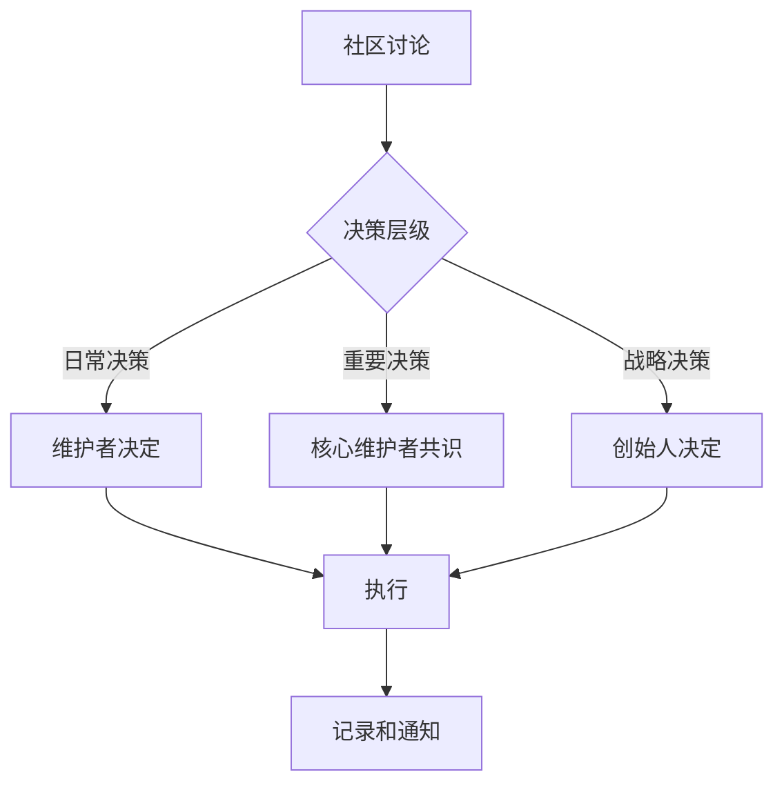
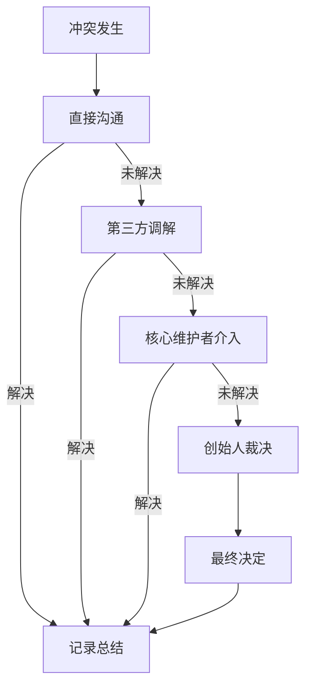

# 项目治理结构 (Governance)

> **版本**: v1.0 | **最后更新**: 2026-04-12 | **状态**: 生效

---

## 概述

本文档定义 AnalysisDataFlow 项目的治理结构，包括决策流程、角色职责和冲突解决机制。

## 项目愿景

打造流计算领域最全面、最严谨、最开放的知识库，连接学术理论与工程实践。

## 治理原则

| 原则 | 说明 |
|-----|------|
| **开放透明** | 所有决策过程公开透明 |
| **精英管理** | 贡献决定影响力 |
| **共识驱动** | 重大决策寻求社区共识 |
| **分权自治** | 各模块维护者有较大自主权 |
| **包容多元** | 欢迎不同背景的贡献者 |

---

## 角色与职责

### 1. 项目创始人 (BDFL)

**现任**: @luyanruyr

**职责**:
- 设定项目整体方向和愿景
- 最终决策权（在无法达成共识时）
- 维护者团队的任命
- 项目品牌和重大合作决策

**限制**:
- 尊重社区共识
- 重大变更需提前沟通
- 接受社区监督

### 2. 核心维护者 (Core Maintainers)

**职责**:
- 日常项目管理和决策
- PR 审查和合并
- Issue 分类和处理
- 版本发布管理
- 维护项目规范和质量标准

**产生方式**:
- 由项目创始人任命
- 基于持续贡献和社区认可

### 3. 领域维护者 (Area Maintainers)

负责特定领域/模块：

| 领域 | 职责范围 |
|-----|---------|
| Struct/ 形式理论 | 定理验证、形式化证明 |
| Knowledge/ 知识结构 | 设计模式、业务建模 |
| Flink/ Flink专项 | 架构分析、源码解读 |
| 工具与基础设施 | CI/CD、自动化脚本 |
| 社区与文档 | 社区运营、文档质量 |

### 4. 贡献者 (Contributors)

**任何为项目做出贡献的人**，包括：
- 代码/文档贡献
- Issue 报告
- 讨论参与
- 问题解答
- 推广宣传

### 5. 用户 (Users)

使用本项目文档和资源的个人和组织。

---

## 决策流程

### 决策层级



### 决策类型与权限

| 决策类型 | 示例 | 决策权限 | 时限 |
|---------|------|---------|------|
| 日常运营 | Issue 标记、简单 PR 合并 | 任何维护者 | 即时 |
| 内容审查 | 新文档合并、定理编号分配 | 领域维护者 | 3-5 工作日 |
| 规范变更 | 文档模板修改、编号规则变更 | 核心维护者共识 | 1-2 周 |
| 架构调整 | 目录结构调整、新模块添加 | 创始人决定 | 2-4 周 |
| 战略方向 | 项目定位调整、重大合作 | 创始人决定 | 按需 |

### 共识建立流程

对于需要社区共识的决策：

1. **提案** - 创建 GitHub Discussion 详细描述提案
2. **讨论** - 开放至少 7 天供社区讨论
3. **修订** - 根据反馈修订提案
4. **决策** - 核心维护者根据讨论结果决策
5. **公告** - 公布决策结果和理由

---

## 冲突解决

### 冲突类型

| 类型 | 示例 | 解决方式 |
|-----|------|---------|
| 技术分歧 | 架构选择、实现方案 | 技术讨论，数据驱动决策 |
| 优先级分歧 | 功能优先级、资源分配 | 基于项目目标评估 |
| 行为规范 | 违反行为准则 | 按 CODE_OF_CONDUCT 处理 |
| 治理争议 | 对治理决策的异议 | 创始人最终裁决 |

### 解决流程



### 升级路径

1. **当事人直接沟通** - 首先尝试私下解决
2. **公开讨论** - 在相关 Issue/PR 中讨论
3. **维护者调解** - 请求维护者介入
4. **创始人裁决** - 最终决策

---

## 贡献者晋升

### 晋升路径

```
用户 → 贡献者 → 活跃贡献者 → 领域维护者 → 核心维护者
```

### 晋升标准

| 角色 | 标准 |
|-----|------|
| 贡献者 | 提交过任何类型的贡献 |
| 活跃贡献者 | 3 个月内多次高质量贡献 |
| 领域维护者 | 特定领域的持续贡献和专业能力 |
| 核心维护者 | 项目整体贡献和领导力 |

### 晋升流程

1. **提名** - 现有维护者提名或自我推荐
2. **评估** - 核心维护者评估贡献记录
3. **公示** - 在社区公示 7 天
4. **任命** - 正式任命并更新文档

---

## 项目资源管理

### 代码仓库

- **主仓库**: 受保护，仅维护者可合并
- **分支策略**: 功能分支 → PR → 审查 → 合并
- **提交规范**: 遵循 CONTRIBUTING.md 要求

### 文档资产

- 所有文档采用 Creative Commons 或类似许可
- 重大变更需经审查
- 保持历史版本可访问

### 品牌与知识产权

- 项目名称和标识由创始人管理
- 内容贡献采用项目许可
- 外部合作需核心维护者批准

---

## 治理文档更新

### 更新流程

1. **提案** - 创建 Discussion 讨论变更
2. **讨论** - 开放至少 14 天收集反馈
3. **修订** - 根据反馈完善提案
4. **批准** - 核心维护者投票（2/3 多数）
5. **实施** - 更新文档并公告

### 紧急情况

对于紧急治理变更，可由创始人直接决定，但需在 7 天内补全社区讨论程序。

---

## 社区参与

### 参与渠道

| 渠道 | 用途 | 参与方式 |
|-----|------|---------|
| GitHub Issues | 问题报告、功能请求 | 创建/评论 Issue |
| GitHub Discussions | 一般讨论、问答 | 参与讨论 |
| Pull Requests | 代码/文档贡献 | 提交 PR |
| 社区例会 | 同步沟通 | 参加会议 |

### 透明度承诺

- 所有决策过程公开记录
- 会议纪要公开存档
- 财务信息（如有）定期公开

---

## 附则

### 文档效力

本文档自 2026-04-12 起生效，取代此前所有非正式治理安排。

### 修订记录

| 版本 | 日期 | 变更内容 | 批准人 |
|-----|------|---------|-------|
| v1.0 | 2026-04-12 | 初始版本 | @luyanruyr |

### 联系方式

治理相关问题请联系：
- 📧 governance@analysisdataflow.org
- 💬 GitHub Discussion - Governance 分类

---

## 相关文档

- [CODE_OF_CONDUCT.md](./CODE_OF_CONDUCT.md) - 行为准则
- [CONTRIBUTING.md](./CONTRIBUTING.md) - 贡献指南
- [MAINTAINERS.md](./MAINTAINERS.md) - 维护者指南

---

*本治理结构旨在促进健康、可持续的社区发展，将根据项目需要进行调整和完善。* 🏛️
