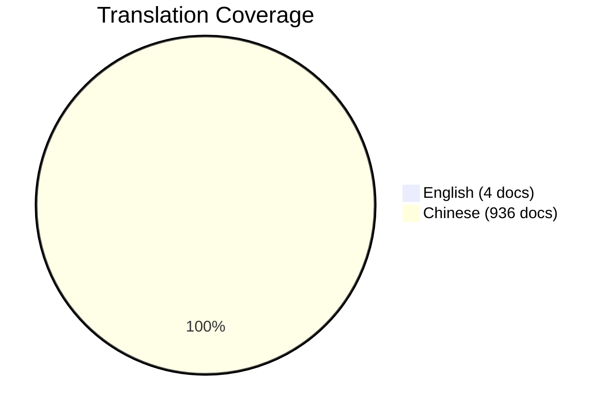

# Internationalization (I18N) Roadmap

> **Document Position**: Project Internationalization Planning | **Version**: 2026.04 | **Status**: Active

---

## Executive Summary

This roadmap outlines the plan for expanding English documentation coverage for the AnalysisDataFlow project. Currently, the project has 4 core English documents out of 940+ total Chinese documents (~0.4% coverage).

**Target**: Achieve 10% English coverage by end of 2026.

---

## Current Status

### Existing English Documents

| Document | Type | Status |
|----------|------|--------|
| [en/README.md](./en/README.md) | Project Overview | ✅ Complete |
| [en/QUICK-START.md](./en/QUICK-START.md) | Quick Start Guide | ✅ Complete |
| [en/ARCHITECTURE.md](./en/ARCHITECTURE.md) | Architecture Overview | ✅ Complete |
| [en/GLOSSARY.md](./en/GLOSSARY.md) | Terminology Glossary | ✅ Complete |
| [en/00-INDEX.md](./en/00-INDEX.md) | English Content Hub | ✅ New |
| [en/STRUCT-INDEX.md](./en/STRUCT-INDEX.md) | Struct/ Navigation | ✅ New |
| [en/KNOWLEDGE-INDEX.md](./en/KNOWLEDGE-INDEX.md) | Knowledge/ Navigation | ✅ New |
| [en/FLINK-INDEX.md](./en/FLINK-INDEX.md) | Flink/ Navigation | ✅ New |

### Translation Coverage



---

## Translation Priorities

### P0: Core Foundation (Complete ✅)

**Goal**: Enable basic English accessibility

| Item | Priority | Status |
|------|----------|--------|
| Project README | P0 | ✅ Complete |
| Quick Start Guide | P0 | ✅ Complete |
| Architecture Overview | P0 | ✅ Complete |
| Terminology Glossary (85 terms) | P0 | ✅ Complete |
| Navigation Indexes | P0 | ✅ Complete |

### P1: Theoretical Foundations (Q2 2026)

**Goal**: Enable academic and research access

| Document | Source | Est. Effort |
|----------|--------|-------------|
| Unified Streaming Theory (USTM) | Struct/01-foundation/01.01-unified-streaming-theory.md | 2 weeks |
| Process Calculus Primer | Struct/01-foundation/01.02-process-calculus-primer.md | 2 weeks |
| Actor Model Formalization | Struct/01-foundation/01.03-actor-model-formalization.md | 1 week |
| Dataflow Model Formalization | Struct/01-foundation/01.04-dataflow-model-formalization.md | 1 week |
| Determinism in Streaming | Struct/02-properties/02.01-determinism-in-streaming.md | 1 week |
| Consistency Hierarchy | Struct/02-properties/02.02-consistency-hierarchy.md | 1 week |
| Watermark Monotonicity | Struct/02-properties/02.03-watermark-monotonicity.md | 1 week |

**Timeline**: April - June 2026  
**Total Effort**: ~9 weeks

### P2: Design Patterns & Best Practices (Q3 2026)

**Goal**: Enable engineering adoption

| Category | Documents | Est. Effort |
|----------|-----------|-------------|
| Event Time Processing Pattern | Knowledge/02-design-patterns/pattern-event-time-processing.md | 3 days |
| Windowed Aggregation Pattern | Knowledge/02-design-patterns/pattern-windowed-aggregation.md | 3 days |
| Stateful Computation Pattern | Knowledge/02-design-patterns/pattern-stateful-computation.md | 3 days |
| Checkpoint Recovery Pattern | Knowledge/02-design-patterns/pattern-checkpoint-recovery.md | 3 days |
| Flink Production Checklist | Knowledge/07-best-practices/07.01-flink-production-checklist.md | 3 days |
| Performance Tuning Patterns | Knowledge/07-best-practices/07.02-performance-tuning-patterns.md | 5 days |
| Troubleshooting Guide | Knowledge/07-best-practices/07.03-troubleshooting-guide.md | 5 days |

**Timeline**: July - September 2026  
**Total Effort**: ~4 weeks

### P3: Flink Core Mechanisms (Q4 2026)

**Goal**: Enable Flink practitioner adoption

| Document | Source | Est. Effort |
|----------|--------|-------------|
| Checkpoint Mechanism Deep Dive | Flink/02-core-mechanisms/checkpoint-mechanism-deep-dive.md | 1 week |
| State Backend Evolution | Flink/02-core-mechanisms/state-backend-evolution-analysis.md | 1 week |
| Time Semantics & Watermark | Flink/02-core-mechanisms/time-semantics-and-watermark.md | 1 week |
| Network Stack Deep Dive | Flink/02-core-mechanisms/network-stack-deep-dive.md | 1 week |
| Table API Complete Guide | Flink/03-sql-table-api/flink-table-sql-complete-guide.md | 2 weeks |
| Kafka Integration Patterns | Flink/04-connectors/kafka-integration-patterns.md | 1 week |
| Kubernetes Deployment Guide | Flink/10-deployment/kubernetes-deployment-production-guide.md | 1 week |

**Timeline**: October - December 2026  
**Total Effort**: ~8 weeks

### P4: Business Patterns & Case Studies (2027+)

**Goal**: Enable industry adoption

| Category | Priority | Timeline |
|----------|----------|----------|
| Fintech Real-time Risk Control | P4 | Q1 2027 |
| Real-time Recommendation Systems | P4 | Q1 2027 |
| IoT Stream Processing | P4 | Q2 2027 |
| Case Studies (Alibaba, Netflix, Uber) | P4 | Q2 2027 |

---

## Resource Requirements

### Human Resources

| Role | FTE | Duration | Responsibility |
|------|-----|----------|----------------|
| Technical Translator | 1.0 | 12 months | Core document translation |
| Technical Reviewer | 0.5 | 12 months | Accuracy review |
| Native English Editor | 0.25 | 12 months | Language polish |
| Community Contributors | - | Ongoing | Community translations |

### Tools & Infrastructure

| Tool | Purpose | Status |
|------|---------|--------|
| Translation Memory | Reuse previous translations | 📋 Planned |
| Terminology Database | Maintain consistent terms | ✅ Using GLOSSARY-en.md |
| i18n-switcher.py | Language link management | ✅ Created |
| i18n-quality-checker.py | Quality validation | ✅ Created |
| CI/CD Integration | Automated checks | 📋 Planned |

### Budget Estimate

| Category | Estimated Cost |
|----------|---------------|
| Professional Translation (P1-P3) | $15,000 - $20,000 |
| Review & Editing | $5,000 - $8,000 |
| Tooling & Infrastructure | $1,000 - $2,000 |
| **Total** | **$21,000 - $30,000** |

---

## Quality Standards

### Translation Quality Criteria

1. **Accuracy**: Technical concepts must be accurately conveyed
2. **Consistency**: Terminology must be consistent throughout
3. **Completeness**: All sections must be translated (including diagrams)
4. **Format**: Must follow the six-section template
5. **References**: Citations must be preserved

### Review Process

```
Draft Translation → Technical Review → Language Review → Final Approval
       ↑                    ↓              ↓                ↓
   Translator          SME Review      Editor Review    Maintainer
```

### Quality Gates

- All terms must exist in GLOSSARY-en.md
- All links must be validated
- All Mermaid diagrams must render correctly
- Spell check must pass

---

## Community Contribution

### How to Contribute

1. **Pick a Document**: Choose from P1-P3 priorities
2. **Claim It**: Open an issue to claim the translation
3. **Translate**: Follow the style guide
4. **Submit PR**: Include both Chinese and English versions
5. **Review**: Address review feedback

### Recognition

Contributors will be:
- Listed in CONTRIBUTORS.md
- Mentioned in release notes
- Awarded "Translation Champion" badges

---

## Progress Tracking

### Milestones

| Milestone | Target Date | Success Criteria |
|-----------|-------------|------------------|
| M1: Foundation Complete | 2026-04 | 4 core docs + indexes |
| M2: Theory Phase 1 | 2026-06 | P1 documents complete |
| M3: Engineering Patterns | 2026-09 | P2 documents complete |
| M4: Flink Core | 2026-12 | P3 documents complete |
| M5: 10% Coverage | 2026-12 | 94+ English documents |

### KPIs

| Metric | Current | Target (2026) |
|--------|---------|---------------|
| English Documents | 8 | 94+ (10%) |
| Core Terms Covered | 150 | 500+ |
| Community Contributors | 0 | 10+ |
| Translation Quality Score | N/A | 95%+ |

---

## Risk Assessment

| Risk | Impact | Mitigation |
|------|--------|------------|
| Translation quality issues | High | Strict review process, SME involvement |
| Terminology inconsistency | Medium | Centralized glossary, automated checks |
| Maintenance burden | Medium | Clear ownership, community involvement |
| Low community engagement | Medium | Recognition programs, clear guidelines |
| Technical accuracy loss | High | Technical review mandatory |

---

## Appendices

### Appendix A: Translation Style Guide

1. **Tone**: Professional, academic, clear
2. **Voice**: Active voice preferred
3. **Person**: Third person
4. **Tense**: Present tense for concepts, past tense for historical references
5. **Numbers**: Use numerals for measurements, spell out for small quantities

### Appendix B: Terminology Management

- Primary source: GLOSSARY-en.md
- New terms must be added before use
- Use i18n-quality-checker.py to validate

### Appendix C: Document Template

English documents must follow the six-section structure:
1. Definitions
2. Properties
3. Relations
4. Argumentation
5. Proof / Engineering Argument
6. Examples
7. Visualizations
8. References

---

*Last updated: 2026-04-12 | Version: v1.0 | Status: Active*
